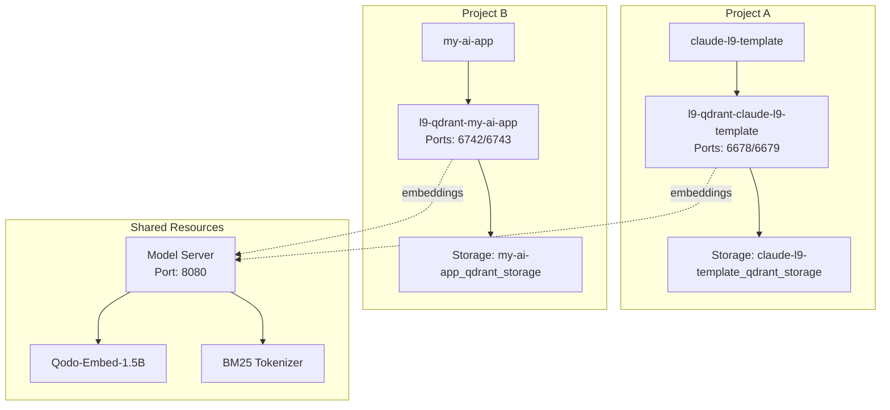

# L9 Multi-Project Isolation Architecture

## Overview

The L9 Neural System now supports **complete project isolation** with automatic container management. Each project gets its own dedicated Qdrant container while sharing embedding model resources.

## Key Features

### 🔐 Complete Data Isolation
- **Per-project Qdrant containers**: Each project runs its own Qdrant instance
- **No data mixing**: Collections are completely isolated between projects
- **Project-specific volumes**: Data persists in project-named Docker volumes

### 🔌 Automatic Port Allocation
- **Deterministic port assignment**: Ports calculated from project path hash
- **No conflicts**: Each project gets unique REST and gRPC ports
- **Port ranges**: 6500-7000 (avoiding common ports and enterprise containers)

### 🏷️ Smart Naming Convention
```
Container: l9-qdrant-{project_name}
Network: l9-network-{project_name}
Storage: {project_name}_qdrant_storage
Collections: {project_name}_{collection_type}
```

## Architecture



## Port Allocation Algorithm

```python
def calculate_ports(project_path):
    # Create stable hash from project path
    path_hash = md5(project_path).hexdigest()[:8]
    hash_num = int(path_hash[:4], 16)
    
    # Calculate unique offset
    port_offset = (hash_num % 250) * 2
    
    # Assign ports in 6500-7000 range
    rest_port = 6500 + port_offset
    grpc_port = rest_port + 1
    
    return rest_port, grpc_port
```

## Example Configurations

### Project: claude-l9-template
```json
{
  "container_name": "l9-qdrant-claude-l9-template",
  "rest_port": 6678,
  "grpc_port": 6679,
  "storage_path": "claude-l9-template_qdrant_storage"
}
```

### Project: my-ai-app
```json
{
  "container_name": "l9-qdrant-my-ai-app",
  "rest_port": 6742,
  "grpc_port": 6743,
  "storage_path": "my-ai-app_qdrant_storage"
}
```

## Usage

### Automatic Detection
The system automatically detects your project context:

```python
from l9_config_manager import get_config

config = get_config()
# Automatically uses project-specific container and ports
```

### Manual Control
For explicit project management:

```python
from l9_project_isolation import L9ProjectIsolation

manager = L9ProjectIsolation()

# Ensure container is running
project = manager.get_project_context()
container_info = manager.ensure_project_container(project)

# List all project containers
projects = manager.list_all_project_containers()
```

## Benefits

1. **Complete Isolation**: No data leakage between projects
2. **Automatic Management**: Containers start on-demand
3. **Resource Efficiency**: Shared model server saves memory
4. **Easy Cleanup**: Remove project container when done
5. **Development Safety**: Can't accidentally affect production
6. **Deterministic**: Same project always gets same ports

## Comparison with Enterprise V3

| Aspect | Enterprise V3 (Production) | L9 Template (Development) |
|--------|---------------------------|---------------------------|
| Container | neural-v36-qdrant | l9-qdrant-{project_name} |
| Ports | 6333/6334 (fixed) | 6500-7000 (dynamic) |
| Data | Shared collections | Isolated per project |
| Models | Dedicated | Shared server |
| Risk | Production critical | Safe to experiment |

## Container Management

### Start Project Container
```bash
# Automatic when using L9 modules
python3 your_script.py  # Container starts if needed
```

### List All Containers
```bash
docker ps -a | grep l9-qdrant
```

### Stop Project Container
```bash
docker stop l9-qdrant-{project_name}
```

### Remove Project Container
```bash
docker rm l9-qdrant-{project_name}
docker volume rm {project_name}_qdrant_storage
```

## Migration from Single Container

If you were using the old single-container approach:

1. **Data Export** (if needed):
   ```bash
   # Export from old container
   docker exec l9-qdrant-local qdrant-export
   ```

2. **Update Code**:
   ```python
   # Old approach
   client = QdrantClient(port=6433)
   
   # New approach (automatic)
   from l9_config_manager import get_config
   config = get_config()
   client = QdrantClient(**config.get_qdrant_config())
   ```

3. **Clean Up Old Container**:
   ```bash
   docker stop l9-qdrant-local
   docker rm l9-qdrant-local
   ```

## Future Enhancements

- [ ] Shared model server implementation
- [ ] Container orchestration with Docker Compose
- [ ] Cross-project memory sharing (with permissions)
- [ ] Automatic backup and restore
- [ ] Resource limits per project
- [ ] Project migration tools

## Summary

The L9 multi-project isolation architecture ensures:
- **Zero interference** between projects
- **Automatic container management**
- **Deterministic port allocation**
- **Complete data isolation**
- **Resource efficiency** through shared models

Each project is self-contained and safe to experiment with, while the enterprise neural v3 system remains completely untouched on its dedicated ports (6333/6334).