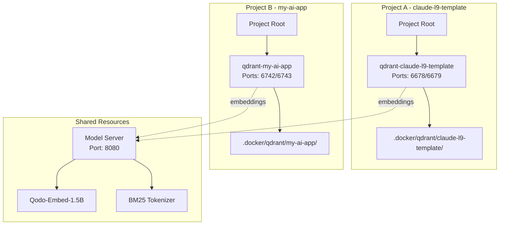

# Multi-Project Isolation Architecture

## Overview

The Neural System supports **complete project isolation** with automatic container management. Each project gets its own dedicated Qdrant container while sharing embedding model resources.

## Key Features

### 🔐 Complete Data Isolation
- **Per-project Qdrant containers**: Each project runs its own Qdrant instance
- **No data mixing**: Collections are completely isolated between projects
- **Project-specific volumes**: Data persists in `.docker/qdrant/{project_name}/` folders

### 🔌 Automatic Port Allocation
- **Deterministic port assignment**: Ports calculated from project path hash
- **No conflicts**: Each project gets unique REST and gRPC ports
- **Port ranges**: 6500-7000 (avoiding common ports and enterprise containers)

### 🏷️ Clean Naming Convention
```
Container: qdrant-{project_name}
Network: neural-network-{project_name}
Storage: .docker/qdrant/{project_name}/storage
Collections: {project_name}_{collection_type}
```

## Architecture



## Unified Docker Compose

All services are managed through a single `docker-compose.unified.yml`:

```yaml
services:
  neural-flow:     # MCP server
  qdrant:         # Vector database
  model-server:   # Future: shared embeddings
  neural-monitor: # Optional monitoring
```

## Port Allocation Algorithm

```python
def calculate_ports(project_path):
    # Create stable hash from project path
    path_hash = md5(project_path).hexdigest()[:8]
    hash_num = int(path_hash[:4], 16)
    
    # Calculate unique offset
    port_offset = (hash_num % 250) * 2
    
    # Assign ports in 6500-7000 range
    rest_port = 6500 + port_offset
    grpc_port = rest_port + 1
    
    return rest_port, grpc_port
```

## Example Configurations

### Project: claude-l9-template
```json
{
  "container_name": "qdrant-claude-l9-template",
  "rest_port": 6678,
  "grpc_port": 6679,
  "storage_path": ".docker/qdrant/claude-l9-template/storage"
}
```

### Project: my-ai-app
```json
{
  "container_name": "qdrant-my-ai-app",
  "rest_port": 6742,
  "grpc_port": 6743,
  "storage_path": ".docker/qdrant/my-ai-app/storage"
}
```

## Usage

### Automatic Detection
The system automatically detects your project context:

```python
from config_manager import get_config

config = get_config()
# Automatically uses project-specific container and ports
```

### Docker Commands

```bash
# Start services (uses .env for configuration)
docker-compose -f docker-compose.unified.yml up -d

# View logs
docker-compose -f docker-compose.unified.yml logs -f qdrant

# Stop services
docker-compose -f docker-compose.unified.yml down
```

### Manual Control
For explicit project management:

```python
from project_isolation import ProjectIsolation

manager = ProjectIsolation()

# Ensure container is running
project = manager.get_project_context()
container_info = manager.ensure_project_container(project)

# List all project containers
projects = manager.list_all_project_containers()
```

## Benefits

1. **Complete Isolation**: No data leakage between projects
2. **Automatic Management**: Containers start on-demand
3. **Resource Efficiency**: Shared model server saves memory
4. **Easy Cleanup**: Remove project container when done
5. **Development Safety**: Can't accidentally affect production
6. **Deterministic**: Same project always gets same ports

## Comparison with Enterprise V3

| Aspect | Enterprise V3 (Production) | Project Development |
|--------|---------------------------|---------------------|
| Container | neural-v36-qdrant | qdrant-{project_name} |
| Ports | 6333/6334 (fixed) | 6500-7000 (dynamic) |
| Data | Production collections | Isolated per project |
| Models | Dedicated | Shared server (planned) |
| Risk | Production critical | Safe to experiment |

## Container Management

### Start Project Container
```bash
# Using unified docker-compose
docker-compose -f docker-compose.unified.yml up -d
```

### List All Containers
```bash
docker ps -a | grep qdrant
```

### Stop Project Container
```bash
docker-compose -f docker-compose.unified.yml down
```

### Clean Up Project Data
```bash
# Stop container
docker-compose -f docker-compose.unified.yml down

# Remove data (optional)
rm -rf .docker/qdrant/{project_name}/
```

## Migration from Old Setup

If you were using the old l9-prefixed containers:

1. **Stop old containers**:
   ```bash
   docker stop l9-qdrant-local
   docker rm l9-qdrant-local
   ```

2. **Move data** (if needed):
   ```bash
   mv qdrant_storage/* .docker/qdrant/{project_name}/storage/
   mv qdrant_snapshots/* .docker/qdrant/{project_name}/snapshots/
   ```

3. **Start new containers**:
   ```bash
   docker-compose -f docker-compose.unified.yml up -d
   ```

## Directory Structure

```
.docker/
├── qdrant/
│   └── {project_name}/
│       ├── storage/      # Vector data
│       └── snapshots/    # Backups
├── models/               # Shared model cache
└── benchmarks/           # Performance data
```

## Environment Variables

Configure via `.env` file:
```env
PROJECT_NAME=claude-l9-template
QDRANT_REST_PORT=6678
QDRANT_GRPC_PORT=6679
```

## Summary

The multi-project isolation architecture ensures:
- **Zero interference** between projects
- **Automatic container management**
- **Clean naming** without "l9" prefixes
- **Unified docker-compose** structure
- **Complete data isolation**
- **Resource efficiency** through shared models

Each project is self-contained and safe to experiment with, while the enterprise neural v3 system remains completely untouched on its dedicated ports (6333/6334).