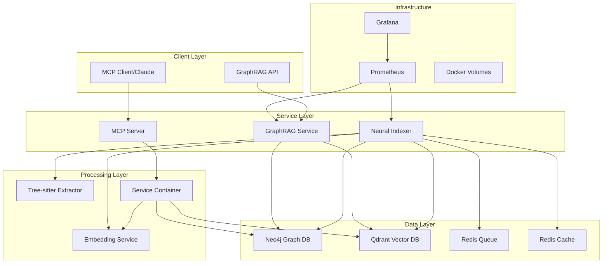

# L9 Neural GraphRAG System Architecture

**Version:** 2.0  
**Last Updated:** 2025-09-09  
**Status:** Production Ready with Tree-sitter Integration  
**Project Root:** `/Users/mkr/local-coding/claude-l9-template/`

## Executive Summary

The L9 Neural GraphRAG system is a sophisticated code intelligence platform that combines graph databases, vector embeddings, and code structure extraction to provide semantic search and code understanding capabilities. The system operates as a distributed microservices architecture with real-time indexing, intelligent caching, and MCP (Model Context Protocol) integration.

## System Overview



## Project File Structure

```
/Users/mkr/local-coding/claude-l9-template/  (Project Root)
├── docker-compose.yml                     # Main orchestration
├── docker-compose.production.yml          # Production config
├── docker/
│   ├── Dockerfile                        # GraphRAG container
│   ├── Dockerfile.indexer                # Indexer container
│   └── scripts/
│       └── indexer-entrypoint.py        # Indexer startup
├── neural-tools/                         # MCP Server Package
│   ├── src/
│   │   └── servers/
│   │       ├── mcp_server.py            # MCP server main
│   │       ├── config/
│   │       │   └── runtime.py           # Runtime config
│   │       └── services/
│   │           ├── indexer_service.py   # Indexer orchestration
│   │           ├── neo4j_service.py     # Graph operations
│   │           ├── qdrant_service.py    # Vector operations
│   │           ├── tree_sitter_extractor.py  # Code parsing
│   │           ├── embedding_service.py # Nomic client
│   │           └── service_container.py # DI container
│   ├── config/
│   │   ├── requirements-indexer-lean.txt
│   │   └── requirements-mcp.txt
│   └── pyproject.toml
├── src/                                  # Main application
│   ├── graphrag/                        # GraphRAG core
│   │   ├── core/
│   │   │   ├── graph_builder.py
│   │   │   ├── embedder.py
│   │   │   ├── indexer.py
│   │   │   ├── retriever.py
│   │   │   └── query_engine.py
│   │   ├── models/
│   │   │   ├── document.py
│   │   │   └── graph.py
│   │   ├── services/
│   │   │   ├── neo4j_client.py
│   │   │   ├── qdrant_client.py
│   │   │   └── llm_client.py
│   │   └── utils/
│   │       ├── config.py
│   │       ├── logger.py
│   │       └── metrics.py
│   └── mcp/                            # MCP integration
│       ├── __init__.py
│       ├── tools.py
│       └── handlers.py
├── docs/
│   └── adr/                            # Architecture decisions
│       ├── 0010-redis-resilience-architecture.md
│       ├── 0011-semantic-search-enablement-qdrant-nomic-extraction.md
│       ├── 0012-extended-language-support-tree-sitter.md
│       ├── 0013-semantic-code-search-implementation.md
│       ├── 0014-incremental-indexing-optimization.md
│       └── 0015-mcp-server-enhanced-tools.md
├── test_*.py                           # Test files (multiple)
├── monitoring/
│   ├── prometheus.yml
│   └── grafana/dashboards/
├── .mcp.json                           # MCP configuration
├── CLAUDE.md                           # Claude instructions
├── ARCHITECTURE.md                     # This file
├── ECOSYSTEM_FILE_INDEX.md             # Complete file index
└── README.md                           # Main documentation
```

## Core Components

### 1. Neural Indexer Sidecar
**Purpose:** Real-time code monitoring and intelligent indexing

**Key Features:**
- File system monitoring with debouncing
- Tree-sitter code structure extraction
- Incremental indexing with hash-based change detection
- Batch processing with timeout protection
- Symbol extraction for Python, JavaScript, TypeScript

**Architecture:**
```
/workspace (monitored) → Watchdog → Debouncer → Processing Queue
                                                          ↓
Tree-sitter ← Symbol Extraction ← File Processor ← Batch Handler
     ↓
Neo4j (relationships) + Qdrant (vectors) + Redis (cache)
```

**Configuration:**
- Batch size: 10 files
- Debounce interval: 2.0 seconds
- Max queue size: 1000 items
- Embed dimension: 768 (Nomic)

### 2. MCP Server
**Purpose:** Provides neural search capabilities via Model Context Protocol

**Tools Available:**
1. `neural_search` - Semantic code search
2. `graph_query` - Neo4j graph queries
3. `find_similar` - Vector similarity search
4. `search_symbols` - Symbol-specific search (proposed)
5. `find_definition` - Jump to definition (proposed)
6. `find_references` - Find all references (proposed)

**Integration:**
```python
ServiceContainer (DI) → {
    Neo4jService: Graph operations
    QdrantService: Vector operations
    EmbeddingService: Nomic embeddings
    TreeSitterExtractor: Code parsing
}
```

### 3. GraphRAG Core
**Purpose:** Graph-based retrieval augmented generation

**Components:**
- Graph Builder: Constructs knowledge graphs
- Query Engine: Processes complex queries
- Retriever: Multi-hop graph traversal
- Embedder: Document vectorization

**Data Flow:**
```
Document → Chunking → Embedding → Graph Construction
                                          ↓
                      Neo4j Storage + Qdrant Indexing
                                          ↓
                      Query → Retrieval → Response
```

### 4. Tree-sitter Extractor
**Purpose:** Language-agnostic code structure extraction

**Supported Languages:**
- Python (.py) - Classes, methods, functions, docstrings
- JavaScript (.js, .jsx) - Classes, functions, arrow functions
- TypeScript (.ts, .tsx) - Interfaces, type aliases, generics

**Extraction Pipeline:**
```python
File Content → Parser Selection → AST Generation → Symbol Extraction
                                                           ↓
                                    Symbol Nodes {
                                        type: class|function|method|interface
                                        name: identifier
                                        qualified_name: full path
                                        line_range: [start, end]
                                        docstring: documentation
                                        parameters: argument list
                                    }
```

## Data Architecture

### Neo4j Graph Schema
```cypher
// Nodes
(:File {path, name, extension, size, modified})
(:Symbol {name, type, qualified_name, file_path, language})
(:Chunk {content, embedding_id, file_path, chunk_index})
(:Entity {name, type, description})

// Relationships
(:File)-[:CONTAINS]->(:Symbol)
(:Symbol)-[:IMPORTS]->(:Symbol)
(:Symbol)-[:DEPENDS_ON]->(:Symbol)
(:Symbol)-[:PARENT_CLASS]->(:Symbol)
(:Chunk)-[:PART_OF]->(:File)
(:Entity)-[:MENTIONED_IN]->(:Chunk)
```

### Qdrant Vector Collections
```yaml
Collections:
  neural_index:
    vectors:
      size: 768  # Nomic embedding dimension
      distance: Cosine
    payload:
      - file_path: string
      - content: text
      - symbol_name: string (optional)
      - symbol_type: string (optional)
      - language: string
      - line_range: [int, int]
      - timestamp: datetime
    
  symbol_embeddings:
    vectors:
      size: 768
      distance: Cosine
    payload:
      - symbol_id: string
      - qualified_name: string
      - docstring: text
      - signature: string
```

### Redis Architecture
**Dual-Instance Design (ADR-0010)**

```yaml
Redis Queue (Port 46380):
  Purpose: Durable job processing
  Configuration:
    - No eviction policy
    - AOF persistence
    - Save every 60 seconds
    - Password protected
  
Redis Cache (Port 46379):
  Purpose: Performance optimization
  Configuration:
    - LRU eviction (512MB max)
    - Periodic saves (300s)
    - Password protected

Data Structures:
  Queues:
    - indexing:queue (file processing)
    - indexing:failed (retry queue)
  
  Caches:
    - symbols:{file_path} (TTL: 1 hour)
    - embeddings:{content_hash} (TTL: 30 min)
    - file_hashes:{path} (TTL: 24 hours)
```

## Service Communication

### Internal Network
- **Network Name:** `l9-graphrag-network`
- **DNS Resolution:** Service names (neo4j, qdrant, redis-queue, etc.)
- **Protocol:** TCP/HTTP/gRPC

### Port Mapping
```yaml
External → Internal:
  43000 → 3000  # GraphRAG API
  47474 → 7474  # Neo4j Browser
  47687 → 7687  # Neo4j Bolt
  46333 → 6333  # Qdrant HTTP
  46334 → 6334  # Qdrant gRPC
  46379 → 6379  # Redis Cache
  46380 → 6379  # Redis Queue
  48000 → 8000  # Embeddings
  48080 → 8080  # Indexer Health
  49090 → 9090  # Prometheus
  43001 → 3000  # Grafana
```

## Processing Pipelines

### 1. File Indexing Pipeline
```
File Change Event
    ↓
Debounce (2s)
    ↓
Hash Check (skip if unchanged)
    ↓
Tree-sitter Extraction
    ↓
Parallel Processing:
    ├─→ Symbol Extraction → Neo4j Storage
    ├─→ Content Chunking → Embedding Generation → Qdrant Storage
    └─→ Cache Update → Redis Storage
```

### 2. Search Pipeline
```
Search Query
    ↓
Query Embedding (Nomic)
    ↓
Parallel Search:
    ├─→ Vector Search (Qdrant)
    ├─→ Graph Search (Neo4j)
    └─→ Cache Check (Redis)
    ↓
Result Fusion & Ranking
    ↓
Context Enrichment
    ↓
Response
```

### 3. Symbol Resolution Pipeline
```
Symbol Query
    ↓
Cache Check (Redis)
    ↓ (miss)
Neo4j Symbol Query
    ↓
Relationship Traversal
    ↓
Context Assembly
    ↓
Cache Update
    ↓
Response
```

## Deployment Architecture

### Docker Compose Services
```yaml
Services Dependency Graph:
  l9-indexer:
    depends_on: [neo4j, qdrant, redis-queue, redis-cache, embeddings]
  
  l9-graphrag:
    depends_on: [neo4j, qdrant]
  
  embeddings:
    standalone: true
  
  neo4j, qdrant, redis-*:
    standalone: true
```

### Resource Allocation
```yaml
l9-indexer:
  memory: 2G limit / 512M reserved
  cpu: 1.0 limit / 0.5 reserved
  
embeddings:
  memory: 4G recommended
  gpu: optional (CPU fallback)
  
neo4j:
  memory: 4G recommended
  heap: 2G
  
qdrant:
  memory: 2G recommended
```

### Volume Persistence
```
/app/state        → indexer_state   (index metadata)
/app/logs         → indexer_logs    (application logs)
/data             → neo4j_data      (graph storage)
/qdrant/storage   → qdrant_data     (vector storage)
/data             → redis_*_data    (cache/queue persistence)
```

## Security Architecture

### Container Security
- Non-root user execution (1000:1000)
- Read-only root filesystem (where applicable)
- No new privileges flag
- tmpfs for temporary files

### Network Security
- Internal network isolation
- Service-to-service authentication
- Redis password protection
- Neo4j authentication enabled

### Data Security
- Persistent volume encryption (host-level)
- No secrets in environment variables
- Configuration via mounted files

## Monitoring & Observability

### Metrics Collection
```
Prometheus (49091) → Scrape Targets:
  - l9-indexer:8080/metrics
  - l9-graphrag:9090/metrics
  - neo4j:7474/metrics
  - qdrant:6333/metrics
```

### Key Metrics
```yaml
Indexer Metrics:
  - files_processed_total
  - symbols_extracted_total
  - indexing_duration_seconds
  - cache_hit_rate
  - queue_depth

GraphRAG Metrics:
  - query_latency_seconds
  - retrieval_accuracy
  - graph_traversal_depth
  - embedding_generation_time

System Metrics:
  - container_memory_usage
  - container_cpu_usage
  - volume_usage_bytes
  - network_io_bytes
```

### Grafana Dashboards
1. System Overview - Resource utilization
2. Indexing Performance - Processing rates
3. Search Analytics - Query patterns
4. Error Tracking - Failure analysis

## Performance Characteristics

### Indexing Performance
- File processing: 10-50 files/second
- Symbol extraction: ~100ms per file
- Embedding generation: ~50ms per chunk
- Neo4j writes: ~1000 nodes/second
- Qdrant inserts: ~500 vectors/second

### Search Performance
- Vector search: <100ms (p95)
- Graph traversal: <200ms (2-hop)
- Symbol resolution: <50ms (cached)
- Full-text search: <150ms

### Scalability Limits
- Files monitored: ~100,000
- Symbols indexed: ~1,000,000
- Vectors stored: ~10,000,000
- Concurrent queries: ~100

## Development Workflow

### Local Development
```bash
# Start all services
docker-compose up -d

# Watch logs
docker-compose logs -f l9-indexer

# Run tests
python test_phase3_integration.py

# Access services
- Neo4j Browser: http://localhost:47474
- Qdrant Dashboard: http://localhost:46333/dashboard
- Grafana: http://localhost:43001
```

### Adding New Features
1. Modify existing services (don't create new ones)
2. Update docker-compose.yml if needed
3. Test with integration suite
4. Update documentation
5. Create ADR for significant changes

## Future Enhancements (Planned)

### Phase 1: Extended Language Support (ADR-0012)
- Add Go, Rust, Java, C/C++, Ruby, Swift
- Enhance symbol type mappings
- Language-specific extractors

### Phase 2: Semantic Code Search (ADR-0013)
- Symbol-aware search
- Context enrichment
- Relationship-based ranking

### Phase 3: Incremental Indexing (ADR-0014)
- Hash-based change detection
- Symbol-level diffing
- Dependency tracking

### Phase 4: Enhanced MCP Tools (ADR-0015)
- find_definition tool
- find_references tool
- get_dependencies tool
- suggest_code tool
- analyze_refactoring tool

## Troubleshooting

### Common Issues

1. **Indexer in Degraded Mode**
   - Check Qdrant connectivity
   - Verify embedding service health
   - Review container logs

2. **High Memory Usage**
   - Adjust batch sizes
   - Increase debounce interval
   - Clear Redis cache

3. **Slow Indexing**
   - Check file system permissions
   - Verify network connectivity
   - Monitor CPU usage

### Health Checks
```bash
# Check service health
curl http://localhost:48080/health  # Indexer
curl http://localhost:48000/health  # Embeddings
curl http://localhost:46333/health  # Qdrant

# Verify Neo4j
echo "RETURN 1" | cypher-shell -u neo4j -p graphrag-password

# Test Redis
redis-cli -p 46379 -a cache-secret-key ping
redis-cli -p 46380 -a queue-secret-key ping
```

## References

- [MCP Specification](https://modelcontextprotocol.io/)
- [Tree-sitter Documentation](https://tree-sitter.github.io/)
- [Neo4j Graph Database](https://neo4j.com/docs/)
- [Qdrant Vector Database](https://qdrant.tech/documentation/)
- [Docker Compose Reference](https://docs.docker.com/compose/)

---

**Architecture Version:** 2.0  
**Tree-sitter Integration:** Enabled  
**Production Ready:** Yes  
**Last Validated:** 2025-09-09