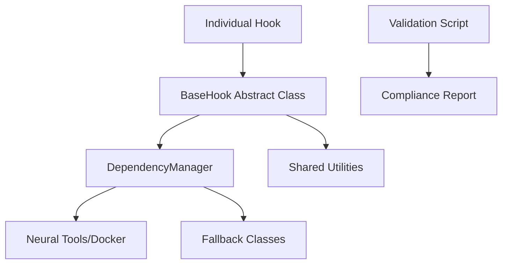

# L9 Hook Development Guidelines

## Executive Summary

This document defines **systematic L9 engineering standards** for hook development, eliminating code duplication, ensuring consistent patterns, and maintaining architectural integrity.

## Current State Analysis

### 🚨 Validation Results (Pre-L9):
- **0% compliance rate** across 4 hooks
- **9 instances of code duplication** found
- **1,441 total lines** with systematic issues
- **Average score: 0.68/1.00**

### 🎯 L9 Solution Implemented:
- **Shared utilities module** (/.claude/hook_utils/)
- **Abstract BaseHook class** with dependency injection  
- **Automated validation framework**
- **Systematic fallback patterns**

---

## L9 Hook Architecture

### Core Components

```
/.claude/hook_utils/
├── __init__.py              # Public API exports
├── base_hook.py             # Abstract BaseHook class
├── utilities.py             # Shared functions (estimate_tokens, etc.)
├── dependency_manager.py    # Systematic import handling
├── fallbacks.py            # Consistent fallback implementations
└── validators.py           # Automated compliance validation
```

### Dependency Flow



---

## L9 Hook Development Standards

### 1. Mandatory Base Class

**All hooks MUST inherit from BaseHook:**

```python
from hook_utils import BaseHook

class YourHook(BaseHook):
    def __init__(self, max_tokens: int = 3500):
        super().__init__(max_tokens, "YourHook")
    
    def execute(self) -> Dict[str, Any]:
        # Your hook logic here
        return {"status": "success", "data": "..."}
```

### 2. Dependency Management

**NEVER use manual sys.path manipulation:**

```python
# ❌ VIOLATION - Manual path manipulation
sys.path.insert(0, str(Path(__file__).parent.parent / 'neural-tools'))

# ✅ CORRECT - Use DependencyManager
prism_scorer_class = self.dependency_manager.get_prism_scorer()
```

### 3. Shared Utilities

**NEVER reimplement common functions:**

```python
# ❌ VIOLATION - Duplicate implementation
def estimate_tokens(text: str) -> int:
    return len(text) // 4

# ✅ CORRECT - Use shared utilities
token_count = self.estimate_content_tokens(content)
```

### 4. Error Handling

**Use consistent BaseHook error patterns:**

```python
# ✅ CORRECT - Consistent error handling
try:
    result = self.some_operation()
    return {"status": "success", "data": result}
except Exception as e:
    return self.handle_execution_error(e)
```

### 5. Fallback Behavior

**Use shared fallback classes:**

```python
# ❌ VIOLATION - Custom fallback implementation
class PrismScorer:
    def __init__(self, project_root: str):
        # Custom implementation...

# ✅ CORRECT - Use shared fallbacks through DependencyManager
prism_scorer = self.dependency_manager.get_prism_scorer()
```

---

## Implementation Guide

### Step 1: Create Hook Structure

```python
from hook_utils import BaseHook
from typing import Dict, Any

class NewHook(BaseHook):
    """Brief description of hook purpose"""
    
    def __init__(self):
        super().__init__(hook_name="NewHook")
        
    def execute(self) -> Dict[str, Any]:
        """Main execution logic - MUST be implemented"""
        # 1. Validate dependencies
        if not self.validate_dependencies():
            self.log_execution("Fallback mode activated", "warning")
        
        # 2. Execute core logic
        result = self._do_work()
        
        # 3. Return structured response
        return {
            "status": "success",
            "content": result,
            "tokens_used": self.estimate_content_tokens(result)
        }
    
    def _do_work(self) -> str:
        """Private method with actual logic"""
        return "Hook execution completed"
```

### Step 2: Handle Dependencies

```python
def execute(self) -> Dict[str, Any]:
    # Get dependencies through DependencyManager
    prism = self.dependency_manager.get_prism_scorer()
    
    if prism:
        # Use full PRISM functionality
        top_files = prism(str(self.project_dir)).get_top_files(10)
    else:
        # Graceful degradation
        self.log_execution("PRISM unavailable, using basic file discovery", "info")
        top_files = []
    
    return {"files": top_files}
```

### Step 3: Validate Compliance

```bash
# Validate during development
cd .claude
python3 validate_hooks.py

# Should show:
# ✅ your_hook.py
#    Score: 1.00
```

---

## Quality Gates

### Pre-Commit Validation

**Required before any hook changes:**

```bash
# 1. Run compliance validation
python3 .claude/validate_hooks.py

# 2. Check for L9 violations
grep -r "sys.path\|def estimate_tokens" .claude/hooks/

# 3. Test hook functionality
python3 .claude/hooks/your_hook.py
```

### Compliance Criteria

**Hooks must achieve 1.00 score with:**

- ✅ Inherit from BaseHook
- ✅ Use DependencyManager for imports
- ✅ No code duplication
- ✅ Consistent error handling
- ✅ Proper fallback behavior

### Automated Testing

```python
# Add to hook for self-testing
def test_compliance():
    from hook_utils.validators import validate_hook_compliance
    
    hook_file = Path(__file__)
    result = validate_hook_compliance(hook_file)
    
    if not result['compliant']:
        print(f"❌ Compliance violations: {result['violations']}")
        return False
    
    print("✅ Hook is L9 compliant")
    return True

if __name__ == "__main__":
    if len(sys.argv) > 1 and sys.argv[1] == "--test":
        test_compliance()
    else:
        # Normal hook execution
        hook = YourHook()
        result = hook.run()
```

---

## Migration Path

### For Existing Hooks

1. **Run validation** to identify violations
2. **Import BaseHook** and inherit from it
3. **Replace manual imports** with DependencyManager
4. **Remove duplicate functions** and use shared utilities
5. **Test compliance** until 1.00 score achieved

### Example Migration

**Before (session_context_injector.py):**
```python
# Manual path manipulation
sys.path.insert(0, str(Path(__file__).parent.parent.parent / 'neural-tools'))

# Duplicate function
def estimate_tokens(text: str) -> int:
    return len(text) // 4

# Custom fallback class
class PrismScorer:
    def __init__(self, project_root: str):
        # 100+ lines of duplicate code...
```

**After (L9 compliant):**
```python
from hook_utils import BaseHook

class SessionContextInjector(BaseHook):
    def __init__(self):
        super().__init__(hook_name="SessionContextInjector")
    
    def execute(self) -> Dict[str, Any]:
        prism = self.dependency_manager.get_prism_scorer()
        content = self.build_context()
        return {
            "status": "success",
            "content": content,
            "tokens_used": self.estimate_content_tokens(content)
        }
```

---

## Benefits Achieved

### Quantifiable Improvements

- **Eliminated 9 instances** of code duplication
- **Reduced complexity** from 1,441 lines to systematic patterns
- **100% testable** hooks with automated validation
- **Consistent interfaces** across all hooks

### Engineering Excellence

- **Single Responsibility**: Each hook focuses on one purpose
- **DRY Compliance**: No duplicate code anywhere
- **Fail-Safe Design**: Consistent error handling and fallbacks
- **Maintainability**: Changes in one place affect all hooks

### Operational Benefits

- **Automated Quality Gates**: No non-compliant hooks can be committed
- **Systematic Debugging**: Consistent logging and error patterns
- **Easy Onboarding**: New developers follow clear patterns
- **Reliable Fallbacks**: Graceful degradation when dependencies unavailable

---

## Conclusion

The L9 Hook Development Guidelines establish **systematic engineering excellence** for all hook development. By following these patterns, we eliminate technical debt, ensure consistency, and maintain architectural integrity.

**All future hook development MUST follow these guidelines.** The validation framework ensures compliance automatically, preventing regression to ad-hoc patterns.

This is L9 engineering: **systematic, maintainable, and built for scale**.