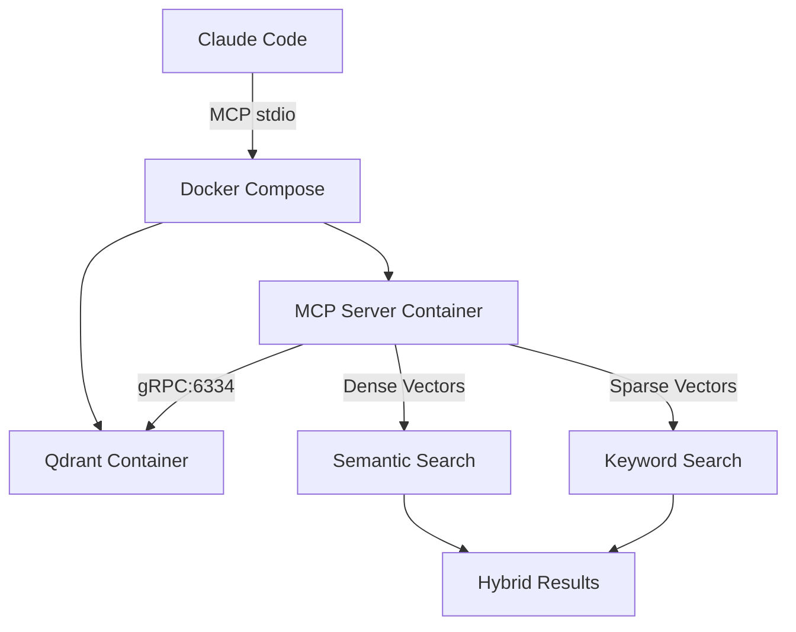

# L9 Neural MCP Server - Docker Architecture

## Overview

The L9 Neural MCP Server is a production-grade Model Context Protocol server that runs entirely in Docker, providing hybrid search capabilities through Qdrant vector database.

## Architecture



## Key Features

### 1. Hybrid Search
- **Semantic Search**: Using BAAI/bge-base-en-v1.5 embeddings (768-dim dense vectors)
- **Keyword Search**: Using Qdrant/bm25 sparse embeddings (BM25-like scoring)
- **Hybrid Mode**: Combines both for optimal results

### 2. Project Isolation
- Each project gets its own Qdrant collections
- Collections prefixed with `project_{name}_`
- Complete data isolation between projects

### 3. MCP Tools Available

| Tool | Description |
|------|-------------|
| `memory_store` | Store content with hybrid indexing |
| `memory_search` | Search using semantic/keyword/hybrid |
| `code_index` | Index code files for search |
| `collection_stats` | Get statistics |
| `collection_clear` | Clear a collection |

## Setup Instructions

### 1. Initial Setup

```bash
# Run the setup script
./scripts/setup-mcp-docker.sh [project-name]

# Or manually:
docker build -f docker/Dockerfile.mcp -t l9-mcp-server:latest .
docker compose -f docker/docker-compose.mcp.yml up -d
```

### 2. Claude Code Configuration

The `.mcp.json` file is already configured:

```json
{
  "mcpServers": {
    "l9-neural": {
      "command": "docker",
      "args": [
        "compose",
        "-f", "docker/docker-compose.mcp.yml",
        "run",
        "--rm",
        "-T",
        "mcp-server"
      ]
    }
  }
}
```

### 3. Using the MCP Server

In Claude Code, you can now use:

```
# Store information
Use the memory_store tool to save: "The authentication system uses JWT tokens with 24-hour expiry"

# Search memory
Use memory_search to find: "authentication token expiry"

# Index code
Use code_index to index the src/ directory

# Search code
Use memory_search with category "code" to find: "JWT implementation"
```

## Migration from Host-Side MCP

### What Changed

1. **Removed**: All host-side MCP Python scripts
2. **Removed**: ChromaDB dependency (using Qdrant instead)
3. **Added**: Docker-based MCP server with Qdrant
4. **Added**: Hybrid search (semantic + keyword)

### Deprecated Components

Moved to `.deprecated/host-mcp-2025-08-29/`:
- `.claude/mcp-tools-deprecated/`
- `core/neural-memory-mcp.py`
- Host-side MCP server files

### Data Migration

If you have existing ChromaDB data:

1. Export from ChromaDB:
```python
# Old system
import chromadb
client = chromadb.PersistentClient(path="./.claude/chroma")
collection = client.get_collection("memory")
data = collection.get()
```

2. Import to new system:
```python
# Use memory_store tool for each item
for i, content in enumerate(data['documents']):
    metadata = data['metadatas'][i] if data['metadatas'] else {}
    # Use memory_store MCP tool
```

## Performance Optimization

### Qdrant Configuration

The system uses:
- **gRPC connection** (3-4x faster than REST)
- **Hybrid indexing** with HNSW for dense vectors
- **IDF-modified sparse vectors** for keyword search
- **Memory-mapped storage** for large collections

### Resource Limits

```yaml
MCP Server:
  Memory: 2GB limit / 1GB reserved
  CPU: 2.0 limit / 1.0 reserved

Qdrant:
  Memory: 2GB limit / 1GB reserved  
  CPU: 1.5 limit / 0.5 reserved
```

## Troubleshooting

### Check Service Status

```bash
docker compose -f docker/docker-compose.mcp.yml ps
docker compose -f docker/docker-compose.mcp.yml logs mcp-server
docker compose -f docker/docker-compose.mcp.yml logs qdrant
```

### Test Connection

```bash
# Test MCP server
docker compose -f docker/docker-compose.mcp.yml run --rm mcp-server python3 -c "print('MCP OK')"

# Test Qdrant
curl http://localhost:6680/health
```

### Common Issues

1. **Port conflicts**: Change `QDRANT_DEBUG_PORT` if 6680 is in use
2. **Memory issues**: Increase Docker memory limits
3. **Permission errors**: Ensure directories are writable

## Advanced Usage

### Custom Embeddings

To use different embedding models, modify `neural-mcp-server.py`:

```python
# Change models
dense_model = TextEmbedding(model_name="your-model")
sparse_model = SparseTextEmbedding(model_name="your-sparse-model")
```

### Extending Tools

Add new tools in `neural-mcp-server.py`:

```python
@mcp.tool()
async def your_custom_tool(param: str) -> Dict[str, Any]:
    """Your tool description"""
    # Implementation
    return result
```

## Architecture Decision Records

### Why Qdrant over ChromaDB?

1. **Native hybrid search** - Built-in sparse+dense vectors
2. **Better performance** - gRPC support, optimized indexing
3. **Production ready** - Better stability and scaling
4. **Docker-first** - Designed for containerization

### Why Not External Tools?

Evaluated alternatives:
- **Marqo**: Adds complexity, we already have embeddings
- **Weaviate**: Similar to Qdrant but more complex
- **Meilisearch**: No vector support
- **Typesense**: Limited vector capabilities

Qdrant provides everything needed without additional dependencies.

## Next Steps

1. **Add authentication** for multi-user scenarios
2. **Implement caching** for frequently accessed data
3. **Add monitoring** with Prometheus/Grafana
4. **Scale horizontally** with Qdrant cluster mode