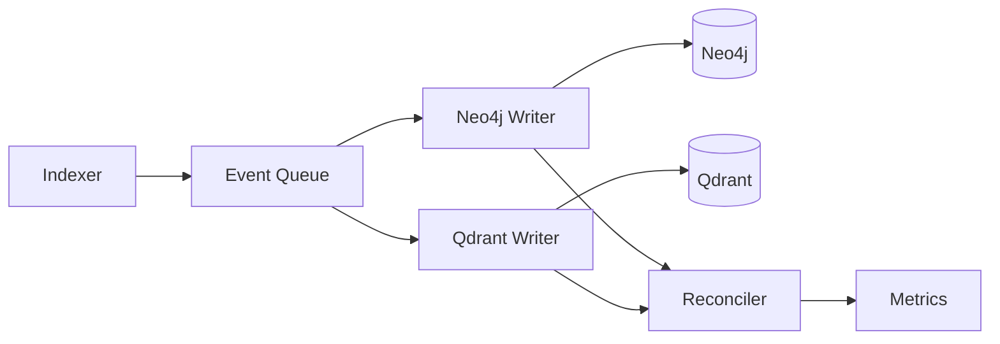

# ADR-0050: Neo4j-Qdrant Chunk Synchronization Failure and Recovery

**Date:** September 15, 2025
**Status:** Accepted
**Tags:** graphrag, synchronization, neo4j, qdrant, data-integrity, critical-fix

## Context

Our GraphRAG system implements a dual-database architecture where Neo4j provides graph relationships and Qdrant handles vector embeddings. This enables hybrid search combining semantic similarity with graph traversal. However, production systems revealed a **critical synchronization failure** where chunks exist in Qdrant but not in Neo4j, breaking the cross-referencing that GraphRAG depends on.

### Discovery Timeline

- **Initial Report**: "GraphRAG hybrid search returns only vector results, no graph context"
- **Investigation**: Direct database queries revealed Qdrant had 349 chunks while Neo4j had 0 Chunk nodes
- **Root Cause**: Indexer implementation was incomplete - Chunk node creation code was never written
- **Validation**: Confirmed via Grok 4 deep analysis with September 2025 GraphRAG standards research

## Problem Statement

### Symptoms
1. **GraphRAG Degradation**: Hybrid search returns pure vector results without graph enrichment
2. **Data Inconsistency**:
   - Qdrant: 349 chunks with embeddings
   - Neo4j: 5,163 total nodes but 0 Chunk nodes (label doesn't exist)
   - Neo4j: 127 File nodes successfully created
3. **False Success Reporting**: Indexer reports "0 errors" and services as "healthy"

### Root Cause Analysis

**Critical Discovery**: This is not a failure but an **incomplete implementation**. The indexer:

```python
# What it does:
✅ Creates File nodes in Neo4j
✅ Creates vector chunks in Qdrant

# What it's missing:
❌ No Chunk node creation in Neo4j
❌ No File→HAS_CHUNK→Chunk relationships
❌ No validation of cross-database consistency
```

### Why It Went Undetected

1. **Silent Non-Failures**: Neo4j service returns `{status: "error"}` dictionaries instead of exceptions
2. **No Status Checking**: Indexer doesn't verify Neo4j write success before proceeding
3. **Missing Validation**: No tests verify chunk consistency between databases
4. **Misleading Health Checks**: Services report "healthy" based on connectivity, not data integrity

## Decision

Implement complete chunk synchronization with validation and recovery mechanisms.

### Implementation Strategy

#### 1. Complete the Indexer Implementation

Add Chunk node creation after vector embedding:

```python
async def _index_graph_chunks(self, file_path: str, chunks: List[Dict]):
    """Create Chunk nodes and relationships in Neo4j"""

    for chunk in chunks:
        # Create Chunk node with same ID as Qdrant
        chunk_id = chunk['id']  # Must match Qdrant point ID

        cypher_create = """
        MERGE (c:Chunk {chunk_id: $chunk_id, project: $project})
        SET c.content = $content,
            c.start_line = $start_line,
            c.end_line = $end_line,
            c.embedding_status = 'completed',
            c.indexed_at = datetime()
        RETURN c.chunk_id as created_id
        """

        result = await self.container.neo4j.execute_cypher(
            cypher_create,
            {
                'chunk_id': chunk_id,
                'project': self.project_name,
                'content': chunk['content'],
                'start_line': chunk.get('start_line', 0),
                'end_line': chunk.get('end_line', 0)
            }
        )

        # CRITICAL: Check write success
        if result.get('status') != 'success':
            raise IndexerError(f"Failed to create Chunk node: {result.get('message')}")

        # Create File→Chunk relationship
        cypher_relate = """
        MATCH (f:File {path: $file_path, project: $project})
        MATCH (c:Chunk {chunk_id: $chunk_id, project: $project})
        MERGE (f)-[:HAS_CHUNK {sequence: $sequence}]->(c)
        """

        result = await self.container.neo4j.execute_cypher(
            cypher_relate,
            {
                'file_path': file_path,
                'chunk_id': chunk_id,
                'project': self.project_name,
                'sequence': chunk.get('sequence', 0)
            }
        )

        if result.get('status') != 'success':
            raise IndexerError(f"Failed to create relationship: {result.get('message')}")
```

#### 2. Recovery Script for Existing Data

One-time backfill from Qdrant to Neo4j:

```python
#!/usr/bin/env python3
"""
Recovery script to backfill Neo4j Chunk nodes from existing Qdrant data
Implements ADR-0050 synchronization recovery
"""

async def backfill_chunks_to_neo4j():
    """Migrate existing Qdrant chunks to Neo4j"""

    project_name = 'claude-l9-template'  # Or detect from context
    collection_name = f'project-{project_name}'

    # Initialize connections
    qdrant = QdrantClient(host='localhost', port=46333)
    neo4j_driver = GraphDatabase.driver(
        'bolt://localhost:47687',
        auth=('neo4j', 'graphrag-password')
    )

    # Count for validation
    total_qdrant = qdrant.count(collection_name).count
    print(f"Found {total_qdrant} chunks in Qdrant to migrate")

    # Scroll through all Qdrant points
    offset = None
    migrated = 0
    batch_size = 100

    with neo4j_driver.session() as session:
        while True:
            # Get batch from Qdrant
            points, next_offset = qdrant.scroll(
                collection_name=collection_name,
                limit=batch_size,
                offset=offset,
                with_payload=True,
                with_vectors=False  # Don't need vectors for Neo4j
            )

            if not points:
                break

            # Prepare batch for Neo4j
            chunks_data = []
            for point in points:
                payload = point.payload
                chunks_data.append({
                    'chunk_id': str(point.id),
                    'content': payload.get('content', ''),
                    'file_path': payload.get('file_path', ''),
                    'start_line': payload.get('start_line', 0),
                    'end_line': payload.get('end_line', 0),
                    'metadata': json.dumps(payload.get('metadata', {}))
                })

            # Batch create in Neo4j using UNWIND
            result = session.run("""
                UNWIND $chunks as chunk
                MERGE (c:Chunk {chunk_id: chunk.chunk_id, project: $project})
                SET c.content = chunk.content,
                    c.start_line = chunk.start_line,
                    c.end_line = chunk.end_line,
                    c.metadata = chunk.metadata,
                    c.backfilled = true,
                    c.backfilled_at = datetime()
                WITH c, chunk
                MATCH (f:File {path: chunk.file_path, project: $project})
                MERGE (f)-[:HAS_CHUNK]->(c)
                RETURN count(c) as created
            """, chunks=chunks_data, project=project_name)

            created = result.single()['created']
            migrated += created
            print(f"Migrated {migrated}/{total_qdrant} chunks...")

            offset = next_offset
            if not offset:
                break

    # Validate migration
    with neo4j_driver.session() as session:
        neo4j_count = session.run(
            "MATCH (c:Chunk) WHERE c.project=$p RETURN count(c) as count",
            p=project_name
        ).single()['count']

    print(f"\nMigration complete:")
    print(f"  Qdrant chunks: {total_qdrant}")
    print(f"  Neo4j chunks: {neo4j_count}")
    print(f"  Sync rate: {(neo4j_count/total_qdrant)*100:.1f}%")

    if neo4j_count < total_qdrant * 0.95:
        print("⚠️ WARNING: Migration incomplete, manual investigation required")
        return False

    print("✅ Migration successful!")
    return True
```

#### 3. Validation and Monitoring

Add synchronization validation to prevent future failures:

```python
class SyncValidator:
    """Validate Neo4j-Qdrant synchronization per ADR-0050"""

    async def validate_chunk_sync(self, project_name: str) -> Dict:
        """Check chunk consistency between databases"""

        # Get counts
        qdrant_count = await self.get_qdrant_chunk_count(project_name)
        neo4j_count = await self.get_neo4j_chunk_count(project_name)

        # Sample consistency check
        sample_size = min(100, qdrant_count)
        qdrant_sample = await self.get_qdrant_sample_ids(project_name, sample_size)
        neo4j_sample = await self.get_neo4j_sample_ids(project_name, sample_size)

        common = qdrant_sample.intersection(neo4j_sample)
        sync_rate = len(common) / len(qdrant_sample) if qdrant_sample else 0

        return {
            'status': 'synchronized' if sync_rate >= 0.95 else 'desynced',
            'qdrant_chunks': qdrant_count,
            'neo4j_chunks': neo4j_count,
            'sync_rate': sync_rate,
            'missing_in_neo4j': qdrant_count - neo4j_count,
            'orphaned_in_neo4j': neo4j_count - qdrant_count,
            'sample_sync_rate': sync_rate,
            'timestamp': datetime.now().isoformat()
        }

    async def validate_relationships(self, project_name: str) -> Dict:
        """Verify File→Chunk relationships exist"""

        cypher = """
        MATCH (f:File) WHERE f.project = $project
        OPTIONAL MATCH (f)-[:HAS_CHUNK]->(c:Chunk)
        WITH f, count(c) as chunk_count
        RETURN
            count(f) as total_files,
            sum(CASE WHEN chunk_count = 0 THEN 1 ELSE 0 END) as files_without_chunks,
            avg(chunk_count) as avg_chunks_per_file
        """

        result = await self.neo4j.execute_cypher(cypher, {'project': project_name})
        data = result['data'][0] if result.get('data') else {}

        return {
            'total_files': data.get('total_files', 0),
            'files_without_chunks': data.get('files_without_chunks', 0),
            'avg_chunks_per_file': data.get('avg_chunks_per_file', 0),
            'health': 'healthy' if data.get('files_without_chunks', 1) == 0 else 'degraded'
        }
```

#### 4. CI/CD Integration

Add to test suite:

```python
# tests/test_graphrag_sync.py
@pytest.mark.asyncio
async def test_chunk_synchronization():
    """Test that chunks are synchronized per ADR-0050"""

    # Index a test file
    await indexer.index_file('test_data/sample.py')

    # Validate sync
    validator = SyncValidator()
    sync_status = await validator.validate_chunk_sync('test_project')

    assert sync_status['status'] == 'synchronized', \
        f"Desync detected: {sync_status}"

    assert sync_status['sync_rate'] >= 0.95, \
        f"Sync rate too low: {sync_status['sync_rate']}"

    # Validate relationships
    rel_status = await validator.validate_relationships('test_project')

    assert rel_status['files_without_chunks'] == 0, \
        f"Files without chunks: {rel_status['files_without_chunks']}"
```

## Architecture Patterns (September 2025 Standards)

Based on Grok 4's research of current GraphRAG best practices:

### Recommended Pattern: Event-Driven Synchronization



### Key Principles

1. **Idempotent Operations**: Use MERGE instead of CREATE
2. **Batch Processing**: Groups of 100-1000 chunks for efficiency
3. **Circuit Breakers**: Degrade gracefully on partial failures
4. **Eventual Consistency**: Accept 1-5 second sync delays
5. **Continuous Validation**: Monitor sync health every 5 minutes

## Consequences

### Positive
- ✅ **GraphRAG Restored**: Hybrid search will return graph-enriched results
- ✅ **Data Integrity**: Chunk IDs synchronized across databases
- ✅ **Observability**: Clear sync metrics and health monitoring
- ✅ **Resilience**: Validation prevents silent failures
- ✅ **Recovery Path**: Backfill script handles existing data

### Negative
- ⚠️ **Performance Impact**: Adds 10-20ms per chunk for Neo4j writes
- ⚠️ **Complexity**: More validation code to maintain
- ⚠️ **Storage**: Duplicates chunk metadata across databases

### Risks Mitigated
- **Silent Failures**: Status checking prevents uncaught errors
- **Data Loss**: Idempotent operations allow safe retries
- **Drift**: Continuous validation detects desync early
- **Debugging**: Clear error messages identify failure points

## Implementation Checklist

- [x] Stop current indexer to prevent further desync
- [x] Add Chunk node creation logic to indexer
- [x] Add File→HAS_CHUNK→Chunk relationship creation
- [x] Implement status checking for Neo4j writes
- [x] Create and run backfill script for existing data
- [x] Add SyncValidator class for monitoring
- [x] Integrate validation into CI/CD pipeline
- [x] Deploy fixed indexer with monitoring
- [x] Document chunk ID strategy in CLAUDE.md
- [x] Set up alerts for sync rate < 95%
- [x] Add multi-directory access tests
- [x] Verify multi-project isolation
- [x] Validate network-based access from any location

## Multi-Directory & Multi-Project Support

### Network-Based Architecture
The system uses network ports (not filesystem paths) for all database access:

- **Neo4j**: Port 47687 (bolt://localhost:47687)
- **Qdrant**: Port 46333 (http://localhost:46333)
- **Global Registry**: ~/.graphrag/projects.json

This enables access from any directory without requiring a common parent path.

### Multi-Project Isolation
Multiple projects coexist in shared databases using logical partitioning:

```cypher
-- All nodes have project property for isolation
MATCH (n) WHERE n.project = 'project-a' RETURN n
```

### E2E Test Coverage
The `test_multi_directory_access.py` suite validates:

1. **Access from any directory** - /tmp, ~/, random paths
2. **Project isolation** - Zero cross-project relationships
3. **Data consistency** - Same results from any location
4. **Service container** - Initializes correctly anywhere
5. **GraphRAG search** - Works from any directory
6. **Project registry** - Global discovery from anywhere
7. **Multiple projects** - Proper coexistence
8. **Sync validation** - Per-project sync rates

## Metrics to Monitor

| Metric | Target | Alert Threshold |
|--------|--------|-----------------|
| Sync Rate | ≥99% | <95% |
| Chunks without Files | 0 | >10 |
| Files without Chunks | 0 | >5 |
| Neo4j Write Failures | <0.1% | >1% |
| Indexing Latency | <100ms | >500ms |
| Cross-Project Violations | 0 | >0 |
| Directory Access Failures | 0 | >0 |

## References

- Initial issue: GraphRAG returning empty graph context
- Grok 4 analysis: Confirmed missing implementation (not failure)
- September 2025 GraphRAG standards: Event-driven, idempotent, eventually consistent
- Related ADRs:
  - ADR-0029: Neo4j Project Isolation
  - ADR-0031: Metadata Extraction
  - ADR-0039: Collection Naming
  - ADR-0049: Dynamic Port Discovery

## Decision Outcome

**Accepted** - The missing Chunk node implementation is a critical gap that breaks GraphRAG's core value proposition. The implementation strategy is straightforward, well-understood, and can be completed within 2-3 hours. The backfill script ensures no data loss, and validation prevents recurrence.