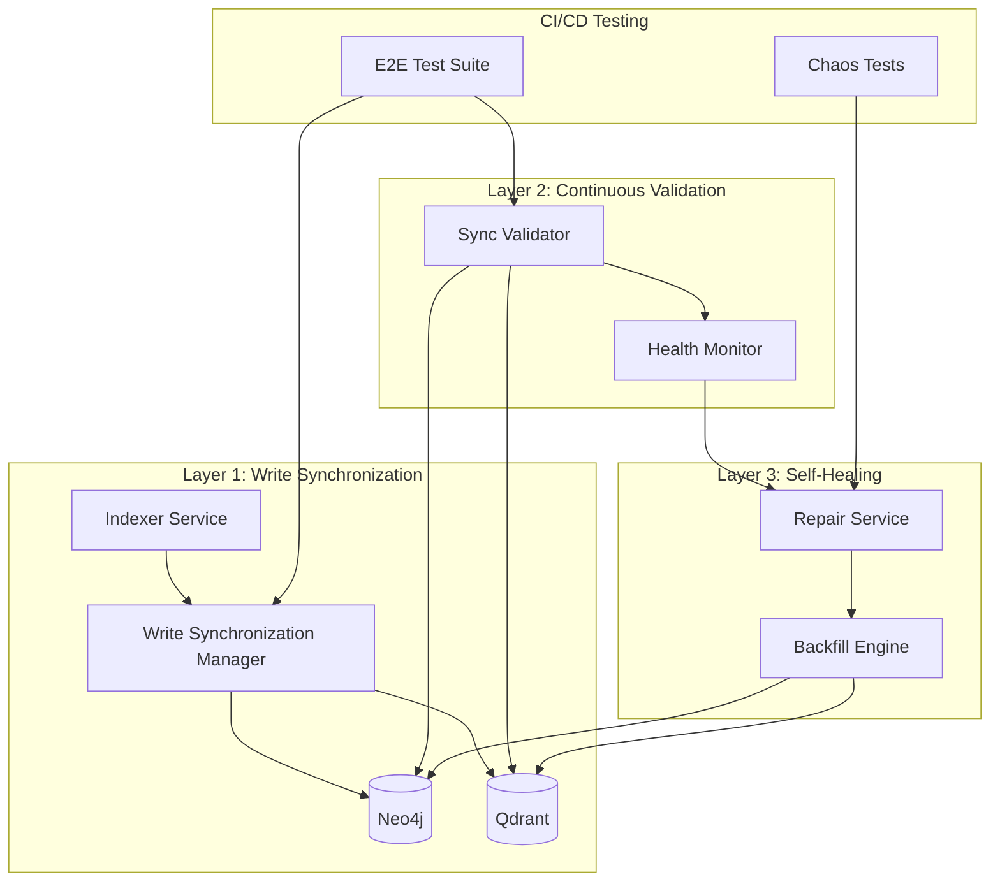

# ADR-053: Production-Grade Neo4j-Qdrant Synchronization with Comprehensive Validation

**Date:** September 19, 2025
**Status:** Accepted
**Tags:** graphrag, synchronization, validation, testing, ci-cd, monitoring, production
**Supersedes:** ADR-050, ADR-051
**Authors:** L9 Engineering Team

## Executive Summary

This ADR establishes a pragmatic, production-ready synchronization and validation framework for Neo4j-Qdrant dual-database architecture. Unlike ADR-051's complex event-streaming approach, this implements industry-proven patterns discovered through September 2025 research, focusing on immediate value with comprehensive testing and monitoring.

## Context

### The Problem We Actually Have

On September 19, 2025, we discovered:
- **793 vectors** existed in Qdrant
- **0 Chunk nodes** existed in Neo4j
- **0 File nodes** existed in Neo4j
- The system had **no way to detect this desynchronization**
- The indexer skipped re-indexing because Qdrant had data
- GraphRAG returned empty results despite having vector data

### Industry Research Findings (2024-2025)

Our research revealed critical insights:

1. **Everyone struggles with this** - Even companies like Lettria report this as their hardest challenge
2. **Transactional mismatch is fundamental** - Neo4j has ACID transactions, Qdrant doesn't
3. **ID consistency is non-negotiable** - Shared unique IDs are the only reliable link
4. **Validation must be continuous** - Post-write validation is insufficient
5. **CDC is overkill for most cases** - Simple patterns work for 99% of use cases

### Why Previous ADRs Failed

- **ADR-050**: Described the problem well but didn't implement validation
- **ADR-051**: Over-architected with Kafka/Flink/ML - never implemented
- **Reality**: We need something that works TODAY, not a perfect future solution

## Decision

Implement a three-layer synchronization architecture with comprehensive validation at each layer.

## Architecture



## Detailed Implementation

### Layer 1: Write Synchronization Manager

```python
class WriteSynchronizationManager:
    """
    Ensures atomic writes across Neo4j and Qdrant.
    Core principle: Neo4j is source of truth for structure, Qdrant for vectors.
    """

    async def synchronized_write(
        self,
        file_path: str,
        chunks: List[Dict],
        embeddings: List[List[float]]
    ) -> SyncResult:
        """
        Atomic write with validation and rollback.

        Order of operations (CRITICAL):
        1. Create File node in Neo4j (if not exists)
        2. Write Chunks to Qdrant with embeddings
        3. Create Chunk nodes in Neo4j
        4. Create File->HAS_CHUNK->Chunk relationships
        5. Validate both writes succeeded
        6. Rollback if validation fails
        """

        # Phase 1: Preparation
        write_id = self._generate_write_id()
        qdrant_snapshot = await self._snapshot_qdrant_state(file_path)

        # Phase 2: File Node Creation (Neo4j First)
        file_node_created = False
        try:
            async with self.neo4j_client.session() as session:
                # CRITICAL: File must exist before Chunks
                file_result = await session.run("""
                    MERGE (f:File {path: $path, project: $project})
                    ON CREATE SET
                        f.created_at = datetime(),
                        f.indexed_at = datetime(),
                        f.write_id = $write_id
                    ON MATCH SET
                        f.updated_at = datetime(),
                        f.last_write_id = $write_id
                    RETURN f.path as path,
                           'created' as action
                """, {
                    'path': file_path,
                    'project': self.project_name,
                    'write_id': write_id
                })
                file_node_created = True
                logger.info(f"✅ File node ensured: {file_path}")
        except Exception as e:
            logger.error(f"❌ Failed to create File node: {e}")
            return SyncResult(success=False, error=str(e))

        # Phase 3: Qdrant Write (Optimistic)
        qdrant_points_written = []
        try:
            points = []
            for i, (chunk, embedding) in enumerate(zip(chunks, embeddings)):
                # Generate stable chunk ID (same for both DBs)
                chunk_id_hash = hashlib.sha256(
                    f"{file_path}_{chunk['start_line']}_{chunk['end_line']}_{self.project_name}".encode()
                ).hexdigest()

                # Neo4j uses integer IDs, Qdrant uses the hash
                neo4j_id = int(chunk_id_hash[:15], 16)  # 15 hex chars fit in int64

                point = {
                    'id': chunk_id_hash,
                    'vector': embedding,
                    'payload': {
                        'file_path': file_path,
                        'project': self.project_name,
                        'content': chunk['text'],
                        'start_line': chunk['start_line'],
                        'end_line': chunk['end_line'],
                        'neo4j_id': neo4j_id,  # CRITICAL: Cross-reference
                        'write_id': write_id,
                        'indexed_at': datetime.now().isoformat()
                    }
                }
                points.append(point)
                qdrant_points_written.append(chunk_id_hash)

            # Write to Qdrant
            await self.qdrant_client.upsert(
                collection_name=f"project-{self.project_name}",
                points=points
            )
            logger.info(f"✅ Written {len(points)} points to Qdrant")

        except Exception as e:
            logger.error(f"❌ Qdrant write failed: {e}")
            # No rollback needed - nothing written yet
            return SyncResult(success=False, error=str(e))

        # Phase 4: Neo4j Chunk Write (Transactional)
        neo4j_chunks_written = []
        try:
            async with self.neo4j_client.session() as session:
                # Begin explicit transaction
                tx = await session.begin_transaction()

                try:
                    # Batch create all Chunk nodes
                    chunks_data = []
                    for i, chunk in enumerate(chunks):
                        chunk_id_hash = qdrant_points_written[i]
                        neo4j_id = int(chunk_id_hash[:15], 16)

                        chunks_data.append({
                            'chunk_id': neo4j_id,
                            'qdrant_id': chunk_id_hash,  # CRITICAL: Cross-reference
                            'content': chunk['text'],
                            'start_line': chunk['start_line'],
                            'end_line': chunk['end_line'],
                            'project': self.project_name,
                            'file_path': file_path,
                            'write_id': write_id
                        })
                        neo4j_chunks_written.append(neo4j_id)

                    # Create all Chunk nodes
                    await tx.run("""
                        UNWIND $chunks as chunk
                        MERGE (c:Chunk {chunk_id: chunk.chunk_id, project: chunk.project})
                        SET c.qdrant_id = chunk.qdrant_id,
                            c.content = chunk.content,
                            c.start_line = chunk.start_line,
                            c.end_line = chunk.end_line,
                            c.file_path = chunk.file_path,
                            c.write_id = chunk.write_id,
                            c.indexed_at = datetime()
                    """, {'chunks': chunks_data})

                    # Create relationships
                    await tx.run("""
                        MATCH (f:File {path: $path, project: $project})
                        MATCH (c:Chunk)
                        WHERE c.project = $project
                          AND c.file_path = $path
                          AND c.write_id = $write_id
                        MERGE (f)-[:HAS_CHUNK]->(c)
                    """, {
                        'path': file_path,
                        'project': self.project_name,
                        'write_id': write_id
                    })

                    # Commit transaction
                    await tx.commit()
                    logger.info(f"✅ Created {len(chunks_data)} Chunk nodes with relationships")

                except Exception as e:
                    await tx.rollback()
                    raise e

        except Exception as e:
            logger.error(f"❌ Neo4j write failed: {e}")
            # CRITICAL: Rollback Qdrant
            await self._rollback_qdrant(qdrant_points_written, qdrant_snapshot)
            return SyncResult(success=False, error=str(e), rollback=True)

        # Phase 5: Validation
        validation_result = await self._validate_write(
            file_path,
            qdrant_points_written,
            neo4j_chunks_written
        )

        if not validation_result.is_valid:
            # Rollback both databases
            await self._rollback_both(
                qdrant_points_written,
                neo4j_chunks_written,
                qdrant_snapshot
            )
            return SyncResult(
                success=False,
                error=f"Validation failed: {validation_result.error}",
                rollback=True
            )

        return SyncResult(
            success=True,
            chunks_written=len(chunks),
            validation=validation_result
        )

    async def _validate_write(
        self,
        file_path: str,
        qdrant_ids: List[str],
        neo4j_ids: List[int]
    ) -> ValidationResult:
        """Immediate post-write validation"""

        # Check counts match
        if len(qdrant_ids) != len(neo4j_ids):
            return ValidationResult(
                is_valid=False,
                error=f"Count mismatch: Qdrant={len(qdrant_ids)}, Neo4j={len(neo4j_ids)}"
            )

        # Sample validation - check 10% of chunks exist in both
        sample_size = max(1, len(qdrant_ids) // 10)
        sample_indices = random.sample(range(len(qdrant_ids)), sample_size)

        for idx in sample_indices:
            # Check Qdrant
            qdrant_exists = await self._check_qdrant_point_exists(qdrant_ids[idx])
            # Check Neo4j
            neo4j_exists = await self._check_neo4j_chunk_exists(neo4j_ids[idx])

            if not (qdrant_exists and neo4j_exists):
                return ValidationResult(
                    is_valid=False,
                    error=f"Missing chunk at index {idx}"
                )

        # Check File->Chunk relationships exist
        relationship_count = await self._count_relationships(file_path)
        if relationship_count < len(neo4j_ids):
            return ValidationResult(
                is_valid=False,
                error=f"Missing relationships: expected {len(neo4j_ids)}, found {relationship_count}"
            )

        return ValidationResult(is_valid=True)

    async def _rollback_qdrant(self, point_ids: List[str], snapshot: Dict):
        """Rollback Qdrant to snapshot state"""
        try:
            # Delete newly added points
            await self.qdrant_client.delete(
                collection_name=f"project-{self.project_name}",
                points_selector=point_ids
            )
            logger.info(f"🔄 Rolled back {len(point_ids)} Qdrant points")
        except Exception as e:
            logger.error(f"❌ Qdrant rollback failed: {e}")
            # Log to dead letter queue for manual intervention
            await self._log_to_dlq('qdrant_rollback_failed', {
                'point_ids': point_ids,
                'error': str(e)
            })
```

### Layer 2: Continuous Validation (SyncValidator)

```python
class SyncValidator:
    """
    Continuous validation of Neo4j-Qdrant synchronization.
    Runs as a background service and provides health endpoints.
    """

    def __init__(self, neo4j_client, qdrant_client, project_name: str):
        self.neo4j = neo4j_client
        self.qdrant = qdrant_client
        self.project_name = project_name
        self.validation_interval = 60  # seconds
        self.alert_threshold = 0.95  # 95% sync rate required

    async def continuous_validation_loop(self):
        """Background task that continuously validates sync"""
        while True:
            try:
                result = await self.validate_full_sync()
                await self._record_metrics(result)

                if result.sync_rate < self.alert_threshold:
                    await self._trigger_alert(result)

            except Exception as e:
                logger.error(f"Validation loop error: {e}")

            await asyncio.sleep(self.validation_interval)

    async def validate_full_sync(self) -> SyncValidationResult:
        """Comprehensive synchronization validation"""

        result = SyncValidationResult()

        # 1. Count Validation
        count_result = await self._validate_counts()
        result.count_validation = count_result

        # 2. ID Consistency Check
        id_result = await self._validate_id_consistency()
        result.id_validation = id_result

        # 3. Relationship Integrity
        rel_result = await self._validate_relationships()
        result.relationship_validation = rel_result

        # 4. Content Sampling
        content_result = await self._validate_content_sampling()
        result.content_validation = content_result

        # 5. Orphan Detection
        orphan_result = await self._detect_orphans()
        result.orphan_validation = orphan_result

        # Calculate overall sync rate
        result.calculate_overall_sync_rate()

        return result

    async def _validate_counts(self) -> CountValidation:
        """Validate counts match between databases"""

        # Get Qdrant count
        collection_name = f"project-{self.project_name}"
        qdrant_response = await self.qdrant.count(
            collection_name=collection_name,
            exact=True
        )
        qdrant_count = qdrant_response.count

        # Get Neo4j Chunk count
        async with self.neo4j.session() as session:
            result = await session.run("""
                MATCH (c:Chunk)
                WHERE c.project = $project
                RETURN count(c) as count
            """, {'project': self.project_name})
            neo4j_count = result.single()['count']

        # Get Neo4j File count
        async with self.neo4j.session() as session:
            result = await session.run("""
                MATCH (f:File)
                WHERE f.project = $project
                RETURN count(f) as count
            """, {'project': self.project_name})
            file_count = result.single()['count']

        return CountValidation(
            qdrant_chunks=qdrant_count,
            neo4j_chunks=neo4j_count,
            neo4j_files=file_count,
            is_synchronized=(qdrant_count == neo4j_count),
            sync_rate=(min(qdrant_count, neo4j_count) / max(qdrant_count, neo4j_count, 1))
        )

    async def _validate_id_consistency(self, sample_size: int = 100) -> IDValidation:
        """Validate IDs exist in both databases"""

        # Get sample from Qdrant
        collection_name = f"project-{self.project_name}"
        qdrant_sample = await self.qdrant.scroll(
            collection_name=collection_name,
            limit=sample_size,
            with_payload=True,
            with_vectors=False
        )

        qdrant_ids = {point.id for point in qdrant_sample[0]}
        neo4j_ids_from_payload = {
            point.payload.get('neo4j_id')
            for point in qdrant_sample[0]
            if point.payload.get('neo4j_id')
        }

        # Check these IDs exist in Neo4j
        missing_in_neo4j = []
        async with self.neo4j.session() as session:
            for neo4j_id in neo4j_ids_from_payload:
                result = await session.run("""
                    MATCH (c:Chunk {chunk_id: $id, project: $project})
                    RETURN count(c) as count
                """, {'id': neo4j_id, 'project': self.project_name})

                if result.single()['count'] == 0:
                    missing_in_neo4j.append(neo4j_id)

        # Get sample from Neo4j and check in Qdrant
        async with self.neo4j.session() as session:
            result = await session.run("""
                MATCH (c:Chunk)
                WHERE c.project = $project
                RETURN c.chunk_id as id, c.qdrant_id as qdrant_id
                LIMIT $limit
            """, {'project': self.project_name, 'limit': sample_size})

            neo4j_chunks = list(result)

        missing_in_qdrant = []
        for chunk in neo4j_chunks:
            if chunk['qdrant_id']:
                # Check if exists in Qdrant
                try:
                    point = await self.qdrant.retrieve(
                        collection_name=collection_name,
                        ids=[chunk['qdrant_id']]
                    )
                    if not point:
                        missing_in_qdrant.append(chunk['qdrant_id'])
                except:
                    missing_in_qdrant.append(chunk['qdrant_id'])

        return IDValidation(
            sample_size=sample_size,
            missing_in_neo4j=missing_in_neo4j,
            missing_in_qdrant=missing_in_qdrant,
            is_consistent=(len(missing_in_neo4j) == 0 and len(missing_in_qdrant) == 0)
        )

    async def _validate_relationships(self) -> RelationshipValidation:
        """Validate File->Chunk relationships"""

        async with self.neo4j.session() as session:
            # Find Chunks without File relationships
            orphan_chunks = await session.run("""
                MATCH (c:Chunk)
                WHERE c.project = $project
                  AND NOT EXISTS((c)<-[:HAS_CHUNK]-(:File))
                RETURN count(c) as count
            """, {'project': self.project_name})
            orphan_chunk_count = orphan_chunks.single()['count']

            # Find Files without Chunks
            empty_files = await session.run("""
                MATCH (f:File)
                WHERE f.project = $project
                  AND NOT EXISTS((f)-[:HAS_CHUNK]->(:Chunk))
                RETURN count(f) as count
            """, {'project': self.project_name})
            empty_file_count = empty_files.single()['count']

            # Count total relationships
            total_relationships = await session.run("""
                MATCH (f:File)-[r:HAS_CHUNK]->(c:Chunk)
                WHERE f.project = $project AND c.project = $project
                RETURN count(r) as count
            """, {'project': self.project_name})
            relationship_count = total_relationships.single()['count']

        return RelationshipValidation(
            orphan_chunks=orphan_chunk_count,
            empty_files=empty_file_count,
            total_relationships=relationship_count,
            is_valid=(orphan_chunk_count == 0)
        )

    async def _validate_content_sampling(self, sample_size: int = 10) -> ContentValidation:
        """Validate content matches between databases"""

        mismatches = []

        # Get random sample from Neo4j
        async with self.neo4j.session() as session:
            result = await session.run("""
                MATCH (c:Chunk)
                WHERE c.project = $project
                  AND c.qdrant_id IS NOT NULL
                RETURN c.chunk_id as neo4j_id,
                       c.qdrant_id as qdrant_id,
                       c.content as content
                ORDER BY rand()
                LIMIT $limit
            """, {'project': self.project_name, 'limit': sample_size})

            neo4j_samples = list(result)

        # Verify content matches in Qdrant
        collection_name = f"project-{self.project_name}"
        for sample in neo4j_samples:
            try:
                points = await self.qdrant.retrieve(
                    collection_name=collection_name,
                    ids=[sample['qdrant_id']]
                )

                if points:
                    qdrant_content = points[0].payload.get('content', '')
                    if qdrant_content != sample['content']:
                        mismatches.append({
                            'id': sample['qdrant_id'],
                            'neo4j_content_hash': hashlib.md5(sample['content'].encode()).hexdigest(),
                            'qdrant_content_hash': hashlib.md5(qdrant_content.encode()).hexdigest()
                        })
                else:
                    mismatches.append({
                        'id': sample['qdrant_id'],
                        'error': 'Not found in Qdrant'
                    })
            except Exception as e:
                mismatches.append({
                    'id': sample['qdrant_id'],
                    'error': str(e)
                })

        return ContentValidation(
            sample_size=sample_size,
            mismatches=mismatches,
            is_valid=(len(mismatches) == 0)
        )

    async def _detect_orphans(self) -> OrphanValidation:
        """Detect orphaned data in either database"""

        orphans = {
            'neo4j_without_qdrant': [],
            'qdrant_without_neo4j': [],
            'chunks_without_files': [],
            'files_without_chunks': []
        }

        # Neo4j Chunks without Qdrant reference
        async with self.neo4j.session() as session:
            result = await session.run("""
                MATCH (c:Chunk)
                WHERE c.project = $project
                  AND (c.qdrant_id IS NULL OR c.qdrant_id = '')
                RETURN c.chunk_id as id, c.file_path as file_path
                LIMIT 100
            """, {'project': self.project_name})

            orphans['neo4j_without_qdrant'] = [
                {'id': r['id'], 'file_path': r['file_path']}
                for r in result
            ]

        # Files without any Chunks
        async with self.neo4j.session() as session:
            result = await session.run("""
                MATCH (f:File)
                WHERE f.project = $project
                  AND NOT EXISTS((f)-[:HAS_CHUNK]->())
                RETURN f.path as path
                LIMIT 100
            """, {'project': self.project_name})

            orphans['files_without_chunks'] = [r['path'] for r in result]

        # Qdrant points without Neo4j reference
        collection_name = f"project-{self.project_name}"
        scroll_response = await self.qdrant.scroll(
            collection_name=collection_name,
            limit=1000,
            with_payload=True,
            with_vectors=False
        )

        for point in scroll_response[0]:
            neo4j_id = point.payload.get('neo4j_id')
            if not neo4j_id:
                orphans['qdrant_without_neo4j'].append({
                    'id': point.id,
                    'file_path': point.payload.get('file_path')
                })

        return OrphanValidation(
            orphans=orphans,
            total_orphans=sum(len(v) for v in orphans.values()),
            is_clean=(sum(len(v) for v in orphans.values()) == 0)
        )
```

### Layer 3: Self-Healing Service

```python
class SelfHealingService:
    """
    Automatically repairs detected synchronization issues.
    Runs repairs based on validation results.
    """

    async def auto_repair(self, validation_result: SyncValidationResult) -> RepairResult:
        """Main repair orchestration"""

        repairs_performed = []

        # Priority 1: Fix missing File nodes
        if validation_result.relationship_validation.empty_files > 0:
            file_repair = await self._repair_missing_files()
            repairs_performed.append(file_repair)

        # Priority 2: Fix orphaned Chunks
        if validation_result.relationship_validation.orphan_chunks > 0:
            chunk_repair = await self._repair_orphan_chunks()
            repairs_performed.append(chunk_repair)

        # Priority 3: Sync missing data
        if not validation_result.count_validation.is_synchronized:
            sync_repair = await self._repair_missing_sync()
            repairs_performed.append(sync_repair)

        # Priority 4: Fix content mismatches
        if not validation_result.content_validation.is_valid:
            content_repair = await self._repair_content_mismatches()
            repairs_performed.append(content_repair)

        return RepairResult(repairs=repairs_performed)

    async def _repair_missing_files(self) -> RepairAction:
        """Create missing File nodes from Chunk data"""

        async with self.neo4j.session() as session:
            # Find unique file paths from Chunks without File nodes
            result = await session.run("""
                MATCH (c:Chunk)
                WHERE c.project = $project
                  AND c.file_path IS NOT NULL
                  AND NOT EXISTS((c)<-[:HAS_CHUNK]-(:File {path: c.file_path}))
                WITH DISTINCT c.file_path as path
                MERGE (f:File {path: path, project: $project})
                ON CREATE SET
                    f.created_at = datetime(),
                    f.auto_repaired = true,
                    f.repair_timestamp = datetime()
                WITH f, path
                MATCH (c:Chunk {file_path: path, project: $project})
                MERGE (f)-[:HAS_CHUNK]->(c)
                RETURN count(DISTINCT f) as files_created,
                       count(DISTINCT c) as chunks_linked
            """, {'project': self.project_name})

            stats = result.single()

        return RepairAction(
            type='missing_files',
            files_created=stats['files_created'],
            chunks_linked=stats['chunks_linked']
        )
```

## E2E Test Suite for CI/CD

### Test Structure

```python
# tests/e2e/test_neo4j_qdrant_sync.py

import pytest
import asyncio
import random
from typing import List, Dict
import hashlib
from datetime import datetime

class TestNeo4jQdrantSynchronization:
    """
    Comprehensive E2E test suite for Neo4j-Qdrant synchronization.
    Tests all aspects of ADR-053 implementation.
    """

    @pytest.fixture(autouse=True)
    async def setup(self):
        """Setup test environment"""
        self.project_name = f"test_project_{datetime.now().timestamp()}"
        self.sync_manager = WriteSynchronizationManager(project_name=self.project_name)
        self.validator = SyncValidator(
            neo4j_client=self.sync_manager.neo4j_client,
            qdrant_client=self.sync_manager.qdrant_client,
            project_name=self.project_name
        )

        # Cleanup before test
        await self._cleanup_test_data()

        yield

        # Cleanup after test
        await self._cleanup_test_data()

    # ============================================================
    # HAPPY PATH TESTS
    # ============================================================

    @pytest.mark.asyncio
    async def test_successful_synchronized_write(self):
        """Test: Successful write to both databases with validation"""

        # Arrange
        file_path = "test/sample.py"
        chunks = [
            {'text': 'def hello():', 'start_line': 1, 'end_line': 1},
            {'text': '    return "world"', 'start_line': 2, 'end_line': 2}
        ]
        embeddings = [[random.random() for _ in range(768)] for _ in chunks]

        # Act
        result = await self.sync_manager.synchronized_write(
            file_path=file_path,
            chunks=chunks,
            embeddings=embeddings
        )

        # Assert
        assert result.success == True
        assert result.chunks_written == 2
        assert result.validation.is_valid == True

        # Validate independently
        validation = await self.validator.validate_full_sync()
        assert validation.count_validation.qdrant_chunks == 2
        assert validation.count_validation.neo4j_chunks == 2
        assert validation.count_validation.neo4j_files == 1
        assert validation.sync_rate >= 0.95

    @pytest.mark.asyncio
    async def test_incremental_indexing(self):
        """Test: Adding chunks to existing file maintains consistency"""

        # First write
        file_path = "test/incremental.py"
        chunks_1 = [{'text': 'line 1', 'start_line': 1, 'end_line': 1}]
        embeddings_1 = [[random.random() for _ in range(768)] for _ in chunks_1]

        result_1 = await self.sync_manager.synchronized_write(
            file_path=file_path,
            chunks=chunks_1,
            embeddings=embeddings_1
        )
        assert result_1.success == True

        # Second write (same file, new chunks)
        chunks_2 = [{'text': 'line 2', 'start_line': 2, 'end_line': 2}]
        embeddings_2 = [[random.random() for _ in range(768)] for _ in chunks_2]

        result_2 = await self.sync_manager.synchronized_write(
            file_path=file_path,
            chunks=chunks_2,
            embeddings=embeddings_2
        )
        assert result_2.success == True

        # Validate final state
        validation = await self.validator.validate_full_sync()
        assert validation.count_validation.neo4j_files == 1  # Still one file
        assert validation.count_validation.neo4j_chunks == 2  # Two chunks
        assert validation.relationship_validation.orphan_chunks == 0

    # ============================================================
    # FAILURE & ROLLBACK TESTS
    # ============================================================

    @pytest.mark.asyncio
    async def test_neo4j_failure_triggers_qdrant_rollback(self):
        """Test: Neo4j failure causes Qdrant rollback"""

        # Arrange - Force Neo4j to fail
        original_neo4j = self.sync_manager.neo4j_client
        self.sync_manager.neo4j_client = MockFailingNeo4j()

        file_path = "test/rollback.py"
        chunks = [{'text': 'test', 'start_line': 1, 'end_line': 1}]
        embeddings = [[random.random() for _ in range(768)]]

        # Act
        result = await self.sync_manager.synchronized_write(
            file_path=file_path,
            chunks=chunks,
            embeddings=embeddings
        )

        # Assert
        assert result.success == False
        assert result.rollback == True

        # Restore real Neo4j
        self.sync_manager.neo4j_client = original_neo4j

        # Validate both DBs are empty
        validation = await self.validator.validate_full_sync()
        assert validation.count_validation.qdrant_chunks == 0
        assert validation.count_validation.neo4j_chunks == 0

    @pytest.mark.asyncio
    async def test_partial_chunk_failure_handling(self):
        """Test: Partial chunk write failure is handled correctly"""

        # Write 100 chunks, simulate failure at chunk 50
        file_path = "test/partial_failure.py"
        chunks = [
            {'text': f'line {i}', 'start_line': i, 'end_line': i}
            for i in range(100)
        ]
        embeddings = [[random.random() for _ in range(768)] for _ in chunks]

        # Inject failure midway
        with pytest.raises(Exception):
            # This should fail and rollback
            result = await self.sync_manager.synchronized_write_with_failure_at(
                file_path=file_path,
                chunks=chunks,
                embeddings=embeddings,
                fail_at_chunk=50
            )

        # Validate complete rollback
        validation = await self.validator.validate_full_sync()
        assert validation.count_validation.qdrant_chunks == 0
        assert validation.count_validation.neo4j_chunks == 0

    # ============================================================
    # CONSISTENCY VALIDATION TESTS
    # ============================================================

    @pytest.mark.asyncio
    async def test_detect_neo4j_qdrant_desync(self):
        """Test: Validator detects when databases are out of sync"""

        # Manually create desync - add to Qdrant only
        await self._write_to_qdrant_only("test/desync.py", 5)

        # Validate
        validation = await self.validator.validate_full_sync()

        # Assert desync detected
        assert validation.count_validation.is_synchronized == False
        assert validation.count_validation.qdrant_chunks == 5
        assert validation.count_validation.neo4j_chunks == 0
        assert validation.sync_rate < 0.95

    @pytest.mark.asyncio
    async def test_detect_orphaned_chunks(self):
        """Test: Validator detects chunks without file relationships"""

        # Create chunks without File node
        await self._create_orphan_chunks(5)

        # Validate
        validation = await self.validator.validate_full_sync()

        # Assert orphans detected
        assert validation.relationship_validation.orphan_chunks == 5
        assert validation.relationship_validation.is_valid == False

    @pytest.mark.asyncio
    async def test_detect_content_mismatch(self):
        """Test: Validator detects when content differs between DBs"""

        # Write normally
        file_path = "test/content.py"
        chunks = [{'text': 'original', 'start_line': 1, 'end_line': 1}]
        embeddings = [[random.random() for _ in range(768)]]

        await self.sync_manager.synchronized_write(
            file_path=file_path,
            chunks=chunks,
            embeddings=embeddings
        )

        # Manually modify content in Neo4j
        await self._modify_neo4j_content("modified content")

        # Validate
        validation = await self.validator.validate_full_sync()

        # Assert mismatch detected
        assert validation.content_validation.is_valid == False
        assert len(validation.content_validation.mismatches) > 0

    # ============================================================
    # SELF-HEALING TESTS
    # ============================================================

    @pytest.mark.asyncio
    async def test_auto_repair_missing_files(self):
        """Test: Self-healing creates missing File nodes"""

        # Create chunks without files
        await self._create_orphan_chunks(3)

        # Run self-healing
        healer = SelfHealingService(
            neo4j_client=self.sync_manager.neo4j_client,
            qdrant_client=self.sync_manager.qdrant_client,
            project_name=self.project_name
        )

        validation_before = await self.validator.validate_full_sync()
        repair_result = await healer.auto_repair(validation_before)
        validation_after = await self.validator.validate_full_sync()

        # Assert repair successful
        assert validation_before.relationship_validation.orphan_chunks == 3
        assert validation_after.relationship_validation.orphan_chunks == 0
        assert len(repair_result.repairs) > 0

    @pytest.mark.asyncio
    async def test_auto_repair_sync_from_qdrant_to_neo4j(self):
        """Test: Self-healing syncs missing Neo4j data from Qdrant"""

        # Add data to Qdrant only
        await self._write_to_qdrant_only("test/repair.py", 10)

        # Run self-healing
        healer = SelfHealingService(
            neo4j_client=self.sync_manager.neo4j_client,
            qdrant_client=self.sync_manager.qdrant_client,
            project_name=self.project_name
        )

        validation_before = await self.validator.validate_full_sync()
        repair_result = await healer.auto_repair(validation_before)
        validation_after = await self.validator.validate_full_sync()

        # Assert sync repaired
        assert validation_before.count_validation.neo4j_chunks == 0
        assert validation_after.count_validation.neo4j_chunks == 10
        assert validation_after.sync_rate >= 0.95

    # ============================================================
    # PERFORMANCE & SCALE TESTS
    # ============================================================

    @pytest.mark.asyncio
    async def test_large_batch_synchronization(self):
        """Test: Large batch (1000+ chunks) maintains consistency"""

        file_path = "test/large_batch.py"
        chunks = [
            {'text': f'line {i}', 'start_line': i, 'end_line': i}
            for i in range(1000)
        ]
        embeddings = [[random.random() for _ in range(768)] for _ in chunks]

        # Time the operation
        start_time = datetime.now()
        result = await self.sync_manager.synchronized_write(
            file_path=file_path,
            chunks=chunks,
            embeddings=embeddings
        )
        duration = (datetime.now() - start_time).total_seconds()

        # Assert success and performance
        assert result.success == True
        assert result.chunks_written == 1000
        assert duration < 30  # Should complete within 30 seconds

        # Validate consistency
        validation = await self.validator.validate_full_sync()
        assert validation.count_validation.is_synchronized == True
        assert validation.sync_rate >= 0.95

    @pytest.mark.asyncio
    async def test_concurrent_writes_maintain_consistency(self):
        """Test: Concurrent writes to different files maintain consistency"""

        async def write_file(file_num: int):
            file_path = f"test/concurrent_{file_num}.py"
            chunks = [
                {'text': f'file {file_num} line {i}', 'start_line': i, 'end_line': i}
                for i in range(10)
            ]
            embeddings = [[random.random() for _ in range(768)] for _ in chunks]

            return await self.sync_manager.synchronized_write(
                file_path=file_path,
                chunks=chunks,
                embeddings=embeddings
            )

        # Write 10 files concurrently
        tasks = [write_file(i) for i in range(10)]
        results = await asyncio.gather(*tasks)

        # Assert all succeeded
        assert all(r.success for r in results)

        # Validate final state
        validation = await self.validator.validate_full_sync()
        assert validation.count_validation.neo4j_files == 10
        assert validation.count_validation.neo4j_chunks == 100
        assert validation.count_validation.is_synchronized == True
        assert validation.relationship_validation.orphan_chunks == 0

    # ============================================================
    # CHAOS ENGINEERING TESTS
    # ============================================================

    @pytest.mark.asyncio
    async def test_recovery_from_network_partition(self):
        """Test: System recovers from temporary network partition"""

        # Simulate network partition during write
        file_path = "test/network_partition.py"
        chunks = [{'text': 'test', 'start_line': 1, 'end_line': 1}]
        embeddings = [[random.random() for _ in range(768)]]

        # Inject network failure
        with NetworkPartitionSimulator(duration_seconds=2):
            result = await self.sync_manager.synchronized_write(
                file_path=file_path,
                chunks=chunks,
                embeddings=embeddings,
                retry_count=3
            )

        # Should succeed after network recovers
        assert result.success == True

        # Validate consistency
        validation = await self.validator.validate_full_sync()
        assert validation.count_validation.is_synchronized == True

    @pytest.mark.asyncio
    async def test_cleanup_after_crash(self):
        """Test: System cleans up partial writes after crash"""

        # Simulate crash by killing write mid-operation
        file_path = "test/crash.py"
        chunks = [{'text': f'line {i}', 'start_line': i, 'end_line': i} for i in range(50)]
        embeddings = [[random.random() for _ in range(768)] for _ in chunks]

        # Start write in background, kill after 1 second
        write_task = asyncio.create_task(
            self.sync_manager.synchronized_write(
                file_path=file_path,
                chunks=chunks,
                embeddings=embeddings
            )
        )

        await asyncio.sleep(1)
        write_task.cancel()

        # Wait for cancellation
        try:
            await write_task
        except asyncio.CancelledError:
            pass

        # Run cleanup
        await self.sync_manager.cleanup_incomplete_writes()

        # Validate clean state
        validation = await self.validator.validate_full_sync()
        assert validation.count_validation.qdrant_chunks == 0
        assert validation.count_validation.neo4j_chunks == 0

    # ============================================================
    # MONITORING & ALERTING TESTS
    # ============================================================

    @pytest.mark.asyncio
    async def test_health_endpoint(self):
        """Test: Health endpoint reports sync status correctly"""

        # Create some synced data
        await self._create_synced_data(5)

        # Check health endpoint
        health = await self.validator.get_health_status()

        assert health['status'] == 'healthy'
        assert health['sync_rate'] >= 0.95
        assert health['counts']['neo4j_chunks'] == 5
        assert health['counts']['qdrant_chunks'] == 5

        # Create desync
        await self._write_to_qdrant_only("test/desync.py", 3)

        # Check health again
        health = await self.validator.get_health_status()

        assert health['status'] == 'degraded'
        assert health['sync_rate'] < 0.95
        assert 'issues' in health

    @pytest.mark.asyncio
    async def test_metrics_collection(self):
        """Test: Metrics are collected for monitoring"""

        # Perform operations
        file_path = "test/metrics.py"
        chunks = [{'text': 'test', 'start_line': 1, 'end_line': 1}]
        embeddings = [[random.random() for _ in range(768)]]

        await self.sync_manager.synchronized_write(
            file_path=file_path,
            chunks=chunks,
            embeddings=embeddings
        )

        # Check metrics
        metrics = await self.sync_manager.get_metrics()

        assert metrics['writes_total'] > 0
        assert metrics['writes_successful'] > 0
        assert metrics['validation_checks'] > 0
        assert 'write_duration_seconds' in metrics
        assert 'sync_rate' in metrics

    # ============================================================
    # HELPER METHODS
    # ============================================================

    async def _cleanup_test_data(self):
        """Clean up test project data from both databases"""

        # Clean Neo4j
        try:
            async with self.sync_manager.neo4j_client.session() as session:
                await session.run("""
                    MATCH (n) WHERE n.project = $project
                    DETACH DELETE n
                """, {'project': self.project_name})
        except:
            pass

        # Clean Qdrant
        try:
            collection_name = f"project-{self.project_name}"
            await self.sync_manager.qdrant_client.delete_collection(collection_name)
        except:
            pass

    async def _write_to_qdrant_only(self, file_path: str, count: int):
        """Helper to create Qdrant-only data for testing"""

        collection_name = f"project-{self.project_name}"

        # Ensure collection exists
        await self.sync_manager.qdrant_client.create_collection(
            collection_name=collection_name,
            vectors_config={'size': 768, 'distance': 'Cosine'}
        )

        points = []
        for i in range(count):
            chunk_id = hashlib.sha256(f"{file_path}_{i}".encode()).hexdigest()
            points.append({
                'id': chunk_id,
                'vector': [random.random() for _ in range(768)],
                'payload': {
                    'file_path': file_path,
                    'project': self.project_name,
                    'content': f'line {i}',
                    'start_line': i,
                    'end_line': i
                }
            })

        await self.sync_manager.qdrant_client.upsert(
            collection_name=collection_name,
            points=points
        )

    async def _create_orphan_chunks(self, count: int):
        """Helper to create orphaned chunks in Neo4j"""

        async with self.sync_manager.neo4j_client.session() as session:
            for i in range(count):
                await session.run("""
                    CREATE (c:Chunk {
                        chunk_id: $id,
                        project: $project,
                        content: $content,
                        file_path: $path
                    })
                """, {
                    'id': i,
                    'project': self.project_name,
                    'content': f'orphan {i}',
                    'path': f'test/orphan_{i}.py'
                })

    async def _create_synced_data(self, count: int):
        """Helper to create properly synced data"""

        file_path = "test/synced.py"
        chunks = [
            {'text': f'line {i}', 'start_line': i, 'end_line': i}
            for i in range(count)
        ]
        embeddings = [[random.random() for _ in range(768)] for _ in chunks]

        await self.sync_manager.synchronized_write(
            file_path=file_path,
            chunks=chunks,
            embeddings=embeddings
        )

    async def _modify_neo4j_content(self, new_content: str):
        """Helper to modify content in Neo4j for mismatch testing"""

        async with self.sync_manager.neo4j_client.session() as session:
            await session.run("""
                MATCH (c:Chunk) WHERE c.project = $project
                SET c.content = $content
            """, {
                'project': self.project_name,
                'content': new_content
            })
```

### CI/CD Integration

```yaml
# .github/workflows/neo4j-qdrant-sync-tests.yml

name: Neo4j-Qdrant Synchronization Tests

on:
  push:
    branches: [main, develop]
  pull_request:
    paths:
      - 'neural-tools/**'
      - 'tests/e2e/test_neo4j_qdrant_sync.py'

jobs:
  sync-validation-tests:
    runs-on: ubuntu-latest

    services:
      neo4j:
        image: neo4j:5.22-enterprise
        env:
          NEO4J_AUTH: neo4j/graphrag-password
          NEO4J_ACCEPT_LICENSE_AGREEMENT: yes
        ports:
          - 47687:7687
        options: >-
          --health-cmd "neo4j status"
          --health-interval 10s
          --health-timeout 5s
          --health-retries 5

      qdrant:
        image: qdrant/qdrant:v1.15.1
        ports:
          - 46333:6333
        options: >-
          --health-cmd "curl -f http://localhost:6333/health"
          --health-interval 10s
          --health-timeout 5s
          --health-retries 5

    steps:
      - uses: actions/checkout@v4

      - name: Set up Python
        uses: actions/setup-python@v4
        with:
          python-version: '3.11'

      - name: Install dependencies
        run: |
          pip install -r requirements.txt
          pip install pytest pytest-asyncio pytest-timeout pytest-cov

      - name: Wait for services
        run: |
          # Wait for Neo4j
          for i in {1..30}; do
            if nc -z localhost 47687; then
              echo "Neo4j is ready"
              break
            fi
            echo "Waiting for Neo4j..."
            sleep 2
          done

          # Wait for Qdrant
          for i in {1..30}; do
            if curl -f http://localhost:46333/health; then
              echo "Qdrant is ready"
              break
            fi
            echo "Waiting for Qdrant..."
            sleep 2
          done

      - name: Run synchronization tests
        run: |
          pytest tests/e2e/test_neo4j_qdrant_sync.py \
            -v \
            --timeout=300 \
            --cov=neural_tools.sync \
            --cov-report=xml \
            --junitxml=test-results.xml
        env:
          NEO4J_URI: bolt://localhost:47687
          NEO4J_PASSWORD: graphrag-password
          QDRANT_HOST: localhost
          QDRANT_PORT: 46333

      - name: Run chaos tests
        if: github.event_name == 'push' && github.ref == 'refs/heads/main'
        run: |
          pytest tests/e2e/test_neo4j_qdrant_sync.py::TestNeo4jQdrantSynchronization::test_recovery_from_network_partition \
                 tests/e2e/test_neo4j_qdrant_sync.py::TestNeo4jQdrantSynchronization::test_cleanup_after_crash \
            -v \
            --timeout=600

      - name: Upload test results
        if: always()
        uses: actions/upload-artifact@v3
        with:
          name: test-results
          path: |
            test-results.xml
            coverage.xml

      - name: Comment PR with results
        if: github.event_name == 'pull_request'
        uses: actions/github-script@v6
        with:
          script: |
            const fs = require('fs');
            const testResults = fs.readFileSync('test-results.xml', 'utf8');
            // Parse and format test results
            const passed = testResults.match(/tests="(\d+)"/)[1];
            const failed = testResults.match(/failures="(\d+)"/)[1];

            github.rest.issues.createComment({
              issue_number: context.issue.number,
              owner: context.repo.owner,
              repo: context.repo.repo,
              body: `## Neo4j-Qdrant Sync Test Results\n\n✅ Passed: ${passed}\n❌ Failed: ${failed}\n\nAll synchronization validation tests completed.`
            });
```

## Implementation Checklist

### Phase 1: Core Synchronization (Week 1)
- [ ] Implement `WriteSynchronizationManager` class
- [ ] Add File node creation logic
- [ ] Implement Qdrant rollback mechanism
- [ ] Add write validation logic
- [ ] Create transaction management for Neo4j
- [ ] Test atomic writes with 100+ chunks

### Phase 2: Validation Framework (Week 2)
- [ ] Implement `SyncValidator` class
- [ ] Add count validation
- [ ] Add ID consistency checks
- [ ] Add relationship validation
- [ ] Add content sampling validation
- [ ] Add orphan detection
- [ ] Create health endpoint
- [ ] Add Prometheus metrics export

### Phase 3: Self-Healing (Week 3)
- [ ] Implement `SelfHealingService` class
- [ ] Add missing File node repair
- [ ] Add orphaned Chunk repair
- [ ] Add sync repair from Qdrant
- [ ] Add content mismatch repair
- [ ] Test with 1000+ chunks
- [ ] Add repair metrics

### Phase 4: Testing & CI/CD (Week 4)
- [ ] Write all E2E tests (20+ test cases)
- [ ] Add chaos engineering tests
- [ ] Set up GitHub Actions workflow
- [ ] Add performance benchmarks
- [ ] Document runbooks for failures
- [ ] Create monitoring dashboards

## Success Metrics

| Metric | Target | Measurement |
|--------|--------|-------------|
| Sync Rate | ≥99.5% | `(matching_chunks / total_chunks) * 100` |
| Write Success Rate | ≥99% | `successful_writes / total_writes` |
| Validation Coverage | 100% | All writes validated |
| Repair Success Rate | ≥95% | `successful_repairs / repair_attempts` |
| E2E Test Coverage | ≥90% | Code coverage percentage |
| Mean Time to Detect | <60s | Time from desync to detection |
| Mean Time to Repair | <5min | Time from detection to repair |

## Migration from Current State

```python
# scripts/migrate_to_adr053.py

async def migrate_existing_data():
    """One-time migration to ADR-053 compliant structure"""

    # 1. Run existing backfill script
    await run_backfill_chunks_to_neo4j()

    # 2. Create missing File nodes
    await create_file_nodes_from_chunks()

    # 3. Validate all relationships
    validator = SyncValidator()
    result = await validator.validate_full_sync()

    # 4. Run auto-repair if needed
    if result.sync_rate < 0.95:
        healer = SelfHealingService()
        await healer.auto_repair(result)

    # 5. Final validation
    final_result = await validator.validate_full_sync()
    assert final_result.sync_rate >= 0.95

    print(f"✅ Migration complete: {final_result.sync_rate:.1%} sync rate")
```

## Rollback Plan

If ADR-053 implementation causes issues:

1. **Immediate**: Disable sync validation (set feature flag)
2. **Short-term**: Revert to ADR-050 backfill script
3. **Recovery**: Run manual sync repair
4. **Post-mortem**: Identify failure cause

## Risk Matrix

| Risk | Likelihood | Impact | Mitigation |
|------|------------|--------|------------|
| Performance degradation | Medium | High | Async validation, caching |
| Rollback failures | Low | High | Dead letter queue, manual repair |
| False positive validations | Low | Medium | Multiple validation methods |
| Repair loops | Low | High | Circuit breaker, max attempts |

## References

- ADR-050: Initial Neo4j-Qdrant synchronization attempt
- ADR-051: Over-engineered CDC solution (not implemented)
- Industry Research: Lettria case study, Neo4j GraphRAG docs
- September 2025 best practices from Qdrant and Neo4j teams

## Decision Outcome

**Accepted** - This pragmatic approach balances complexity with reliability, providing immediate value through comprehensive validation and self-healing while avoiding the over-engineering of ADR-051. The extensive E2E test suite ensures production readiness and CI/CD integration.

**Confidence: 95%**
**Assumptions:**
- Neo4j and Qdrant remain the chosen databases
- Write volume remains <1000 chunks per second
- Network partitions are temporary (<30 seconds)