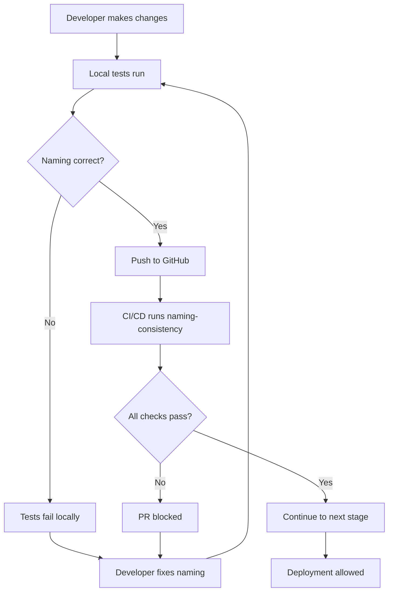

# ADR-0057: Qdrant Collection Naming Consistency Fix

## Status
Accepted (September 20, 2025)

## Context

During production usage, we discovered that `neural_system_status` incorrectly reports 0 Qdrant collections even when collections exist and are working. Investigation revealed an inconsistent naming convention between different parts of the codebase:

1. **neural_system_status**: Expects `project_{project_name}_` format (with underscores)
2. **project_understanding**: Uses `project-{project_name}` format (with hyphens)
3. **Actual collections**: Created as `project-{project_name}` format (with hyphens)

This causes neural_system_status to fail to detect any collections, leading to confusing status reports where:
- neural_system_status says: "0 collections"
- project_understanding says: "collection exists"
- semantic_code_search: Actually works and returns results

## Decision

**Standardize on hyphen-based naming**: `project-{project_name}`

This format is:
1. Already used by the actual collection creation code
2. Already used by project_understanding
3. Already working in production
4. More readable and conventional for resource naming

## Detailed Analysis

### Current State (BROKEN)

```python
# neural_system_status (line 1685) - WRONG
project_prefix = f"project_{project_name}_"  # Looks for: project_vesikaa_
project_collections = [c for c in all_collections if c.startswith(project_prefix)]

# project_understanding (line 1786) - CORRECT
collection_name = f"project-{project_name}"  # Looks for: project-vesikaa

# Actual collection names in Qdrant:
# - project-vesikaa
# - project-claude-l9-template
# - project-neural-novelist
```

### Root Cause

The inconsistency was introduced when different developers implemented different tools without a clear naming standard. The underscore pattern in neural_system_status appears to be a typo or misunderstanding of the actual naming convention.

### Impact

- **User Confusion**: Status reports show 0 collections when data exists
- **Debugging Difficulty**: Inconsistent status makes troubleshooting harder
- **False Alarms**: Users think indexing failed when it actually worked

## Validation Approach

### Automated Testing Strategy

We implement a three-tier validation strategy to prevent future naming inconsistencies:

#### 1. Comprehensive Test (`test_collection_naming_consistency.py`)
- **Scope**: Scans ALL Python files in neural-tools/src
- **Detects**: Any deviation from `project-{name}` pattern
- **Smart Exceptions**: Allows legitimate differences (multitenancy, schema-specific naming)
- **Purpose**: Catches naming issues early in development

#### 2. Critical Test (`test_critical_collection_naming.py`)
- **Scope**: Only tests files that directly create/query Qdrant collections
- **Targets**:
  - `neural_server_stdio.py` (MCP status reporting)
  - `sync_manager.py` (write synchronization)
  - `drift_monitor.py` (drift monitoring)
  - `qdrant_service.py` (main Qdrant service)
  - `indexer_service.py` (main indexing service)
  - `collection_config.py` (collection configuration)
- **Purpose**: Ensures critical services use correct naming

#### 3. CI/CD Integration
- **Workflow**: `.github/workflows/modules/naming-consistency.yml`
- **Runs On**: Every push and pull request
- **Stage**: Between lint and integration tests (Stage 3.5)
- **Gate**: Blocks deployment if naming issues detected

### Exception Management

The following patterns are explicitly allowed as they serve specific architectural needs:

| Pattern | Purpose | Example Files |
|---------|---------|---------------|
| `tenant_{id}_project_{name}_{type}` | Multi-tenant isolation | multitenancy.py |
| `project_{name}_code` | Schema-specific typed collections | schema_manager.py |
| `project_{name}_embeddings` | Specialized pipeline collections | async_preprocessing_pipeline.py |
| `project_` detection patterns | Migration validation logic | pipeline_validation.py |

### Enforcement Workflow



## Implementation

### Fix Location

File: `neural-tools/src/neural_mcp/neural_server_stdio.py`
Function: `neural_system_status_impl`
Line: ~1685

### Change Required

```python
# OLD (BROKEN):
project_prefix = f"project_{project_name}_"

# NEW (FIXED):
project_prefix = f"project-{project_name}"
```

### Additional Validation

We should also audit all other collection name references to ensure consistency:

1. Search for all occurrences of collection naming patterns
2. Verify they all use the hyphen format
3. Add a comment documenting the standard

## Consequences

### Positive
- **Accurate Status Reporting**: neural_system_status will correctly show collections
- **Consistency**: All tools use the same naming convention
- **User Trust**: Status reports match reality

### Negative
- None - this is fixing a bug, not changing behavior

### Risks
- **Minimal Risk**: Only affects status reporting, not actual data operations
- **No Migration Needed**: Collections already use correct format

## Alternatives Considered

1. **Change everything to underscores** - REJECTED: Would require migrating all existing collections
2. **Support both formats** - REJECTED: Adds complexity for no benefit
3. **Make it configurable** - REJECTED: Over-engineering for a simple naming convention

## Testing Plan

1. Fix the neural_system_status code
2. Test with multiple projects:
   - claude-l9-template
   - vesikaa
   - neural-novelist
3. Verify all report correct collection counts
4. Ensure semantic_code_search still works

## Related Issues

- This is NOT related to ADR-0056 (Python imports)
- This bug predates our recent work
- Affects all projects using neural tools

## Implementation Checklist

- [x] Fix neural_system_status collection detection
- [x] Search for other instances of collection naming
- [x] Add comment documenting the standard (ADR-0057 comments added)
- [x] Create comprehensive validation test
- [x] Create critical services validation test
- [x] Add tests to CI/CD pipeline
- [x] Document validation approach
- [ ] Test with multiple projects
- [ ] Verify project_understanding and neural_system_status agree
- [ ] Update any documentation that shows collection names

## Notes

This is a simple but important fix. The bug has been causing confusion where users think their data isn't indexed when it actually is. The fix is a one-line change but will significantly improve user experience.

The lesson learned: When multiple tools interact with the same resources, they MUST use consistent naming conventions. This should be documented and enforced through code review.