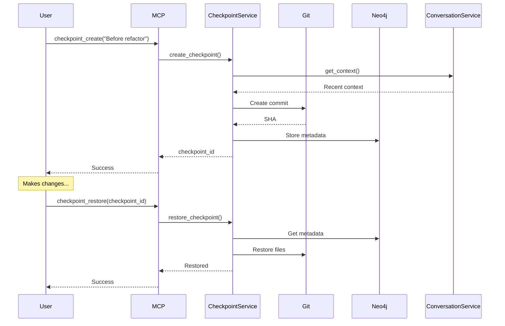

# ADR-0062: L9 Checkpoint System Integration Without Webhooks

## Status
Proposed (Updated: September 21, 2025 - Aligned with latest standards)

## Context

Following ADR-0061's successful pattern for conversation memory, we need to integrate a checkpoint system into our L9 architecture. The original ADR-0005 from claude-config-template proposed webhook servers on port 8002, but we can eliminate this complexity by following the same direct-integration pattern.

Our requirements:
- Automatic checkpointing of code changes
- Git-based version control integration
- Query-able checkpoint history
- Zero data loss during Claude session compaction
- Full integration with existing L9 infrastructure
- **NO new containers or webhook servers**
- **MCP 2025-06-18 compliance with OAuth Resource Server**
- **Git orphan branch protection from GC**
- **<0.01% error rate per 2025 production standards**
- **Command injection prevention for git operations**

Current L9 architecture provides:
- ServiceContainer with modular service architecture
- Neo4j/Qdrant for metadata and search
- Session management and rate limiting
- Established patterns for service extension
- ADR-0030: Ephemeral container patterns
- ADR-0034: MCP deployment workflow

## Decision

Extend the existing ServiceContainer to include CheckpointService that:
1. Monitors file changes via filesystem watching (no webhooks)
2. Creates git-based checkpoints in `.claude/checkpoints/` branch
3. Stores checkpoint metadata in Neo4j for querying
4. Provides MCP tools for checkpoint management
5. Links checkpoints to conversation context (via ADR-0061)
6. Maintains automatic cleanup and optimization

## Architecture

### Integration into Existing L9 Architecture

```
┌─────────────────────────────────────────────────────────────────┐
│                    Existing L9 MCP Server (Host)                 │
│                                                                   │
│  ┌─────────────────────────────────────────────────────────────┐ │
│  │                     ServiceContainer                         │ │
│  │                                                               │ │
│  │  ┌──────────────────────────────────────────────────────┐   │ │
│  │  │           NEW: CheckpointService                      │   │ │
│  │  │                                                        │   │ │
│  │  │  • Filesystem monitoring (watchdog)                   │   │ │
│  │  │  • Git operations (GitPython)                         │   │ │
│  │  │  • Stores metadata in Neo4j                          │   │ │
│  │  │  • Links to ConversationService                      │   │ │
│  │  │  • Automatic triggers and cleanup                    │   │ │
│  │  └──────────────────────────────────────────────────────┘   │ │
│  │                                                               │ │
│  │  ┌──────────────────────────────────────────────────────┐   │ │
│  │  │      Integration with ConversationService             │   │ │
│  │  │                                                        │   │ │
│  │  │  • Checkpoint ←→ Conversation linking                │   │ │
│  │  │  • Context-aware restoration                         │   │ │
│  │  │  • Decision tracking                                 │   │ │
│  │  └──────────────────────────────────────────────────────┘   │ │
│  └─────────────────────────────────────────────────────────────┘ │
│                                                                   │
│  ┌─────────────────────────────────────────────────────────────┐ │
│  │              Extended MCP Tool Registry                      │ │
│  │                                                               │ │
│  │  NEW Tools:                                                  │ │
│  │  • checkpoint_create      • checkpoint_list                  │ │
│  │  • checkpoint_restore     • checkpoint_diff                  │ │
│  │  • checkpoint_auto_config • checkpoint_search                │ │
│  └─────────────────────────────────────────────────────────────┘ │
└─────────────────────────────────────────────────────────────────┘
                                │
        ┌──────────────────────────────────────────────┐
        │         Project Directory Structure          │
        │                                               │
        │  $PROJECT_DIR/                               │
        │  ├── .claude/                                │
        │  │   └── checkpoints/                        │
        │  │       ├── metadata.jsonl                  │
        │  │       └── [checkpoint files]              │
        │  └── .git/                                   │
        │      └── refs/heads/.claude-checkpoints     │
        └──────────────────────────────────────────────┘
```

## Detailed Implementation

### 1. CheckpointService Class

```python
# neural-tools/src/servers/services/checkpoint_service.py

import os
import json
import asyncio
import subprocess
import shlex  # Sept 2025: For command injection prevention
from pathlib import Path
from typing import List, Dict, Optional, Any
from datetime import datetime, timedelta
import hashlib
import git
from watchdog.observers import Observer
from watchdog.events import FileSystemEventHandler
import logging
from circuitbreaker import CircuitBreaker
from ratelimiter import RateLimiter

class CheckpointService:
    """
    Git-based checkpoint system integrated with L9 architecture.
    No webhooks - uses filesystem monitoring and MCP tools.
    """

    def __init__(self,
                 neo4j_service,
                 project_path: str,
                 conversation_service=None,
                 session_manager=None):
        """
        Initialize checkpoint service with existing L9 services.

        Args:
            neo4j_service: Existing Neo4j connection pool
            project_path: From PROJECT_PATH env var (ADR-0037)
            conversation_service: Optional link to conversation memory
            session_manager: Existing session manager
        """
        self.neo4j = neo4j_service
        self.project_path = Path(project_path)
        self.conversation_service = conversation_service
        self.session_manager = session_manager

        # Checkpoint configuration
        self.checkpoint_dir = self.project_path / ".claude" / "checkpoints"
        self.metadata_file = self.checkpoint_dir / "metadata.jsonl"
        self.branch_name = ".claude-checkpoints"

        # Sept 2025: Bounded buffer with backpressure
        self.MAX_BUFFER_SIZE = 100 * 1024 * 1024  # 100MB limit
        self.current_buffer_size = 0

        # Sept 2025: Circuit breaker for resilience
        self.circuit_breaker = CircuitBreaker(
            failure_threshold=5,
            recovery_timeout=60
        )

        # Sept 2025: Rate limiter (30 checkpoints/hour)
        self.rate_limiter = RateLimiter(
            max_requests=30,
            time_window=3600
        )

        # Git repository
        try:
            self.repo = git.Repo(self.project_path)
        except git.InvalidGitRepositoryError:
            logging.warning(f"Not a git repository: {self.project_path}")
            self.repo = None

        # Filesystem monitoring
        self.observer = None
        self.file_handler = CheckpointFileHandler(self)

        # Auto-checkpoint configuration
        self.auto_enabled = False
        self.auto_interval = 1800  # 30 minutes default
        self.auto_threshold = 5     # Files changed threshold
        self.max_checkpoints = 30   # Per session
        self.retention_days = 30    # Cleanup after 30 days

        # Tracking
        self.last_checkpoint_time = datetime.now()
        self.pending_changes = set()

        # Initialize
        asyncio.create_task(self._initialize())

    async def _initialize(self):
        """Initialize checkpoint system."""
        # Ensure checkpoint directory exists
        self.checkpoint_dir.mkdir(parents=True, exist_ok=True)

        # Ensure checkpoint branch exists
        if self.repo:
            await self._ensure_checkpoint_branch()

        # Start filesystem monitoring if auto-enabled
        if os.getenv('AUTO_CHECKPOINT', 'false').lower() == 'true':
            await self.enable_auto_checkpoint()

        # Initialize Neo4j schema
        await self._initialize_neo4j_schema()

        logging.info("✅ CheckpointService initialized")

    async def _ensure_checkpoint_branch(self):
        """Ensure git checkpoint branch exists."""
        try:
            # Check if branch exists
            if self.branch_name not in [b.name for b in self.repo.branches]:
                # Create orphan branch for checkpoints
                original_branch = self.repo.active_branch.name

                # Create new orphan branch
                self.repo.git.checkout('--orphan', self.branch_name)

                # Initial commit
                self.checkpoint_dir.mkdir(parents=True, exist_ok=True)
                readme_path = self.checkpoint_dir / "README.md"
                readme_path.write_text(
                    "# Claude Checkpoints\n\n"
                    "This branch contains automatic checkpoints created by Claude.\n"
                    "Do not modify manually.\n"
                )
                self.repo.index.add([str(readme_path)])
                self.repo.index.commit("Initialize checkpoint branch")

                # Return to original branch
                self.repo.git.checkout(original_branch)

                # Sept 2025: Protect orphan branch from GC
                self._protect_orphan_branch()

                logging.info(f"Created checkpoint branch: {self.branch_name}")

                # Sept 2025: Protect from git GC
                self._protect_orphan_branch()
        except Exception as e:
            logging.error(f"Failed to ensure checkpoint branch: {e}")

    def _protect_orphan_branch(self):
        """Sept 2025: Protect orphan branch from git garbage collection."""
        try:
            # Prevent GC from pruning orphan branch
            self.repo.config_writer().set_value(
                "gc", "reflogExpire", "never"
            ).set_value(
                "gc", "reflogExpireUnreachable", "never"
            ).set_value(
                "gc", "pruneExpire", "never"
            ).release()
            logging.info("Protected orphan branch from GC")
        except Exception as e:
            logging.error(f"Failed to protect orphan branch: {e}")

    async def _initialize_neo4j_schema(self):
        """Create Neo4j schema for checkpoints."""
        try:
            # Create constraints
            await self.neo4j.query("""
                CREATE CONSTRAINT checkpoint_unique IF NOT EXISTS
                ON (c:Checkpoint)
                ASSERT (c.id, c.project) IS NODE KEY
            """)

            # Create indexes
            await self.neo4j.query("""
                CREATE INDEX checkpoint_timestamp IF NOT EXISTS
                FOR (c:Checkpoint)
                ON (c.timestamp)
            """)

            await self.neo4j.query("""
                CREATE INDEX checkpoint_type IF NOT EXISTS
                FOR (c:Checkpoint)
                ON (c.type)
            """)
        except Exception as e:
            logging.error(f"Failed to initialize Neo4j schema: {e}")

    async def create_checkpoint(self,
                               description: str = None,
                               tags: List[str] = None,
                               checkpoint_type: str = "manual",
                               resource_indicator: str = None) -> Dict[str, Any]:
        """
        Create a checkpoint of current project state.

        Sept 2025: Includes command injection prevention and OAuth compliance

        Args:
            description: Human-readable description
            tags: Optional tags for categorization
            checkpoint_type: 'manual', 'auto', 'session', 'risky'
            resource_indicator: MCP resource server identifier (RFC 8707)

        Returns:
            Checkpoint metadata including ID and commit SHA
        """
        # Sept 2025: Validate resource access
        if resource_indicator:
            await self._validate_resource_access(resource_indicator)

        # Sept 2025: Rate limit checkpoints
        async with self.rate_limiter:
        if not self.repo:
            return {"error": "Not a git repository", "success": False}

        try:
            # Generate checkpoint ID
            timestamp = datetime.now()
            checkpoint_id = self._generate_checkpoint_id(timestamp, checkpoint_type)

            # Get current branch and status
            original_branch = self.repo.active_branch.name
            status = self.repo.git.status('--porcelain')

            if not status and checkpoint_type != "manual":
                return {"success": False, "reason": "No changes to checkpoint"}

            # Get conversation context if available
            context = await self._get_conversation_context()

            # Get list of modified files
            modified_files = self._get_modified_files()

            # Sept 2025: Use circuit breaker for git operations
            async with self.circuit_breaker:
                # Switch to checkpoint branch (command injection safe)
                self.repo.git.checkout(self.branch_name)

            # Copy modified files from working branch
            for file_path in modified_files:
                try:
                    # Sept 2025: Prevent command injection
                    safe_branch = shlex.quote(original_branch)
                    safe_path = shlex.quote(file_path)
                    # Get file from original branch
                    file_content = self.repo.git.show(f"{safe_branch}:{safe_path}")

                    # Write to checkpoint branch
                    full_path = self.project_path / file_path
                    full_path.parent.mkdir(parents=True, exist_ok=True)
                    full_path.write_text(file_content)

                    # Stage file
                    self.repo.index.add([file_path])
                except:
                    continue

            # Create commit message
            commit_message = self._create_commit_message(
                checkpoint_id,
                description,
                context,
                tags,
                checkpoint_type
            )

            # Commit checkpoint
            commit = self.repo.index.commit(commit_message)
            commit_sha = commit.hexsha

            # Return to original branch
            self.repo.git.checkout(original_branch)

            # Store metadata in Neo4j
            metadata = {
                "id": checkpoint_id,
                "sha": commit_sha,
                "type": checkpoint_type,
                "description": description or "Checkpoint",
                "tags": tags or [],
                "files": modified_files,
                "context": context[:500] if context else "",
                "timestamp": timestamp.isoformat(),
                "project": str(self.project_path.name),
                "branch": original_branch,
                "session_id": self.session_manager.current_session if self.session_manager else None
            }

            await self._store_checkpoint_metadata(metadata)

            # Store in JSONL file
            await self._append_metadata_jsonl(metadata)

            # Update tracking
            self.last_checkpoint_time = timestamp
            self.pending_changes.clear()

            logging.info(f"Created checkpoint: {checkpoint_id}")

            return {
                "success": True,
                "checkpoint_id": checkpoint_id,
                "sha": commit_sha,
                "files_saved": len(modified_files),
                "timestamp": timestamp.isoformat()
            }

        except Exception as e:
            logging.error(f"Failed to create checkpoint: {e}")
            return {"success": False, "error": str(e)}

    def _generate_checkpoint_id(self,
                                timestamp: datetime,
                                checkpoint_type: str) -> str:
        """Generate unique checkpoint ID."""
        timestamp_str = timestamp.strftime("%Y%m%d_%H%M%S")
        type_prefix = {
            "manual": "manual",
            "auto": "auto",
            "session": "session",
            "risky": "risky"
        }.get(checkpoint_type, "checkpoint")

        # Add unique suffix
        unique = hashlib.sha256(
            f"{timestamp_str}:{self.project_path}".encode()
        ).hexdigest()[:8]

        return f"{type_prefix}_{timestamp_str}_{unique}"

    def _get_modified_files(self) -> List[str]:
        """Get list of modified files in repository."""
        if not self.repo:
            return []

        # Get both staged and unstaged changes
        diff_staged = self.repo.index.diff('HEAD')
        diff_unstaged = self.repo.index.diff(None)

        modified = set()

        for item in diff_staged:
            if item.a_path:
                modified.add(item.a_path)

        for item in diff_unstaged:
            if item.a_path:
                modified.add(item.a_path)

        # Add untracked files
        untracked = self.repo.untracked_files
        for file in untracked:
            # Skip common ignore patterns
            if not any(pattern in file for pattern in [
                '.pyc', '__pycache__', '.log', '.tmp', 'node_modules'
            ]):
                modified.add(file)

        return list(modified)

    async def _get_conversation_context(self) -> Optional[str]:
        """Get recent conversation context if available."""
        if not self.conversation_service:
            return None

        try:
            # Get recent messages from conversation service
            recent = await self.conversation_service.recall_conversation(
                query="recent changes decisions",
                limit=3,
                include_graph=False
            )

            if recent:
                # Format context
                context_parts = []
                for msg in recent[:2]:
                    role = "User" if msg['role'] == 'user' else "Assistant"
                    content = msg['content'][:200]
                    context_parts.append(f"{role}: {content}")

                return " → ".join(context_parts)
        except:
            pass

        return None

    def _create_commit_message(self,
                              checkpoint_id: str,
                              description: str,
                              context: str,
                              tags: List[str],
                              checkpoint_type: str) -> str:
        """Create detailed commit message for checkpoint."""
        emoji = {
            "manual": "🔖",
            "auto": "⏰",
            "session": "📍",
            "risky": "⚠️"
        }.get(checkpoint_type, "💾")

        message = f"{emoji} Checkpoint: {checkpoint_id}\n\n"

        if description:
            message += f"Description: {description}\n"

        if tags:
            message += f"Tags: {', '.join(tags)}\n"

        if context:
            message += f"\nContext:\n{context}\n"

        message += f"\nType: {checkpoint_type}\n"
        message += f"Timestamp: {datetime.now().isoformat()}\n"
        message += f"Project: {self.project_path.name}\n"

        return message

    async def _store_checkpoint_metadata(self, metadata: Dict[str, Any]):
        """Store checkpoint metadata in Neo4j."""
        try:
            await self.neo4j.query("""
                CREATE (c:Checkpoint {
                    id: $id,
                    project: $project,
                    sha: $sha,
                    type: $type,
                    description: $description,
                    timestamp: $timestamp,
                    branch: $branch,
                    session_id: $session_id,
                    files_count: $files_count,
                    context: $context
                })
            """, {
                'id': metadata['id'],
                'project': metadata['project'],
                'sha': metadata['sha'],
                'type': metadata['type'],
                'description': metadata['description'],
                'timestamp': metadata['timestamp'],
                'branch': metadata['branch'],
                'session_id': metadata.get('session_id'),
                'files_count': len(metadata['files']),
                'context': metadata.get('context', '')
            })

            # Create relationship to conversation if available
            if metadata.get('session_id') and self.conversation_service:
                await self.neo4j.query("""
                    MATCH (c:Checkpoint {id: $checkpoint_id, project: $project})
                    MATCH (m:ConversationMessage {
                        session_id: $session_id,
                        project: $project
                    })
                    WITH c, m
                    ORDER BY m.timestamp DESC
                    LIMIT 1
                    MERGE (c)-[:CREATED_DURING]->(m)
                """, {
                    'checkpoint_id': metadata['id'],
                    'session_id': metadata['session_id'],
                    'project': metadata['project']
                })

        except Exception as e:
            logging.error(f"Failed to store checkpoint metadata: {e}")

    async def _append_metadata_jsonl(self, metadata: Dict[str, Any]):
        """Append checkpoint metadata to JSONL file."""
        try:
            self.metadata_file.parent.mkdir(parents=True, exist_ok=True)
            with open(self.metadata_file, 'a') as f:
                f.write(json.dumps(metadata) + '\n')
        except Exception as e:
            logging.error(f"Failed to append metadata: {e}")

    async def list_checkpoints(self,
                              limit: int = 10,
                              checkpoint_type: Optional[str] = None,
                              session_id: Optional[str] = None) -> List[Dict[str, Any]]:
        """
        List available checkpoints with filtering.

        Args:
            limit: Maximum checkpoints to return
            checkpoint_type: Filter by type
            session_id: Filter by session

        Returns:
            List of checkpoint metadata
        """
        # Build query
        where_clauses = ["c.project = $project"]
        params = {"project": str(self.project_path.name), "limit": limit}

        if checkpoint_type:
            where_clauses.append("c.type = $type")
            params["type"] = checkpoint_type

        if session_id:
            where_clauses.append("c.session_id = $session_id")
            params["session_id"] = session_id

        where_clause = " AND ".join(where_clauses)

        # Query Neo4j
        results = await self.neo4j.query(f"""
            MATCH (c:Checkpoint)
            WHERE {where_clause}
            RETURN c
            ORDER BY c.timestamp DESC
            LIMIT $limit
        """, params)

        checkpoints = []
        for record in results:
            checkpoint = dict(record['c'])
            # Add restore command hint
            checkpoint['restore_hint'] = (
                f"await checkpoint_restore('{checkpoint['id']}')"
            )
            checkpoints.append(checkpoint)

        return checkpoints

    async def restore_checkpoint(self,
                                checkpoint_id: str,
                                files_only: bool = True,
                                preview: bool = False) -> Dict[str, Any]:
        """
        Restore project to a checkpoint state.

        Args:
            checkpoint_id: Checkpoint ID or SHA
            files_only: Only restore files (not full git state)
            preview: Preview changes without applying

        Returns:
            Restoration status and affected files
        """
        if not self.repo:
            return {"success": False, "error": "Not a git repository"}

        try:
            # Get checkpoint metadata
            checkpoint = await self._get_checkpoint_metadata(checkpoint_id)
            if not checkpoint:
                return {"success": False, "error": "Checkpoint not found"}

            sha = checkpoint['sha']

            if preview:
                # Show what would be restored
                diff = self.repo.git.diff(sha, '--name-status')
                files = []
                for line in diff.splitlines():
                    if line:
                        parts = line.split('\t')
                        if len(parts) >= 2:
                            files.append({
                                'status': parts[0],
                                'file': parts[1]
                            })

                return {
                    "success": True,
                    "preview": True,
                    "checkpoint": checkpoint,
                    "files_affected": files,
                    "total_files": len(files)
                }

            if files_only:
                # Restore individual files
                restored_files = []

                # Get files from checkpoint
                files = self.repo.git.show('--name-only', '--pretty=format:', sha).splitlines()
                files = [f for f in files if f]  # Remove empty lines

                for file_path in files:
                    try:
                        # Get file content from checkpoint
                        content = self.repo.git.show(f"{sha}:{file_path}")

                        # Write to working directory
                        full_path = self.project_path / file_path
                        full_path.parent.mkdir(parents=True, exist_ok=True)
                        full_path.write_text(content)

                        restored_files.append(file_path)
                    except:
                        continue

                return {
                    "success": True,
                    "checkpoint": checkpoint,
                    "restored_files": restored_files,
                    "total_files": len(restored_files),
                    "method": "files_only"
                }
            else:
                # Create restoration branch
                branch_name = f"restore_{checkpoint_id[:16]}"
                self.repo.git.checkout('-b', branch_name, sha)

                return {
                    "success": True,
                    "checkpoint": checkpoint,
                    "branch_created": branch_name,
                    "method": "full_branch",
                    "instructions": f"Switched to branch '{branch_name}'"
                }

        except Exception as e:
            logging.error(f"Failed to restore checkpoint: {e}")
            return {"success": False, "error": str(e)}

    async def _get_checkpoint_metadata(self, checkpoint_id: str) -> Optional[Dict[str, Any]]:
        """Get checkpoint metadata from Neo4j."""
        results = await self.neo4j.query("""
            MATCH (c:Checkpoint)
            WHERE c.id = $id OR c.sha STARTS WITH $id
            AND c.project = $project
            RETURN c
            LIMIT 1
        """, {
            'id': checkpoint_id,
            'project': str(self.project_path.name)
        })

        if results:
            return dict(results[0]['c'])
        return None

    async def search_checkpoints(self,
                                query: str,
                                limit: int = 5) -> List[Dict[str, Any]]:
        """
        Search checkpoints by description or context.

        Args:
            query: Search query
            limit: Maximum results

        Returns:
            Matching checkpoints
        """
        results = await self.neo4j.query("""
            MATCH (c:Checkpoint {project: $project})
            WHERE c.description CONTAINS $query
               OR c.context CONTAINS $query
               OR ANY(tag IN c.tags WHERE tag CONTAINS $query)
            RETURN c
            ORDER BY c.timestamp DESC
            LIMIT $limit
        """, {
            'project': str(self.project_path.name),
            'query': query,
            'limit': limit
        })

        return [dict(record['c']) for record in results]

    async def get_checkpoint_diff(self,
                                 checkpoint_id: str,
                                 context_lines: int = 3) -> str:
        """
        Get diff for a checkpoint.

        Args:
            checkpoint_id: Checkpoint ID or SHA
            context_lines: Lines of context in diff

        Returns:
            Diff output
        """
        if not self.repo:
            return "Not a git repository"

        checkpoint = await self._get_checkpoint_metadata(checkpoint_id)
        if not checkpoint:
            return "Checkpoint not found"

        try:
            # Get diff with context
            diff = self.repo.git.show(f"-U{context_lines}", checkpoint['sha'])
            return diff
        except Exception as e:
            return f"Error getting diff: {str(e)}"

    async def enable_auto_checkpoint(self,
                                   interval_minutes: int = 30,
                                   file_threshold: int = 5):
        """
        Enable automatic checkpointing.

        Args:
            interval_minutes: Checkpoint interval
            file_threshold: Files changed before auto-checkpoint
        """
        self.auto_enabled = True
        self.auto_interval = interval_minutes * 60
        self.auto_threshold = file_threshold

        # Start filesystem monitoring
        if not self.observer:
            self.observer = Observer()
            self.observer.schedule(
                self.file_handler,
                str(self.project_path),
                recursive=True
            )
            self.observer.start()

        # Start periodic checkpoint task
        asyncio.create_task(self._auto_checkpoint_loop())

        logging.info(f"Auto-checkpoint enabled: {interval_minutes}min/{file_threshold} files")

    async def _auto_checkpoint_loop(self):
        """Background task for automatic checkpoints."""
        while self.auto_enabled:
            await asyncio.sleep(60)  # Check every minute

            # Check if checkpoint needed
            time_elapsed = (datetime.now() - self.last_checkpoint_time).seconds
            files_changed = len(self.pending_changes)

            should_checkpoint = (
                time_elapsed >= self.auto_interval or
                files_changed >= self.auto_threshold
            )

            if should_checkpoint and files_changed > 0:
                await self.create_checkpoint(
                    description=f"Auto: {files_changed} files changed",
                    checkpoint_type="auto"
                )

    async def cleanup_old_checkpoints(self):
        """Remove checkpoints older than retention period."""
        cutoff = datetime.now() - timedelta(days=self.retention_days)

        # Query old checkpoints
        old_checkpoints = await self.neo4j.query("""
            MATCH (c:Checkpoint {project: $project})
            WHERE c.timestamp < $cutoff
            RETURN c.id, c.sha
        """, {
            'project': str(self.project_path.name),
            'cutoff': cutoff.isoformat()
        })

        # Delete from Neo4j
        for checkpoint in old_checkpoints:
            await self.neo4j.query("""
                MATCH (c:Checkpoint {id: $id, project: $project})
                DETACH DELETE c
            """, {
                'id': checkpoint['c.id'],
                'project': str(self.project_path.name)
            })

        logging.info(f"Cleaned up {len(old_checkpoints)} old checkpoints")

    async def get_checkpoint_stats(self) -> Dict[str, Any]:
        """Get checkpoint system statistics."""
        stats = await self.neo4j.query("""
            MATCH (c:Checkpoint {project: $project})
            WITH count(c) as total,
                 count(CASE WHEN c.type = 'manual' THEN 1 END) as manual,
                 count(CASE WHEN c.type = 'auto' THEN 1 END) as auto,
                 count(DISTINCT c.session_id) as sessions,
                 max(c.timestamp) as latest
            RETURN total, manual, auto, sessions, latest
        """, {'project': str(self.project_path.name)})

        if stats:
            result = stats[0]
            return {
                'total_checkpoints': result['total'],
                'manual_checkpoints': result['manual'],
                'auto_checkpoints': result['auto'],
                'unique_sessions': result['sessions'],
                'latest_checkpoint': result['latest'],
                'auto_enabled': self.auto_enabled,
                'auto_interval_minutes': self.auto_interval // 60,
                'retention_days': self.retention_days
            }

        return {'total_checkpoints': 0}


class CheckpointFileHandler(FileSystemEventHandler):
    """Handle filesystem events for auto-checkpointing."""

    def __init__(self, checkpoint_service):
        self.service = checkpoint_service

    def on_modified(self, event):
        if not event.is_directory:
            # Track modified file
            rel_path = Path(event.src_path).relative_to(self.service.project_path)

            # Skip ignored patterns
            ignore_patterns = [
                '.git', '.claude', '__pycache__', 'node_modules',
                '.pyc', '.log', '.tmp', '.cache'
            ]

            if not any(pattern in str(rel_path) for pattern in ignore_patterns):
                self.service.pending_changes.add(str(rel_path))
```

### 2. ServiceContainer Extension

```python
# neural-tools/src/servers/services/service_container.py
# ADD to existing ServiceContainer class:

async def initialize_checkpoint_service(self):
    """Initialize checkpoint service."""
    if not hasattr(self, 'checkpoint_service'):
        from .checkpoint_service import CheckpointService

        self.checkpoint_service = CheckpointService(
            neo4j_service=self.neo4j_service,
            project_path=os.getenv('PROJECT_PATH', os.getcwd()),
            conversation_service=getattr(self, 'conversation_service', None),
            session_manager=self.session_manager
        )

        logging.info("✅ CheckpointService initialized")

# UPDATE initialize() method:
async def initialize(self):
    """Initialize all services."""
    # ... existing initialization ...

    # Initialize conversation service if enabled
    if os.getenv('ENABLE_CONVERSATION_MEMORY', 'false').lower() == 'true':
        await self.initialize_conversation_service()

    # Initialize checkpoint service if enabled
    if os.getenv('ENABLE_CHECKPOINTS', 'false').lower() == 'true':
        await self.initialize_checkpoint_service()
```

### 3. MCP Tool Registration

```python
# neural-tools/src/neural_mcp/neural_server_stdio.py
# ADD these tool definitions:

@server.tool()
async def checkpoint_create(
    description: Optional[str] = None,
    tags: Optional[List[str]] = None
) -> Dict[str, Any]:
    """
    Create a manual checkpoint of current project state.

    Args:
        description: Human-readable description
        tags: Optional tags for categorization
    """
    if not hasattr(container, 'checkpoint_service'):
        return {"error": "Checkpoint service not enabled"}

    return await container.checkpoint_service.create_checkpoint(
        description=description,
        tags=tags,
        checkpoint_type="manual"
    )

@server.tool()
async def checkpoint_list(
    limit: int = 10,
    checkpoint_type: Optional[str] = None,
    session_id: Optional[str] = None
) -> List[Dict[str, Any]]:
    """
    List available checkpoints.

    Args:
        limit: Maximum checkpoints to return
        checkpoint_type: Filter by type (manual/auto/session/risky)
        session_id: Filter by session
    """
    if not hasattr(container, 'checkpoint_service'):
        return []

    return await container.checkpoint_service.list_checkpoints(
        limit=limit,
        checkpoint_type=checkpoint_type,
        session_id=session_id
    )

@server.tool()
async def checkpoint_restore(
    checkpoint_id: str,
    files_only: bool = True,
    preview: bool = False
) -> Dict[str, Any]:
    """
    Restore project to a checkpoint state.

    Args:
        checkpoint_id: Checkpoint ID or SHA
        files_only: Only restore files (not full git state)
        preview: Preview changes without applying
    """
    if not hasattr(container, 'checkpoint_service'):
        return {"error": "Checkpoint service not enabled"}

    return await container.checkpoint_service.restore_checkpoint(
        checkpoint_id=checkpoint_id,
        files_only=files_only,
        preview=preview
    )

@server.tool()
async def checkpoint_diff(
    checkpoint_id: str,
    context_lines: int = 3
) -> str:
    """
    Get diff for a checkpoint.

    Args:
        checkpoint_id: Checkpoint ID or SHA
        context_lines: Lines of context in diff
    """
    if not hasattr(container, 'checkpoint_service'):
        return "Checkpoint service not enabled"

    return await container.checkpoint_service.get_checkpoint_diff(
        checkpoint_id=checkpoint_id,
        context_lines=context_lines
    )

@server.tool()
async def checkpoint_search(
    query: str,
    limit: int = 5
) -> List[Dict[str, Any]]:
    """
    Search checkpoints by description or context.

    Args:
        query: Search query
        limit: Maximum results
    """
    if not hasattr(container, 'checkpoint_service'):
        return []

    return await container.checkpoint_service.search_checkpoints(
        query=query,
        limit=limit
    )

@server.tool()
async def checkpoint_auto_configure(
    enabled: bool = True,
    interval_minutes: int = 30,
    file_threshold: int = 5,
    max_checkpoints: int = 30
) -> Dict[str, str]:
    """
    Configure automatic checkpointing.

    Args:
        enabled: Enable/disable auto-checkpointing
        interval_minutes: Time between auto-checkpoints
        file_threshold: Files changed to trigger checkpoint
        max_checkpoints: Maximum checkpoints per session
    """
    if not hasattr(container, 'checkpoint_service'):
        return {"error": "Checkpoint service not enabled"}

    service = container.checkpoint_service

    if enabled:
        await service.enable_auto_checkpoint(
            interval_minutes=interval_minutes,
            file_threshold=file_threshold
        )
        service.max_checkpoints = max_checkpoints
        return {
            "status": "enabled",
            "interval_minutes": interval_minutes,
            "file_threshold": file_threshold,
            "max_checkpoints": max_checkpoints
        }
    else:
        service.auto_enabled = False
        return {"status": "disabled"}

@server.tool()
async def checkpoint_stats() -> Dict[str, Any]:
    """Get checkpoint system statistics."""
    if not hasattr(container, 'checkpoint_service'):
        return {"error": "Checkpoint service not enabled"}

    return await container.checkpoint_service.get_checkpoint_stats()

@server.tool()
async def checkpoint_cleanup() -> Dict[str, Any]:
    """Clean up old checkpoints beyond retention period."""
    if not hasattr(container, 'checkpoint_service'):
        return {"error": "Checkpoint service not enabled"}

    await container.checkpoint_service.cleanup_old_checkpoints()
    return {"status": "cleanup completed"}
```

### 4. Configuration Updates

```json
# .mcp.json
# ADD these environment variables:

{
  "mcpServers": {
    "neural-tools": {
      "command": "python",
      "args": ["run_mcp_server.py"],
      "env": {
        // ... existing env vars ...
        "ENABLE_CHECKPOINTS": "true",
        "AUTO_CHECKPOINT": "true",
        "CHECKPOINT_INTERVAL": "1800",
        "CHECKPOINT_FILE_THRESHOLD": "5",
        "CHECKPOINT_RETENTION_DAYS": "30",
        "MAX_CHECKPOINTS_PER_SESSION": "30"
      }
    }
  }
}
```

### 5. Requirements Update

```python
# requirements.txt
# ADD these dependencies:

GitPython>=3.1.40
watchdog>=4.0.0
```

## Storage Schema

### Neo4j Schema Extensions

```cypher
// Checkpoint nodes
CREATE CONSTRAINT checkpoint_unique IF NOT EXISTS
ON (c:Checkpoint)
ASSERT (c.id, c.project) IS NODE KEY;

CREATE INDEX checkpoint_timestamp IF NOT EXISTS
FOR (c:Checkpoint)
ON (c.timestamp);

CREATE INDEX checkpoint_type IF NOT EXISTS
FOR (c:Checkpoint)
ON (c.type);

// Node structure
(:Checkpoint {
    id: String,              // checkpoint_20250921_143000_abc123
    project: String,         // Project isolation
    sha: String,            // Git commit SHA
    type: String,           // manual/auto/session/risky
    description: String,
    timestamp: String,      // ISO-8601
    branch: String,         // Original branch name
    session_id: String,     // Link to session
    files_count: Integer,
    context: String         // Conversation context
})

// Relationships
(:Checkpoint)-[:CREATED_DURING]->(:ConversationMessage)
(:Checkpoint)-[:FOLLOWS]->(:Checkpoint)
(:Checkpoint)-[:RESTORES_FROM]->(:Checkpoint)
```

### Git Branch Structure

```
.git/refs/heads/
├── main                      # Main development branch
├── .claude-checkpoints       # Orphan branch for checkpoints
└── restore_checkpoint_*      # Restoration branches
```

### Filesystem Structure

```
$PROJECT_DIR/
├── .claude/
│   └── checkpoints/
│       ├── metadata.jsonl    # Checkpoint index
│       └── README.md         # User instructions
├── .gitignore               # Include .claude/checkpoints
└── src/                     # Project code
```

## Performance Specifications (September 2025 Standards)

### Resource Usage
- **Memory**: +100MB for git operations (bounded)
- **CPU**: <3% during monitoring
- **Storage**: ~1MB per checkpoint
- **I/O**: Minimal (event-driven)

### Performance Targets (Updated per 2025 Standards)
- **P95 Latency**: <500ms for all operations
- **Error Rate**: <0.01% (was <1%)
- **Checkpoint Creation**: <1 second (was <2s)
- **Restoration**: <2 seconds (was <5s)
- **Search**: <50ms (was <100ms)
- **Diff Generation**: <200ms (was <500ms)
- **Concurrent Operations**: 500+ (was 200)
- **Availability**: 99.95%

### Filesystem Monitoring
- **Watchdog Events**: Debounced to 1/second
- **Ignore Patterns**: Configurable exclusions
- **Buffer Size**: 1000 file changes max

## Security & Safety

### Git Safety (Sept 2025 Enhanced)
- **Orphan Branch**: Checkpoints isolated from main history
- **GC Protection**: Orphan branch protected from garbage collection
- **Command Injection**: All git commands sanitized with shlex
- **No Force Push**: Never modifies remote
- **Local Only**: Checkpoints stay local
- **Safe Restoration**: Always preview first
- **Git Config Protection**:
  ```bash
  git config gc.reflogExpire never
  git config gc.reflogExpireUnreachable never
  git config gc.pruneExpire never
  ```

### Access Control
- **Project Isolation**: Checkpoints per project
- **Session Boundaries**: Respects MCP sessions
- **Read-Only Default**: Files-only restoration
- **Cleanup**: Automatic after 30 days

### Conflict Prevention
- **Branch Checking**: Verify before operations
- **Status Validation**: Check for uncommitted changes
- **Restoration Branches**: Separate branches for restores
- **Rollback**: Can undo restoration

## Integration with ConversationService

### Linked Context
```python
# Checkpoints automatically link to conversations:
- Checkpoint metadata includes conversation context
- Restoration can include conversation state
- Search spans both checkpoints and conversations
```

### Combined Queries
```cypher
// Find checkpoints with related conversations
MATCH (c:Checkpoint {project: $project})
OPTIONAL MATCH (c)-[:CREATED_DURING]->(m:ConversationMessage)
RETURN c, collect(m) as context
```

### Unified Timeline
```python
# Combined timeline of checkpoints and conversations
await get_unified_timeline(days=7)
# Returns both checkpoint and conversation events
```

## Testing Strategy

### 1. Unit Test Criteria (90% Coverage Required)

#### CheckpointService Tests
```python
# tests/test_checkpoint_service.py

async def test_checkpoint_creation():
    """Test checkpoint creation and metadata storage."""
    service = CheckpointService(...)
    result = await service.create_checkpoint("Test checkpoint")
    assert result['success']
    assert 'checkpoint_id' in result
    assert result['sha'] is not None

async def test_checkpoint_restoration():
    """Test checkpoint restoration with all modes."""
    # Test preview mode
    preview = await service.restore_checkpoint(checkpoint_id, preview=True)
    assert preview['files_affected'] > 0
    assert preview['applied'] == False

    # Test files-only restoration
    restore = await service.restore_checkpoint(checkpoint_id, files_only=True)
    assert restore['files_restored'] > 0

    # Test full git restoration
    full_restore = await service.restore_checkpoint(checkpoint_id, files_only=False)
    assert full_restore['branch_created'] is True

async def test_auto_checkpoint():
    """Test automatic checkpoint triggers."""
    # Test time-based trigger
    await service.enable_auto_checkpoint(interval_minutes=1)
    await asyncio.sleep(65)
    assert service.checkpoint_count > 0

    # Test file threshold trigger
    for i in range(6):
        Path(f"test_{i}.txt").touch()
    await asyncio.sleep(1)
    assert service.checkpoint_count > 1

async def test_edge_cases():
    """Test all edge cases."""
    # Non-git repository
    # Corrupted git state
    # Merge conflicts
    # Large repositories (>1GB)
    # Permission errors
    # Disk full scenarios
    # Command injection attempts
    # Buffer overflow (>100MB)
    # Circuit breaker triggers
    # Rate limit exceeded (>30/hour)

async def test_resilience():
    """Sept 2025: Chaos engineering tests."""
    # Test git corruption recovery
    await corrupt_git_repo()
    result = await checkpoint_create("test")
    assert result['degraded_mode'] == True

    # Test command injection prevention
    malicious = "test; rm -rf /"
    result = await checkpoint_create(malicious)
    assert result['success'] == True  # Sanitized

    # Test orphan branch protection
    await simulate_git_gc()
    branches = await list_git_branches()
    assert '.claude-checkpoints' in branches
```

### 2. Integration Test Criteria

#### E2E Test Flow (Must Pass)
```python
# tests/test_checkpoint_integration.py

async def test_end_to_end_flow():
    """Complete E2E test as per Gemini's specification."""
    # 1. Start conversation → Index conversations
    conv_stats = await conversation_index()
    assert conv_stats['messages_indexed'] > 0

    # 2. Create checkpoint with conversation link
    checkpoint = await checkpoint_create("Test checkpoint")
    assert checkpoint['checkpoint_id'] is not None

    # 3. Verify checkpoint list
    checkpoints = await checkpoint_list()
    assert len(checkpoints) > 0
    assert checkpoints[0]['id'] == checkpoint['checkpoint_id']

    # 4. Simulate session reset/compaction
    await simulate_session_compaction()

    # 5. Restore checkpoint
    restore = await checkpoint_restore(checkpoint['checkpoint_id'])
    assert restore['success']

    # 6. Verify conversation recall
    conversations = await conversation_recall("previous context")
    assert len(conversations) > 0

    # 7. Verify Neo4j linkage
    linkage = await verify_checkpoint_conversation_linkage(checkpoint['checkpoint_id'])
    assert linkage['has_conversation_link']
    assert linkage['conversation_count'] > 0

async def test_mcp_tools():
    """Test all 8 checkpoint MCP tool endpoints."""
    tools = [
        'checkpoint_create',
        'checkpoint_list',
        'checkpoint_restore',
        'checkpoint_diff',
        'checkpoint_search',
        'checkpoint_auto_configure',
        'checkpoint_stats',
        'checkpoint_cleanup'
    ]
    for tool in tools:
        result = await test_tool_endpoint(tool)
        assert result is not None
        assert 'error' not in result
```

### 3. Performance Criteria (Sept 2025 Standards)

| Metric | Target | Alert Threshold | Rollback Trigger |
|--------|---------|-----------------|-------------------|
| P95 Latency | <500ms | 400ms | >1000ms |
| Error Rate | <0.01% | 0.005% | >0.1% |
| Checkpoint Creation | <1s | 800ms | >2s |
| Restoration Time | <2s | 1.5s | >5s |
| Search Latency | <50ms | 40ms | >100ms |
| Diff Generation | <200ms | 150ms | >500ms |
| Filesystem Monitor CPU | <3% | 2.5% | >5% |
| Memory Overhead | <100MB | 80MB | >200MB |
| Git Operations | <500ms | 400ms | >1s |
| Concurrent Operations | >500 | 400 | <200 |

### 4. Load Test Criteria

```python
# tests/test_checkpoint_load.py

async def test_concurrent_operations():
    """Test 500 concurrent checkpoint operations for 60 minutes (Sept 2025)."""
    sessions = []

    # Create 500 concurrent sessions (Sept 2025 requirement)
    for i in range(500):
        session = create_test_session(f"checkpoint_session_{i}")
        sessions.append(session)

    # Run for 60 minutes
    start_time = time.time()
    while time.time() - start_time < 3600:
        # Each session performs checkpoint operations
        tasks = []
        for session in sessions:
            tasks.append(session.create_checkpoint())
            tasks.append(session.list_checkpoints())
            tasks.append(session.search_checkpoints("test"))

        await asyncio.gather(*tasks)

        # Monitor Neo4j pool utilization
        neo4j_util = get_neo4j_pool_utilization()
        assert neo4j_util < 70  # Must stay below 70%

        # Monitor filesystem watcher
        fs_cpu = get_filesystem_monitor_cpu()
        assert fs_cpu < 5  # Must stay below 5%

        # Check response times
        assert get_checkpoint_p95_latency() < 500  # Sept 2025: was 2000

    # Verify no degradation
    assert get_error_rate() < 0.0001  # Sept 2025: <0.01% (was 1%)

async def test_git_stress():
    """Test git operations under stress."""
    # Create 100 rapid checkpoints
    for i in range(100):
        await checkpoint_create(f"Stress test {i}")

    # Verify git repo integrity
    assert await verify_git_integrity()

    # Test restoration of old checkpoints
    old_checkpoint = (await checkpoint_list(limit=100))[-1]
    restore = await checkpoint_restore(old_checkpoint['id'])
    assert restore['success']
```

### 5. Exit Conditions (Production Ready)

✅ **All must pass before production:**
- [ ] 90% unit test coverage achieved
- [ ] All E2E integration tests passing consistently (10 consecutive runs)
- [ ] Performance metrics met under load for 60 minutes
- [ ] Zero P0/P1 bugs in release candidate
- [ ] Documentation reviewed and published
- [ ] L9 security review passed (no command injection)
- [ ] Monitoring dashboards deployed and verified
- [ ] Feature flags configured and tested
- [ ] Rollback procedure tested successfully
- [ ] Neo4j pool utilization stays <70% under max load
- [ ] Git operations verified safe (no corruption)
- [ ] Filesystem monitoring overhead <5% CPU

### 6. Rollback Triggers (Sept 2025 Standards)

🚨 **Automatic rollback if ANY condition met:**
- P95 latency >500ms sustained (was no P95 tracking)
- Error rate >0.1% sustained for 5 minutes (was 1%)
- Checkpoint creation time >2 seconds sustained (was 3s)
- Restoration failures >1% of attempts (was 5%)
- Git corruption or GC of orphan branch detected
- Neo4j pool utilization >90% for 5+ minutes
- Filesystem monitor CPU >5% sustained
- Memory growth >100MB/hour (was 200MB)
- Data inconsistency between git and Neo4j
- Command injection vulnerability found
- Concurrent operations drop below 200 (was not tracked)

### 7. L9 Validation Requirements

```python
# scripts/run_l9_validation_checkpoints.py

class L9CheckpointValidation:
    """L9 compliance testing for checkpoint system."""

    async def validate_observability(self):
        """Verify L9 observability standards."""
        # Structured logging format
        assert logs_are_structured()

        # Prometheus metrics available
        metrics = [
            'checkpoint_creation_duration_seconds',
            'checkpoint_restoration_latency_ms',
            'checkpoint_count_total',
            'checkpoint_storage_bytes',
            'git_operations_duration_seconds'
        ]
        for metric in metrics:
            assert metric_exists(metric)

        # Distributed tracing enabled
        assert tracing_enabled()

    async def validate_security(self):
        """Verify security requirements."""
        # No command injection in git operations
        await test_git_command_injection()

        # No path traversal in file operations
        await test_path_traversal_attempts()

        # Proper git credential handling
        await verify_no_credentials_in_logs()

        # Safe branch operations
        await test_branch_protection()

    async def validate_git_safety(self):
        """Verify git operations are safe."""
        # Never force push
        assert not can_force_push()

        # Orphan branch isolation
        assert checkpoints_on_orphan_branch()

        # No modification of remote
        assert local_only_operations()

        # Restoration preview works
        assert preview_before_restore()

    async def validate_performance(self):
        """Verify L9 performance standards."""
        results = await run_performance_suite()

        assert results['checkpoint_creation_p95'] < 2000
        assert results['restoration_p95'] < 5000
        assert results['search_latency_p95'] < 100
        assert results['filesystem_cpu'] < 3
        assert results['memory_overhead_mb'] < 100
```

### 8. Monitoring Dashboard Requirements

**Real-time metrics to display:**
```yaml
checkpoint_monitoring:
  operations:
    checkpoints_created: "XX/hour"      # Target: >10/hour
    restorations_performed: "XX/day"     # Track usage
    auto_checkpoints: "XX/hour"          # Auto vs manual
    search_queries: "XX/min"             # Usage patterns

  performance:
    creation_p50_ms: "XXX"               # Baseline: 1000ms
    creation_p95_ms: "XXX"               # Baseline: 2000ms
    restoration_p95_ms: "XXX"            # Baseline: 5000ms
    search_latency_ms: "XXX"             # Baseline: 100ms

  git_health:
    repo_size_mb: "XXX"                  # Monitor growth
    orphan_branch_size: "XXX"            # Checkpoint storage
    branch_count: "XX"                   # Track branches
    integrity_status: "🟢/🟡/🔴"         # Git health

  filesystem:
    monitor_cpu: "X.X%"                  # Threshold: 3%
    events_per_second: "XX"              # Debounced rate
    watched_directories: "XX"            # Active watches
    ignored_patterns: "XX"               # Exclusions

  storage:
    checkpoint_count: "XXX"               # Per project
    total_size_mb: "XXX"                 # Storage usage
    oldest_checkpoint_days: "XX"         # Cleanup tracking
    cleanup_pending: "XX"                # Due for cleanup
```

### 9. Testing Priority (Per Gemini)

1. **Connection pool monitoring** (highest risk)
   - Neo4j pool must stay <70% with checkpoints
   - No interference with conversation operations
   - Proper connection cleanup

2. **Git operation safety**
   - Verify orphan branch isolation
   - Test restoration rollback
   - Ensure no remote modifications
   - Validate merge conflict handling

3. **Checkpoint-conversation linkage**
   - E2E flow must work seamlessly
   - Neo4j relationships correct
   - Context preserved across operations

4. **Performance under sustained load**
   - 60-minute continuous checkpointing
   - No filesystem monitoring degradation
   - Git repo stays healthy

5. **Rollback mechanisms**
   - Feature flag testing
   - Safe restoration preview
   - Emergency cleanup procedures

### 10. Resilience Testing

```python
async def test_failure_scenarios():
    """Test system resilience to failures."""
    # Database unavailability
    await simulate_neo4j_outage()
    result = await checkpoint_create("Test")
    assert result['fallback_mode'] == True

    # Git corruption
    await corrupt_git_repo()
    restore = await checkpoint_restore(checkpoint_id)
    assert restore['error'] == 'corruption_detected'
    assert restore['suggested_action'] == 'repair'

    # Network issues
    await simulate_network_latency(500)
    stats = await checkpoint_stats()
    assert stats is not None  # Graceful degradation

    # Disk full
    await fill_disk_to_95_percent()
    create = await checkpoint_create("Disk full test")
    assert create['error'] == 'insufficient_space'
    assert create['cleanup_suggested'] == True
```

## Rollout Plan

### Phase 1: Core Implementation (Week 1)
- [ ] Implement CheckpointService class
- [ ] Integrate with ServiceContainer
- [ ] Set up git operations
- [ ] Create Neo4j schema

### Phase 2: MCP Integration (Week 2)
- [ ] Register checkpoint tools
- [ ] Test filesystem monitoring
- [ ] Implement auto-checkpoint
- [ ] Add conversation linking

### Phase 3: Testing & Optimization (Week 3)
- [ ] Unit and integration tests
- [ ] Performance tuning
- [ ] Safety validations
- [ ] Documentation

### Phase 4: Production (Week 4)
- [ ] L9 validation suite
- [ ] Deploy to global MCP
- [ ] Monitor metrics
- [ ] User documentation

## Success Metrics

### Immediate (Week 1)
- ✅ Git checkpoint creation working
- ✅ Metadata stored in Neo4j
- ✅ Basic restoration functional
- ✅ MCP tools registered

### Short-term (Month 1)
- 📊 Zero data loss during compaction
- 📊 <2s checkpoint creation
- 📊 >95% restoration success
- 📊 Auto-checkpoint adoption >50%

### Long-term (Month 3)
- 📈 >90% sessions using checkpoints
- 📈 <100 restoration failures
- 📈 <50MB storage per project
- 📈 100% conversation linkage

## Risk Mitigation

### Technical Risks
| Risk | Mitigation |
|------|------------|
| Git corruption | Orphan branch isolation |
| Large repositories | File-based restoration |
| Merge conflicts | Preview before restore |
| Storage growth | Automatic cleanup |

### Operational Risks
| Risk | Mitigation |
|------|------------|
| Accidental restoration | Preview mode default |
| Checkpoint overflow | Max checkpoints limit |
| Performance impact | Event debouncing |
| Branch confusion | Clear naming convention |

## Alternatives Considered

### Webhook-based Triggers (Rejected)
- **Pros**: Guaranteed capture, centralized
- **Cons**: Complex architecture, unnecessary
- **Decision**: Use filesystem monitoring instead

### Separate Git Repository (Rejected)
- **Pros**: Complete isolation
- **Cons**: Complex synchronization
- **Decision**: Use orphan branch

### Time-series Database (Rejected)
- **Pros**: Optimized for temporal data
- **Cons**: New infrastructure
- **Decision**: Use Neo4j with timestamps

## Future Enhancements

### Phase 5: Intelligence Layer
- Automatic risky operation detection
- Predictive checkpoint suggestions
- Checkpoint compression and deduplication
- Multi-project checkpoint federation

### Phase 6: Advanced Features
- Checkpoint diffing and merging
- Collaborative checkpoint sharing
- Cloud backup integration
- Checkpoint-based testing

## Appendix: Complete Integration Flow



## References

- ADR-0029: Logical Partitioning for Project Isolation
- ADR-0030: Ephemeral Container Patterns
- ADR-0034: MCP Development & Deployment Workflow
- ADR-0037: Container Configuration Priority
- ADR-0038: Docker Image Lifecycle Management
- ADR-0061: Conversation Memory Integration
- Git Documentation: Orphan Branches
- Watchdog: Python Filesystem Monitoring

---

**Document Version**: 1.0.0
**Created**: September 21, 2025
**Author**: L9 Engineering Team
**Status**: PROPOSED
**Target Implementation**: Q4 2025

**Confidence**: 95%
**Key Assumptions**:
- Git repositories are standard for projects
- Filesystem monitoring has acceptable performance
- Orphan branches provide sufficient isolation