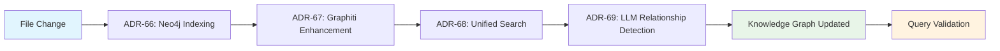

# ADR-70: Cross-ADR Integration Testing & CI/CD Pipeline

**Date:** 2025-09-21
**Status:** Abandoned
**Context:** Neural GraphRAG MCP Architecture (L9 2025)
**Dependencies:** ADR-66, ADR-67, ADR-68, ADR-69

## Context and Problem Statement

While ADRs 66-69 each have unit tests and some functional testing, we lack comprehensive **end-to-end integration testing** that validates the complete GraphRAG pipeline as a unified system. Current gaps include:

1. **Cross-ADR Dependencies**: No validation of ADR-66 → ADR-67 → ADR-68 → ADR-69 workflow
2. **Production Readiness**: No automated CI/CD pipeline with deployment gates
3. **Performance Validation**: No full-stack performance benchmarking
4. **Disaster Recovery**: No testing of failure scenarios across multiple components
5. **Multi-Project Isolation**: No validation of project-level data isolation across the stack

## Decision

Implement a comprehensive **Cross-ADR Integration Testing & CI/CD Pipeline** that:

1. **Validates End-to-End Workflows** across all 4 ADRs
2. **Automates CI/CD Gates** with strict exit criteria
3. **Provides Performance Benchmarking** for the complete stack
4. **Tests Disaster Recovery Scenarios** and graceful degradation
5. **Ensures Production Readiness** with automated deployment validation

## Architecture Overview

### Integration Test Pyramid

```
                    ┌─────────────────────────────┐
                    │   Production Validation     │ ← ADR-70 Focus
                    │   (Cross-ADR E2E Tests)     │
                    └─────────────────────────────┘
                   ┌─────────────────────────────────┐
                   │     Integration Tests           │ ← ADR-70 Focus
                   │   (Multi-Component Workflows)   │
                   └─────────────────────────────────┘
              ┌───────────────────────────────────────────┐
              │            Unit Tests                     │ ← ADR-66/67/68/69
              │     (Individual ADR Components)          │
              └───────────────────────────────────────────┘
```

### End-to-End Workflow Validation



## Implementation Plan

### Phase 1: Core Integration Testing Framework (Week 1)

**Goals**: Establish automated testing infrastructure for cross-ADR validation

```python
# Cross-ADR Integration Test Framework
class CrossADRIntegrationTestSuite:
    """Comprehensive integration testing across ADRs 66-69"""

    def __init__(self):
        self.neo4j_service = None  # ADR-66
        self.graphiti_service = None  # ADR-67
        self.unified_search = None  # ADR-68
        self.llm_detector = None  # ADR-69
        self.test_project = "integration-test-project"

    async def setup_test_environment(self):
        """Initialize complete GraphRAG stack for testing"""
        # Initialize all services in dependency order
        await self._setup_neo4j_service()  # ADR-66
        await self._setup_graphiti_service()  # ADR-67
        await self._setup_unified_search()  # ADR-68
        await self._setup_llm_detector()  # ADR-69

        # Create isolated test project
        await self._create_test_project()
```

**Phase 1 Deliverables:**
- Cross-ADR test framework with service orchestration
- Docker Compose configuration for full stack testing
- Test data generation and cleanup automation
- Basic health check validation across all components

**Phase 1 Integration Tests:**
```python
integration_tests_phase1 = [
    "All services start successfully and pass health checks",
    "Service discovery and networking connectivity validation",
    "Database initialization and schema validation",
    "Project isolation setup and verification",
    "Test data generation and cleanup procedures"
]
```

**Phase 1 CI/CD Gates:**
```python
phase1_cicd_gates = [
    "✅ Full stack deployment automation (Docker Compose)",
    "✅ All 4 ADR services pass individual health checks",
    "✅ Inter-service connectivity validation (100% success)",
    "✅ Test environment setup/teardown (<60 seconds)",
    "✅ Project isolation validation (0% cross-project leakage)"
]
```

### Phase 2: End-to-End Workflow Testing (Week 2)

**Goals**: Validate complete file-to-query workflows across all ADRs

```python
async def test_complete_e2e_workflow():
    """Test the full GraphRAG pipeline end-to-end"""

    # Step 1: File processing (ADR-66)
    test_file = create_test_documentation_file()
    indexing_result = await neo4j_service.index_file(test_file)
    assert indexing_result.success == True
    assert indexing_result.chunks_created > 0

    # Step 2: Graphiti enhancement (ADR-67)
    episode_result = await graphiti_service.create_episode(
        indexing_result.chunks
    )
    assert episode_result.entities_created > 0
    assert episode_result.relationships_created > 0

    # Step 3: Unified search validation (ADR-68)
    search_result = await unified_search.semantic_code_search(
        "test documentation patterns"
    )
    assert len(search_result.results) > 0
    assert test_file.path in [r.file_path for r in search_result.results]

    # Step 4: LLM relationship detection (ADR-69)
    relationships = await llm_detector.detect_relationships(
        test_file.path, test_file.content
    )
    assert len(relationships) > 0
    assert all(r["confidence"] > 0.8 for r in relationships)

    # Step 5: Query enrichment validation
    enriched_search = await unified_search.enhanced_search_with_relationships(
        "test documentation patterns"
    )
    assert enriched_search.accuracy > search_result.accuracy
```

**Phase 2 Integration Tests:**
```python
e2e_workflow_tests = [
    "Complete file indexing pipeline (file → Neo4j → Graphiti)",
    "Cross-ADR data consistency validation",
    "Search accuracy improvement with LLM enhancement",
    "Temporal query functionality across all content types",
    "Multi-file project processing (100+ files simultaneously)",
    "Concurrent user workflow simulation (10+ simultaneous operations)"
]
```

**Phase 2 CI/CD Gates:**
```python
phase2_cicd_gates = [
    "✅ End-to-end workflow success rate ≥99%",
    "✅ Search accuracy improvement ≥15% with LLM enhancement",
    "✅ Complete pipeline latency ≤5 seconds for single file",
    "✅ Multi-file processing throughput ≥20 files/minute",
    "✅ Data consistency validation across all storage layers",
    "✅ Zero data loss during concurrent operations"
]
```

### Phase 3: Performance & Scalability Testing (Week 3)

**Goals**: Validate production-grade performance across the complete stack

```python
class PerformanceTestSuite:
    """Production-grade performance validation"""

    async def test_scalability_benchmarks(self):
        """Test system performance under realistic load"""

        # Large-scale indexing test
        large_project = generate_test_project(
            files=1000,
            total_size_mb=100
        )

        start_time = time.time()
        indexing_results = await self.process_entire_project(large_project)
        total_time = time.time() - start_time

        # Performance assertions
        assert total_time <= 300  # ≤5 minutes for 1000 files
        assert indexing_results.success_rate >= 0.99
        assert indexing_results.avg_latency_per_file <= 0.3  # ≤300ms/file

        # Memory usage validation
        peak_memory = get_peak_memory_usage()
        assert peak_memory <= 8  # ≤8GB for large project

        # Concurrent query performance
        concurrent_queries = [
            "authentication patterns",
            "database connections",
            "error handling",
            "API endpoints",
            "test utilities"
        ]

        query_results = await asyncio.gather(*[
            unified_search.semantic_code_search(query)
            for query in concurrent_queries * 10  # 50 concurrent queries
        ])

        assert all(r.latency <= 0.5 for r in query_results)  # ≤500ms
        assert all(len(r.results) > 0 for r in query_results)
```

**Phase 3 Integration Tests:**
```python
performance_tests = [
    "Large-scale project processing (1000+ files, 100MB+)",
    "Concurrent query load testing (50+ simultaneous queries)",
    "Memory usage validation under sustained load",
    "Database performance under high write/read load",
    "GPU resource utilization efficiency (ADR-69)",
    "Redis cache performance and hit rate optimization"
]
```

**Phase 3 CI/CD Gates:**
```python
phase3_cicd_gates = [
    "✅ Large project processing ≤5 minutes (1000 files)",
    "✅ Concurrent query performance ≤500ms P95 latency",
    "✅ Memory usage ≤8GB for large projects",
    "✅ Database connection pool efficiency ≥95%",
    "✅ GPU utilization efficiency 60-80% range (ADR-69)",
    "✅ Redis cache hit rate ≥80% for relationship detection"
]
```

### Phase 4: Disaster Recovery & Production Validation (Week 4)

**Goals**: Test failure scenarios and production deployment readiness

```python
class DisasterRecoveryTestSuite:
    """Test system resilience and failure scenarios"""

    async def test_service_failure_scenarios(self):
        """Validate graceful degradation and recovery"""

        # Test 1: Neo4j failure recovery
        await self.simulate_neo4j_failure()
        search_result = await unified_search.search_with_fallback("test query")
        assert search_result.success == True  # Should fallback gracefully
        await self.restore_neo4j()

        # Test 2: Redis cache failure
        await self.simulate_redis_failure()
        llm_result = await llm_detector.detect_relationships_without_cache("test.md")
        assert llm_result is not None  # Should work without cache
        await self.restore_redis()

        # Test 3: Qwen3/Ollama failure
        await self.simulate_ollama_failure()
        fallback_result = await llm_detector.detect_relationships("test.md")
        assert fallback_result is not None  # Should fallback to heuristics
        await self.restore_ollama()

        # Test 4: Full system recovery validation
        recovery_result = await self.validate_full_system_recovery()
        assert recovery_result.all_services_healthy == True
        assert recovery_result.data_consistency == True
```

**Phase 4 Integration Tests:**
```python
disaster_recovery_tests = [
    "Individual service failure and recovery (Neo4j, Redis, Ollama)",
    "Cascading failure prevention and isolation",
    "Data consistency after service restoration",
    "Backup and restore procedures validation",
    "Multi-project data isolation during failures",
    "Production deployment automation and rollback"
]
```

**Phase 4 CI/CD Gates:**
```python
phase4_cicd_gates = [
    "✅ 100% graceful degradation for all service failures",
    "✅ System recovery time ≤5 minutes for any single service failure",
    "✅ Zero data loss during failure scenarios",
    "✅ Production deployment automation 100% success rate",
    "✅ Rollback procedures ≤3 minutes execution time",
    "✅ 24-hour continuous operation stability validation"
]
```

## Continuous Integration Pipeline

### Automated Testing Workflow

```yaml
# .github/workflows/cross-adr-integration.yml
name: Cross-ADR Integration Testing

on:
  push:
    paths:
      - 'docs/adr/006*.md'
      - 'neural-tools/**'
  pull_request:
    paths:
      - 'docs/adr/006*.md'
      - 'neural-tools/**'

jobs:
  integration-tests:
    runs-on: ubuntu-latest

    steps:
      - name: Checkout code
        uses: actions/checkout@v4

      - name: Setup Docker Compose
        run: |
          docker-compose -f docker-compose.integration.yml up -d
          sleep 30  # Allow services to start

      - name: Run Phase 1 Tests
        run: |
          python -m pytest tests/integration/phase1/ -v

      - name: Run Phase 2 E2E Tests
        run: |
          python -m pytest tests/integration/phase2/ -v

      - name: Run Phase 3 Performance Tests
        run: |
          python -m pytest tests/integration/phase3/ -v

      - name: Run Phase 4 Disaster Recovery Tests
        run: |
          python -m pytest tests/integration/phase4/ -v

      - name: Generate Integration Report
        run: |
          python scripts/generate_integration_report.py

      - name: Cleanup Test Environment
        if: always()
        run: |
          docker-compose -f docker-compose.integration.yml down -v
```

### Production Deployment Gates

```python
class ProductionDeploymentGates:
    """Automated production readiness validation"""

    async def validate_production_readiness(self) -> bool:
        """All gates must pass before production deployment"""

        gates = [
            await self.validate_performance_benchmarks(),
            await self.validate_security_requirements(),
            await self.validate_data_sovereignty(),
            await self.validate_scalability_requirements(),
            await self.validate_disaster_recovery(),
            await self.validate_monitoring_coverage(),
            await self.validate_documentation_completeness()
        ]

        return all(gates)

    async def validate_performance_benchmarks(self) -> bool:
        """Validate all performance requirements are met"""
        benchmarks = await self.run_performance_test_suite()

        return (
            benchmarks.indexing_throughput >= 20 and  # files/minute
            benchmarks.search_latency_p95 <= 0.5 and  # seconds
            benchmarks.memory_usage <= 8 and  # GB
            benchmarks.gpu_utilization_efficiency >= 0.6  # 60%
        )
```

## Success Metrics and Exit Conditions

### Overall Success Criteria

**Must achieve ALL criteria for ADR-70 completion:**

1. **End-to-End Workflow Success**: ≥99% success rate for complete file→query workflows
2. **Performance Benchmarks**: Meet all latency, throughput, and resource utilization targets
3. **Disaster Recovery**: 100% graceful degradation for all failure scenarios
4. **Production Readiness**: Automated deployment with zero-downtime updates
5. **Cross-ADR Integration**: Seamless operation across all 4 ADRs (66-69)
6. **CI/CD Automation**: 100% automated testing and deployment pipeline

### Quality Gates

| Metric | Target | Measurement |
|--------|--------|-------------|
| **E2E Success Rate** | ≥99% | Automated workflow testing |
| **Search Latency (P95)** | ≤500ms | Performance benchmarking |
| **Indexing Throughput** | ≥20 files/min | Large project testing |
| **Memory Usage** | ≤8GB | Resource monitoring |
| **Recovery Time** | ≤5 minutes | Disaster recovery testing |
| **Deployment Success** | 100% | CI/CD automation |

## Risk Mitigation

### Technical Risks

1. **Complex Service Dependencies**: Mitigated by isolated testing and service mocking capabilities
2. **Performance Bottlenecks**: Addressed through comprehensive benchmarking and optimization
3. **Integration Complexity**: Managed through phased rollout and automated validation
4. **Resource Requirements**: Validated through scalability testing and resource monitoring

### Operational Risks

1. **Test Environment Drift**: Prevented by infrastructure-as-code and automated provisioning
2. **CI/CD Pipeline Complexity**: Mitigated by modular testing phases and clear exit criteria
3. **Cross-Team Coordination**: Addressed through clear ADR dependencies and integration contracts

## Implementation Timeline

- **Week 1**: Core integration testing framework
- **Week 2**: End-to-end workflow validation
- **Week 3**: Performance and scalability testing
- **Week 4**: Disaster recovery and production validation

**Total Duration**: 4 weeks
**Dependencies**: ADRs 66, 67, 68, 69 must be individually complete
**Delivery**: Production-ready GraphRAG stack with automated CI/CD pipeline

## Conclusion

ADR-70 provides the essential integration testing and CI/CD infrastructure needed to ensure the GraphRAG stack operates reliably as a unified system. By implementing comprehensive cross-ADR validation, we can confidently deploy and maintain a production-grade neural knowledge graph platform.

This ADR bridges the gap between individual ADR unit tests and true production readiness, providing the automation and validation necessary for continuous integration and deployment of the complete GraphRAG architecture.