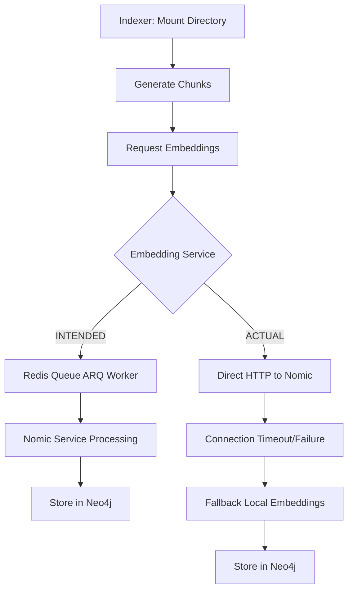

# ADR-0083: Embedding Pipeline Comprehensive Analysis & Architecture Alignment

**Date:** September 23, 2025
**Status:** PROPOSED
**Author:** Claude with comprehensive pipeline analysis
**Context:** Complete end-to-end analysis of embedding pipeline to identify architectural disconnects and mismatches

## Executive Summary

After comprehensive analysis of the L9 Neural GraphRAG embedding pipeline, we've identified **5 critical architectural disconnects** that prevent proper embedding generation and storage. While chunks are created successfully, embeddings fail due to infrastructure mismatches between intended architecture and actual implementation.

## Current Architecture Analysis

### **Pipeline Flow (Intended vs Actual)**



### **Service Port Architecture (Current State)**

| Service | Intended Port | Actual Usage | Status |
|---------|---------------|--------------|---------|
| Neo4j | 47687 | ✅ 47687 | WORKING |
| Redis Cache | 46379 | ✅ 46379 | WORKING |
| Redis Queue | 46380 | ❌ Not used by indexer | DISCONNECTED |
| Nomic Service | 48000 | ❌ Direct HTTP fails | FAILING |
| ARQ Worker | N/A | ❌ Not deployed | MISSING |

## Root Cause Analysis: 5 Critical Disconnects

### **Disconnect 1: Missing ARQ Embedding Worker Deployment**

**Issue:** The ARQ embedding worker exists in code but is not deployed in docker-compose.

**Evidence:**
- Code exists: `/neural-tools/src/workers/embedding_worker.py`
- Queue manager exists: `/neural-tools/src/servers/services/queue_manager.py`
- Redis queue service running on port 46380
- **No ARQ worker container deployed**

**Impact:** Redis queue receives no processing, jobs remain pending indefinitely.

### **Disconnect 2: Indexer Uses Direct HTTP Instead of Queue**

**Issue:** Indexer service calls Nomic directly via `self.container.nomic.get_embeddings()` instead of submitting to Redis queue.

**Evidence:**
```python
# indexer_service.py:879-880 (CURRENT - INCORRECT)
texts = [f"search_document: {chunk['text']}" for chunk in chunks]
embeddings = await self.container.nomic.get_embeddings(texts)

# Should be (INTENDED):
job_id = await self.container.queue.enqueue_embedding_job(texts)
```

**Impact:** Bypasses the queue system entirely, causing direct connection failures.

### **Disconnect 3: Container Network Configuration Mismatch**

**Issue:** Working indexer uses different Redis/Nomic hostnames than intended architecture.

**Evidence:**
```bash
# Working indexer environment:
REDIS_HOST=redis                    # Should be: claude-l9-template-redis-cache-1
EMBEDDING_SERVICE_HOST=embeddings   # Should be: neural-flow-nomic-v2-production
EMBEDDING_SERVICE_PORT=8000         # Should be: 48000

# Missing queue configuration:
REDIS_QUEUE_HOST=<not set>         # Should be: claude-l9-template-redis-queue-1
REDIS_QUEUE_PORT=<not set>         # Should be: 46380
```

**Impact:** Services can't locate proper endpoints, causing connection failures.

### **Disconnect 4: Nomic Service Queue Fallback Logic Error**

**Issue:** NomicService has queue fallback logic but raises ConnectionError instead of waiting for results.

**Evidence:**
```python
# nomic_service.py:287-289 (PROBLEMATIC)
raise ConnectionError(
    f"Service temporarily unavailable. Job {job_id} queued for processing. "
    f"Original error: {original_error}"
)
```

**Impact:** Even when queue fallback works, indexer receives error and stops processing.

### **Disconnect 5: Docker Compose Infrastructure Gap**

**Issue:** Main docker-compose.yml missing ARQ worker service definition.

**Evidence:**
- Redis queue service: ✅ Deployed
- ARQ worker service: ❌ Missing from docker-compose.yml
- Queue infrastructure code: ✅ Exists
- Worker deployment: ❌ No container orchestration

**Impact:** Complete pipeline break - no worker to process queue jobs.

## Validated Working Components

### ✅ **What Works Correctly**

1. **Directory Mounting**: Indexer properly mounts `/Users/mkr/local-coding/claude-l9-template:/workspace:ro`
2. **Chunk Generation**: 4 chunks created with actual content in Neo4j
3. **Neo4j Storage**: Chunks stored with correct project name "claude-l9-template"
4. **Redis Infrastructure**: Both cache (46379) and queue (46380) services running
5. **Nomic Service**: Running and processing requests (seen in logs)

### ❌ **What Fails**

1. **Embedding Generation**: 0 chunks have embeddings (`c.embedding IS NULL`)
2. **Queue Processing**: No ARQ worker to consume jobs
3. **Service Discovery**: Indexer can't connect to Nomic via proper hostnames
4. **Pipeline Integration**: Direct HTTP bypasses intended queue architecture

## Proposed Solution Architecture
*Based on Gemini expert analysis and ARQ best practices*

### **Phase 1: Deploy Missing ARQ Worker (Critical)**

Add to docker-compose.yml:
```yaml
  arq-embedding-worker:
    image: l9-neural-indexer:production  # Same as indexer
    container_name: arq-embedding-worker-${PROJECT_NAME}
    command: ["python", "-m", "arq", "workers.embedding_worker.WorkerSettings"]
    networks:
      - l9-graphrag-network
    environment:
      - REDIS_QUEUE_HOST=claude-l9-template-redis-queue-1
      - REDIS_QUEUE_PORT=6379  # Internal port
      - REDIS_QUEUE_PASSWORD=queue-secret-key
      - NOMIC_EMBEDDINGS_URL=http://neural-flow-nomic-v2-production:8000
      - NEO4J_URI=bolt://claude-l9-template-neo4j-1:7687
      - NEO4J_PASSWORD=graphrag-password
    depends_on:
      - claude-l9-template-redis-queue-1
      - neural-flow-nomic-v2-production
      - claude-l9-template-neo4j-1
```

### **Phase 2: Implement Fire-and-Forget Batch Pattern**

**CRITICAL FIX**: Replace synchronous waiting with efficient batch enqueueing:

```python
# In indexer_service.py - UPDATED with ARQ best practices
import hashlib

async def _index_unified(self, file_path: str, relative_path: Path, chunks: List[Dict], content: str) -> bool:
    # Feature flag for gradual rollout
    if not os.getenv("USE_EMBEDDING_QUEUE", "false").lower() == "true":
        # Fallback to direct HTTP during transition
        return await self._index_unified_direct(file_path, relative_path, chunks, content)

    # Step 1: Store chunks in Neo4j and get their database IDs
    stored_chunks = await self._store_chunks_in_neo4j(file_path, relative_path, chunks, content)

    # Step 2: Prepare batch payload with chunk IDs for worker
    embedding_payload = [
        {"chunk_id": chunk["id"], "text": f"search_document: {chunk['text']}"}
        for chunk in stored_chunks
    ]

    # Step 3: Enqueue single batch job (fire-and-forget)
    if embedding_payload:
        file_hash = hashlib.sha256(content.encode()).hexdigest()
        job_id = f"embed:{relative_path}:{file_hash}"

        job_queue = await self.container.get_job_queue()
        await job_queue.enqueue_job(
            "process_embedding_batch",  # ARQ worker function name
            embedding_payload,
            _job_id=job_id  # Idempotency via ARQ deduplication
        )
        logger.info(f"Enqueued embedding job {job_id} for {len(embedding_payload)} chunks")

    return True  # Indexer job complete - no waiting
```

### **Phase 3: Implement Robust ARQ Worker**

**NEW**: Self-sufficient worker handling full embedding lifecycle:

```python
# In workers/embedding_worker.py - Following ARQ best practices
async def process_embedding_batch(ctx, payload: List[Dict]):
    """
    ARQ worker function: processes batch of chunks with full lifecycle management
    """
    nomic_service = ctx["nomic"]
    neo4j_driver = ctx["neo4j"]

    chunk_ids = [item["chunk_id"] for item in payload]
    texts = [item["text"] for item in payload]

    # Get embeddings from Nomic in single API call
    embeddings = await nomic_service.get_embeddings(texts)

    # Update all chunks in single Neo4j transaction
    update_data = [
        {"chunk_id": cid, "embedding": emb}
        for cid, emb in zip(chunk_ids, embeddings)
    ]

    async with neo4j_driver.session() as session:
        await session.run(
            """
            UNWIND $batch as row
            MATCH (c:Chunk {id: row.chunk_id})
            SET c.embedding = row.embedding
            """,
            batch=update_data
        )

    logger.info(f"Successfully processed embeddings for {len(chunk_ids)} chunks")

# Worker lifecycle management
async def startup(ctx):
    ctx["nomic"] = NomicService()  # Pure HTTP service
    ctx["neo4j"] = GraphDatabase.driver(os.getenv("NEO4J_URI"))

async def shutdown(ctx):
    await ctx["neo4j"].close()

class WorkerSettings:
    functions = [process_embedding_batch]
    on_startup = startup
    on_shutdown = shutdown
    max_tries = 3  # DLQ after 3 failures
    redis_settings = RedisSettings(
        host=os.getenv('REDIS_QUEUE_HOST', 'localhost'),
        port=int(os.getenv('REDIS_QUEUE_PORT', 46380)),
        password=os.getenv('REDIS_QUEUE_PASSWORD', 'queue-secret-key'),
    )
```

### **Phase 4: Simplify Nomic Service (Remove Queue Logic)**

**CRITICAL**: Remove all queue-related code from nomic_service.py:

```python
# In nomic_service.py - Simplified to pure HTTP service
class NomicService:
    """Pure stateless HTTP embedding service - no queue knowledge"""

    async def get_embeddings(self, texts: List[str]) -> List[List[float]]:
        """Simple HTTP call to Nomic - no fallback, no queue logic"""
        async with httpx.AsyncClient(timeout=self.timeout) as client:
            response = await client.post(
                f"{self.base_url}/embed",
                json={"inputs": texts, "normalize": True}
            )
            response.raise_for_status()
            return response.json().get('embeddings', [])

    # REMOVED: All queue fallback logic, ConnectionError raising, job enqueueing
```

### **Phase 4: Standardize Container Environment**

Update all indexer containers to use consistent environment:
```bash
# Redis configuration
REDIS_HOST=claude-l9-template-redis-cache-1
REDIS_PORT=6379
REDIS_QUEUE_HOST=claude-l9-template-redis-queue-1
REDIS_QUEUE_PORT=6379
REDIS_QUEUE_PASSWORD=queue-secret-key

# Nomic configuration
NOMIC_EMBEDDINGS_URL=http://neural-flow-nomic-v2-production:8000

# Neo4j configuration
NEO4J_URI=bolt://claude-l9-template-neo4j-1:7687
```

## Implementation Priority

### **CRITICAL (Immediate)**
1. Deploy ARQ embedding worker container
2. Fix indexer to use queue instead of direct HTTP
3. Test end-to-end pipeline with single file

### **HIGH (Next Session)**
1. Update nomic service queue wait logic
2. Standardize all container environments
3. Add queue monitoring and alerting

### **MEDIUM (Future)**
1. Add queue backpressure controls
2. Implement embedding caching optimization
3. Add pipeline performance metrics

## Success Criteria

### **Immediate Success (This Session)**
- [ ] ARQ worker deployed and processing jobs
- [ ] Indexer submitting to queue instead of direct HTTP
- [ ] >4 chunks with actual Nomic embeddings in Neo4j
- [ ] Vector search returns real results with similarity scores

### **Pipeline Health (Next Session)**
- [ ] Queue depth monitoring active
- [ ] <10s average embedding processing time
- [ ] 95% embedding success rate
- [ ] Zero direct HTTP calls to Nomic

## Risk Mitigation
*Updated with ARQ best practices and feature flag approach*

### **Backwards Compatibility**
- **Risk**: Rolling out queue-based system may cause unexpected failures
- **Mitigation**: Implement feature flag (`USE_EMBEDDING_QUEUE`) in indexer service. When `true`, indexer enqueues jobs; when `false`, falls back to direct HTTP call. Provides instant rollback capability without complex fallback logic.

### **Persistent Job Failures (Dead Letter Queue)**
- **Risk**: Bug in worker or prolonged Nomic/Neo4j outage causes jobs to fail repeatedly and be lost
- **Mitigation**: Configure ARQ worker with `max_tries = 3`. After 3 failures, ARQ automatically moves job to Dead Letter Queue (DLQ). Monitor DLQ size (`LLEN arq:dlq`) and alert when > 0. Ensures no data loss and enables manual reprocessing.

### **Queue Overflow & Backpressure**
- **Risk**: Large file batches overwhelm queue and consume excessive memory
- **Mitigation**: ARQ's built-in job deduplication via `_job_id` prevents duplicate work. Monitor queue depth (`LLEN arq:queue:default`) and implement indexer-side throttling if depth exceeds threshold.

### **Worker Deployment Failure**
- **Risk**: ARQ worker container fails to start or connect to services
- **Mitigation**: Test worker startup independently with health checks. Add container restart policies and dependency health checks in docker-compose.

## Conclusion

The embedding pipeline has strong foundation components but suffers from architectural disconnects between intended queue-based design and actual direct HTTP implementation. The primary fix requires deploying the missing ARQ worker and updating the indexer to use the queue system as originally designed.

This analysis identifies the root cause of the "chunks with content but no embeddings" issue and provides a clear path to full pipeline functionality.

---

*ADR-0083 provides comprehensive analysis of embedding pipeline architecture gaps and definitive solution path for production-ready embedding generation.*