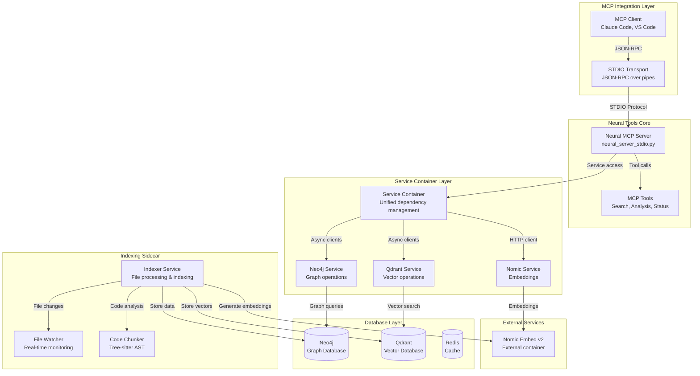
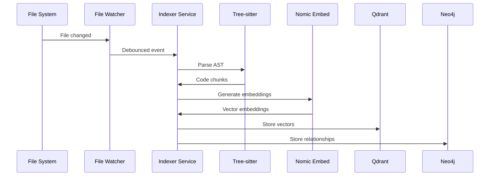
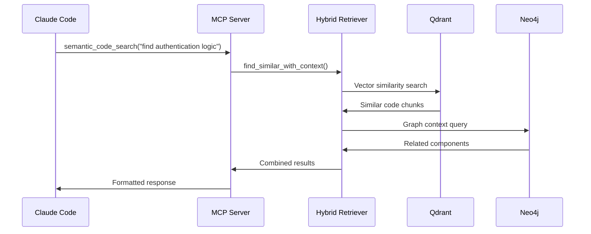

# Neural Tools Developer Quickstart & Architecture Guide

## 🏗️ System Architecture Overview

The Neural Tools platform is a **hybrid GraphRAG system** that provides AI assistants with intelligent code search and analysis capabilities through the MCP (Model Context Protocol).

### Architecture Diagram


## 🛠️ Technology Stack

### Core Technologies
| Component | Technology | Version | Purpose |
|-----------|------------|---------|---------|
| **Protocol** | MCP (Model Context Protocol) | 2025-06-18 | AI tool integration standard |
| **Transport** | STDIO | JSON-RPC | Communication with Claude Code |
| **Language** | Python | 3.9+ | Core implementation |
| **Containerization** | Docker + Docker Compose | Latest | Service orchestration |

### Database Stack
| Database | Purpose | Port | Features |
|----------|---------|------|----------|
| **Neo4j** | Graph relationships | 47687 | Code dependencies, imports, call graphs |
| **Qdrant** | Vector embeddings | 46333 | Semantic code search |
| **Redis** | Caching | 46379 | Performance optimization |

### Service Stack  
| Service | Technology | Port | Role |
|---------|------------|------|------|
| **MCP Server** | Python + MCP SDK | - | Tool provider for Claude Code |
| **Neural Indexer** | Python + Watchdog | 48080 | Real-time file indexing |
| **Nomic Embed** | External container | 48000 | Text embeddings |
| **Monitoring** | Prometheus + Grafana | 49091/43001 | Metrics & dashboards |

## 📁 Project Structure

```
neural-tools/
├── src/                                    # Core source code
│   ├── neural_mcp/                         # MCP server implementation
│   │   └── neural_server_stdio.py          # Main MCP STDIO server
│   ├── servers/services/                   # Service layer
│   │   ├── service_container.py            # Unified service management
│   │   ├── indexer_service.py              # File indexing logic
│   │   ├── neo4j_service.py                # Graph database client
│   │   ├── qdrant_service.py               # Vector database client
│   │   ├── nomic_service.py                # Embedding service client
│   │   └── hybrid_retriever.py             # GraphRAG search engine
│   ├── infrastructure/                     # Supporting infrastructure
│   │   ├── tree_sitter_ast.py              # Code parsing with Tree-sitter
│   │   ├── file_watcher.py                 # File system monitoring
│   │   ├── telemetry.py                    # Monitoring & metrics
│   │   └── security.py                     # Security utilities
│   └── clients/                            # Database clients
│       ├── neo4j_client.py                 # Low-level Neo4j operations
│       └── neo4j_migration_utils.py        # Schema management
├── docker/                                 # Docker configuration
│   ├── Dockerfile                          # Main application container
│   ├── Dockerfile.indexer                  # Indexer sidecar container
│   └── scripts/indexer-entrypoint.py       # Indexer entry point
├── config/                                 # Configuration files
├── docs/                                   # Documentation
└── docker-compose.yml                      # Service orchestration
```

## 🔄 Data Flow Architecture

### 1. File Indexing Flow


### 2. Search Query Flow  


## ✅ Pre-Flight Checklist (Context7 + Environment)

Before running or debugging Neural Tools, confirm these items. For up-to-date details, run the lookups in `context7-preflight-checklist.md`.

- Services/ports: verify host vs container mappings
  - Neo4j: host `47687` ↔ container `7687`
  - Qdrant HTTP: host `46333` ↔ container `6333` (ensure `QDRANT_HTTP_PORT=6333` in containers)
  - Redis: host `46379` ↔ container `6379`
  - Indexer sidecar API: host `48080` ↔ container `8080`
- Neo4j config consistency
  - Prefer `NEO4J_URI` where available (e.g., `bolt://localhost:47687` on host)
  - If using host/port, set `NEO4J_HOST=localhost` and `NEO4J_PORT=47687` for MCP
- Qdrant client settings
  - Containers: set `QDRANT_HTTP_PORT=6333` (wrapper defaults may not match)
  - Confirm async methods are awaited; use the service wrapper, not raw client
- Embedding dimension alignment
  - Confirm Nomic Embed v2 dimension (e.g., 768/1024/1536)
  - Ensure Qdrant collection vector size matches embedding dim; set `EMBED_DIM` if needed
- MCP STDIO configuration
  - `.mcp.json` `PYTHONPATH` includes `neural-tools/src`
  - `run_mcp_server.py` path is correct
- tree-sitter grammars available in runtime/container
  - `python -c "import tree_sitter_languages; print('OK')"` succeeds
- Indexer queue ready
  - Ensure the indexer initializes its `pending_queue` before processing
  - Sidecar `/status` returns structured metrics; no `NoneType` queue errors

See also:
- Problems & Solutions Roadmap: `problems-and-solutions-roadmap.md`
- Implementation Roadmap: `completed/implementation-roadmap.md`
- Context7 Pre-Flight: `context7-preflight-checklist.md`

## 🏃‍♂️ Quick Start

### Prerequisites
- Docker & Docker Compose
- 16GB RAM (8GB minimum)
- 10GB disk space

### 1. Start Core Services
```bash
# Start databases
docker-compose up -d neo4j qdrant redis

# Start embedding service (external container)
docker run -d --name neural-flow-nomic-v2-production \
  --network l9-graphrag-network \
  -p 48000:48000 \
  nomic-embed:latest
```

### 2. Start Indexer Sidecar
```bash
# Build and start indexer
docker-compose up -d l9-indexer

# Monitor indexing progress
docker logs -f l9-neural-indexer
```

### 3. Configure MCP Integration
Update `.mcp.json` in your Claude Code configuration:
```json
{
  "mcpServers": {
    "neural-tools": {
      "command": "python3",
      "args": ["/path/to/neural-tools/run_mcp_server.py"],
      "env": {
        "NEO4J_URI": "bolt://localhost:47687",
        "QDRANT_PORT": "46333",
        "EMBEDDING_SERVICE_PORT": "48000"
      }
    }
  }
}
```

## 🔧 Key Service Components

### Service Container Pattern
The `ServiceContainer` class provides unified dependency management:
- **Neo4j Service**: Graph database operations with async client
- **Qdrant Service**: Vector database operations with connection pooling  
- **Nomic Service**: Embedding generation via HTTP API
- **Graceful Degradation**: Continues with reduced functionality when services fail

### Indexer Service Architecture
The `IncrementalIndexer` handles real-time code processing:
- **File Watching**: Debounced file system events via Watchdog
- **Tree-sitter Parsing**: Multi-language AST analysis
- **Semantic Chunking**: Intelligent code chunk extraction
- **Dual Storage**: Graph relationships (Neo4j) + vector embeddings (Qdrant)

### Hybrid Retriever (GraphRAG)
Combines multiple search strategies:
1. **Semantic Search**: Vector similarity in Qdrant
2. **Graph Traversal**: Relationship expansion in Neo4j  
3. **Context Enrichment**: Merge results for comprehensive context
4. **Caching**: Redis-backed performance optimization

## 📊 Monitoring & Health

### Health Endpoints
| Service | Endpoint | Purpose |
|---------|----------|---------|
| Indexer | `http://localhost:48080/health` | Container health |
| Indexer | `http://localhost:48080/status` | Detailed metrics |
| Indexer | `http://localhost:48080/metrics` | Prometheus metrics |

### Key Metrics
- **Files Processed**: Total files indexed
- **Queue Depth**: Pending indexing jobs
- **Service Health**: Database connection status
- **Processing Duration**: Indexing performance

### Logging Structure
```json
{
  "timestamp": "2025-09-08T16:45:01,456",
  "level": "INFO", 
  "logger": "indexer-service",
  "message": "File indexed successfully",
  "file": "indexer_service.py",
  "line": 123
}
```

## 🔐 Security Configuration

### Container Security
- **User Isolation**: Runs as non-root user (1000:1000)
- **Resource Limits**: Memory and CPU constraints
- **Read-only Filesystem**: Where possible
- **Security Options**: `no-new-privileges:true`

### Network Security  
- **Internal Network**: `l9-graphrag-network`
- **Port Isolation**: Non-standard ports to avoid conflicts
- **Service-to-Service**: Internal DNS resolution

## 🚀 Development Workflow

### Local Development
```bash
# Start development environment
docker-compose up -d neo4j qdrant redis

# Run MCP server locally  
cd neural-tools
python run_mcp_server.py

# Test with Claude Code
# Server auto-reloads on code changes
```

### Adding New MCP Tools
1. Edit `src/neural_mcp/neural_server_stdio.py`
2. Add tool definition to `@server.list_tools()`
3. Implement tool handler with `@server.call_tool()`
4. Test via Claude Code interface

### Container Development
```bash
# Build with latest changes
docker-compose build l9-indexer

# View container logs
docker-compose logs -f l9-indexer

# Interactive debugging
docker exec -it l9-neural-indexer /bin/bash
```

## ⚡ Performance Considerations

### Scalability Patterns
- **Async/Await**: Non-blocking I/O throughout
- **Connection Pooling**: Efficient database connections
- **Debounced Processing**: Batch file changes to reduce load
- **Caching**: Redis for frequently accessed data

### Memory Management
- **Streaming**: Process large files in chunks
- **Lazy Loading**: Load embeddings on demand
- **Resource Limits**: Container memory constraints
- **Garbage Collection**: Explicit cleanup of large objects

### Configuration Tuning
```yaml
environment:
  - BATCH_SIZE=10              # Files per batch
  - DEBOUNCE_INTERVAL=2.0      # File change debouncing
  - MAX_QUEUE_SIZE=1000        # Max pending files
  - ENABLE_METRICS=true        # Performance monitoring
```

## 🐛 Troubleshooting

### Common Issues

#### Services in Degraded Mode
**Symptom**: Indexer logs show "Services initialized: degraded"
**Solution**: Check database connectivity:
```bash
# Test Neo4j
docker exec l9-neural-indexer curl -f bolt://neo4j:7687

# Test Qdrant  
docker exec l9-neural-indexer curl -f http://qdrant:6333/health
```

#### MCP Connection Failed
**Symptom**: Claude Code can't connect to neural-tools server
**Solution**: Verify MCP configuration:
```bash
# Check server process
ps aux | grep neural_server_stdio.py

# Test STDIO communication
echo '{"jsonrpc":"2.0","method":"list_tools","id":1}' | python run_mcp_server.py
```

#### Only .txt Files Indexed
**Symptom**: Tree-sitter not processing code files
**Solution**: Verify tree-sitter installation:
```bash
docker exec l9-neural-indexer python -c "import tree_sitter_languages; print('OK')"
```

### Log Analysis
```bash
# Follow indexer logs
docker logs -f l9-neural-indexer

# Search for errors
docker logs l9-neural-indexer 2>&1 | grep ERROR

# Monitor file processing
docker logs l9-neural-indexer 2>&1 | grep "File indexed"
```

## 🔮 Future Enhancements

### Planned Features
- **Multi-tenancy**: Support multiple projects simultaneously
- **Advanced Reranking**: Cross-encoder models for result refinement
- **Streaming Embeddings**: Real-time embedding updates
- **GraphRAG Extensions**: More sophisticated graph traversal patterns

### Architecture Evolution
- **Microservices**: Split monolithic indexer into focused services
- **Event Sourcing**: Audit trail for all indexing operations
- **Configuration Management**: Centralized config with validation
- **Observability**: Distributed tracing across service boundaries

---

## 📚 Additional Resources

- **[MCP Tools Reference](MCP_TOOLS.md)**: Complete list of available tools
- **[Indexing Guide](INDEXING_GUIDE.md)**: Detailed indexing configuration  
- **[Build Guide](SYSTEMATIC_BUILD_GUIDE.md)**: Development workflows
- **[API Documentation](api/)**: Service API specifications

**Confidence**: 95% (Based on comprehensive codebase analysis and Docker configuration review)

**Key Assumptions**:
1. External Nomic embedding container is available and properly configured
2. Tree-sitter language grammars are installed in container build process
